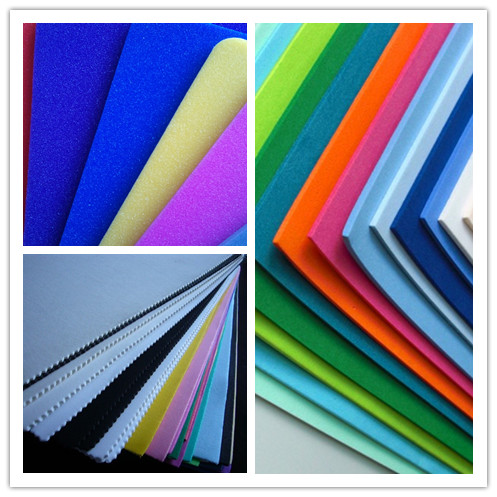
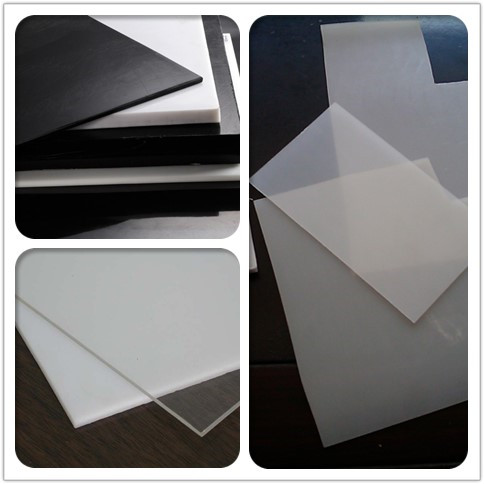
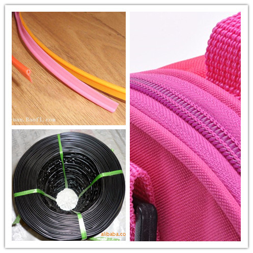
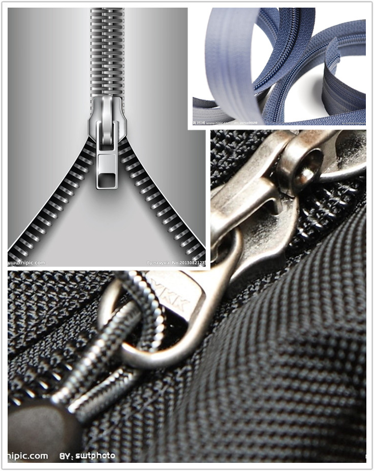
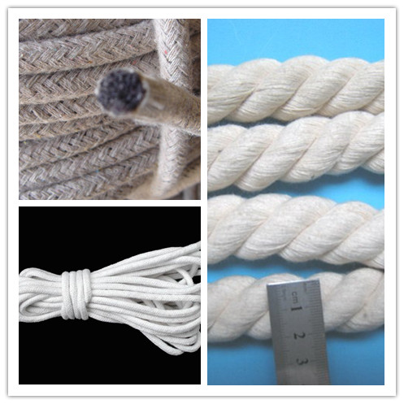
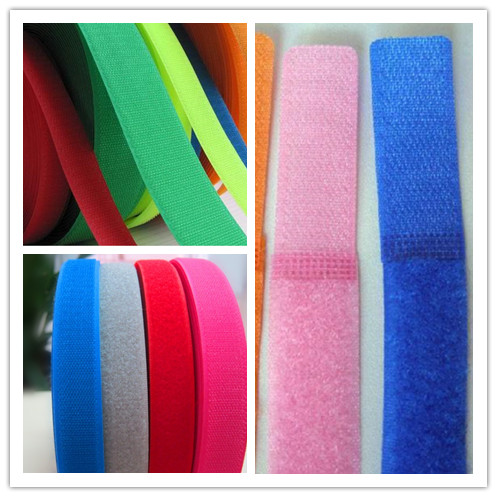
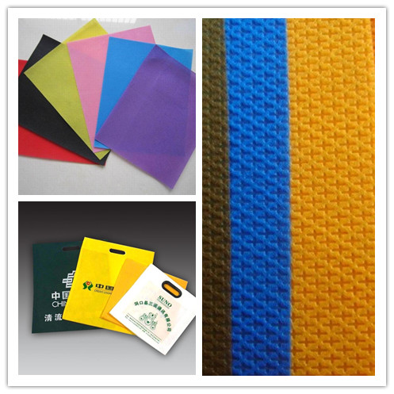
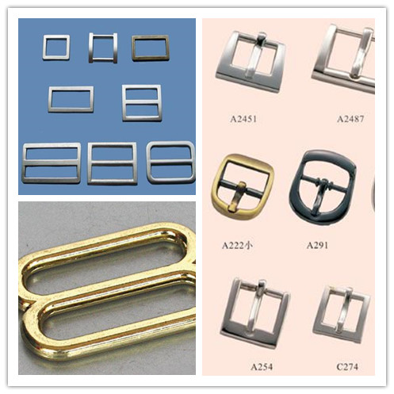
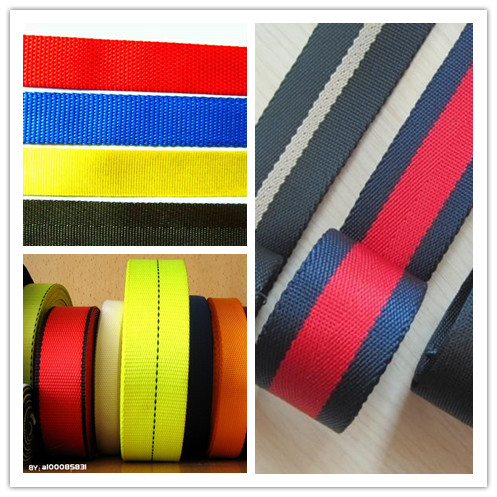
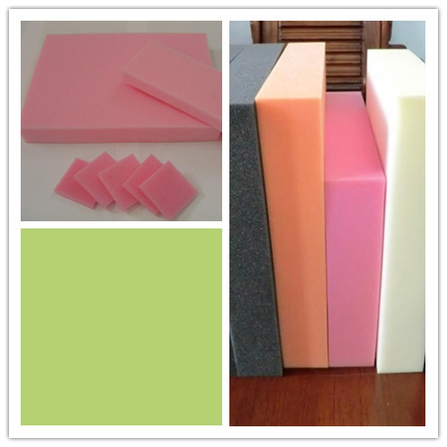

layout: post
title: "箱包辅料"
category: Bag
tags: [material, bag]
---

## EVA

- 中文名称: 乙烯-醋酸乙烯共聚物 
- 化学品英文名称: ethylene-vinyl acetate copo 乙烯-醋酸乙烯共聚物 。

特性：

- 耐水性: 密闭泡孔结构、不吸水、防潮、耐水性能良好。
- 耐腐蚀性: 耐海水、油脂、酸、碱等化学品腐蚀，抗菌、无毒、无味、无污染。 
- 加工性: 无接头，且易于进行热压、剪裁、涂胶、贴合等加工。 
- 防震动: 回弹性和抗张力高，韧性高，具有良好的防震 / 缓冲性能。 
- 保温性: 隔热，保温防寒及低温性能优异，可耐严寒和曝晒。 
- 隔音性: 密闭泡孔，隔音效果好。 

价格：

- 厚1.0mm：1.275元/米
- 厚1.2mm：1.55元/米
- 厚1.5mm：1.9元/米
- 厚2mm：2.6元/米
- 厚3mm：3.8元/米
- 厚4mm：5.1元/米
- 厚5mm：6.5元/米
- 厚8mm：10.8元/米

## PEVA

性能特点：

1. 可生物降解:弃掉或燃烧时不会对环境造成伤害。
2. 与PVC价格相近:EVA的价格比有毒的PVC较贵，但相对不含邻苯二甲酸盐之PVC为便宜。
3. 重量较轻:EVA的密度介乎0.91至0.93，而PVC则为1.32。
4. 不含臭味:EVA不含像阿摩尼亚(ammonia)或其它有机气味。
5. 不含重金属:符合有关国际的玩具条例(EN-71 Part 3及ASTM-F963)。
6. 不含邻苯二甲酸盐:适合儿童玩具及不会产生增塑剂释出危险。
7. 高透明，柔软及坚韧度:应用范围十分广阔。

## PE 板

### 性能

- 具有韧性高，抗拉，耐腐蚀，耐低温，耐磨性能好等特点。在化工，服装，包装，食品等领域有广泛应用。
- 可进行填充，阻燃，改性，表面可压花，磨砂。
- LDPE(高压低密聚乙烯)性质较柔软，机械强度较低，熔点亦较低，适于制薄膜和电缆绝缘层。
- HDPE(低压高密聚乙烯)刚性较大，机械强度较高，熔点亦较高。适合制中空制品，注塑制品等,广泛用于制造冰球场墙板．厚度：1-350mm颜色:本色,白色,蓝色,黄色,灰色,黑色,绿色等。

### 性质

HDPE板（高密度聚乙烯板）熔点约为130℃，相对密度为0.941~0.960。它具有良好的耐热性和耐寒性，化学稳定性好，还具有较高的刚性和韧性，机械强度好。介电性能，耐环境应力开裂性亦较好。熔化温度220~260C。对于分子较大的材料，建议熔化温度范围在200~250C之间。

- 中文名： 聚乙烯
- 英文名： POLYETHYLENE
- 英文名2：PE
- 产品规格：厚x宽x长 1-100mmX1000mmx2000mm
- 幅宽：1 米

### 用途

- PE保温板采用聚乙烯塑胶粒发泡而成，具有非常卓越的吸声隔单，抗水气渗透能力和截止气体流通能力，吸水性低，导热系数低。

- 橡塑海绵保温材料是采用性能优异的丁腈橡胶、聚氯乙烯为主要原料，配以各种优质辅助材料，以特殊工艺发泡而成的软质高档保温节能材料，绝不含氯氟烃。

- 本品具有柔软、耐屈绕、耐寒、耐热、阻燃、防水、导热系数低、减震、吸音等优良性能。可广泛用于中央空调、建筑、化工、医药、轻纺等行业。

- 饮用水污水管道、热水管道、运输容器、泵和阀门部件、医用器具部件、密封件、切割板、滑动型材。广泛用于化工、机械、电力、服装、包装、食品等行业。

### 价格

- 0.6mm =12元/平方米
- 0.8mm =16元/平方米
- 1mm =20元/平方米
- 1.2mm =24元/平方米

## 骨条解析

### 作用

- 固定包的整个框架
- 让包更稳，更不容易变形
- 使包更立体更美观

### 价格

- 2.0mm骨条=0.08元/m
- 2.5mm骨条=0.1元/m
- 3.0mm骨条=0.11元/m
- 3.2mm骨条=0.15元/m

## 拉链

拉链由链牙、拉头、上下止（前码和后码）或锁紧件等组成。其中链牙是关键部分，它直接决定拉链的侧拉强度。一般拉链有两片链带，每片链带上各自有一列链牙，两列链牙相互交错排列。拉头夹持两侧链牙，借助拉襻滑行，即可使两侧的链牙相互啮合或脱开。

### 分类

按材料：尼龙拉链、树脂拉链、金属拉链。

1. 尼龙拉链：隐形拉链、穿心拉链、背胶防水拉链、不穿心拉链、双骨拉链、编织拉链等。
2. 树脂拉链：金（银）牙拉链、透明拉链、半透明拉链、畜能发光拉链、蕾射拉链、钻石拉链。
3. 金属拉链：铝牙拉链、铜牙拉链（黄铜、白铜、古铜、红铜等）、黑镍拉链

按照是否开尾可分为：

1. 开尾拉链（左右插） 双开尾X型
2. 双闭尾拉链（X或O）

按大小分类：

0#、2#、3#、4#、5#、7#、8#、9#、10#、20#........30#，型号的大小和拉链牙齿的大小成正比。

按结构：

- 闭口拉链。后码是固定的，只能从前码端拉开。在拉链全开状态下，两链带被后码连接不能分开。适用于普通包袋。
- 开口拉链。在牙链下端无后码而设紧锁件。紧锁件锁合时相当于闭口拉链，把拉头拉靠锁紧件而将锁紧件分开，链带即可分开。适用于服装或常需拉开的物品。
- 双开拉链。有两个拉头，可从任意一端打开或闭合。将两个拉头都拉靠紧锁件而使其分开，便可完全打开。适用于大型袋子、卧具、帐篷等。

按功能分类：

- 自锁拉链
- 无锁拉链
- 半自锁拉链

按牙形分类：

- 单点牙
    + 普 通 牙
    + Y 牙
    + 方 牙
- 双点牙
    + 玉 米 牙
    + 欧 牙

### 价格

- 3#尼龙拉链=0.22元/m
- 3#铜齿拉链=1.8—2.5元/m
- 5#尼龙拉链=0.34元/m
- 3#铜齿拉链=3.5元/m

## 棉芯

一般用于箱包手提内部，加固手提，提的承受重量和受力度，不易折断。

### 价格

- 0.7cm=0.35元/m
- 0.8cm=0.4元/m
- 1.0cm=0.5元/m

## 魔术贴

### 分类

1. 尼龙材质：尼龙不容易燃烧，而且非常的软，魔术贴比较适合在服装上使用，并且是非常环保的材质。
2. 涤纶材质：容易燃烧，而且会产生黑烟，还伴随有刺鼻的味道，材质较硬，而且手感比较粗糙。
3. 涤纶和尼龙混合材质：结合了涤纶和尼龙的所有特点，不易燃烧，非常的耐用。背胶魔术贴就是使用这种材质做成
4. 尼龙A级材质：非常的柔软，常用作贴身衣服使用，而且还能使用在宝宝身上，不会造成皮肤伤害。
5. 不抓毛材质：主要有不抓毛魔术贴种类，只有毛面，钩子通常配尼龙A级材质使用，用在贴身衣服上比较的多。

不同的材质可以制作成不同的魔术贴，材质的不同，魔术贴的用处和特点也是不一样的，但是各种魔术贴都是符合环保标准的，客户可以根据自己的要求来选择不同的魔术贴种类。

### 规格尺寸

魔术贴的宽度介于1.0cm~15cm，市面常用规格分别有：1.25cm，1.6cm，2.0cm，2.5cm，3.0cm，4.0cm，5.0cm，6.0cm，7.5cm，8.0cm，10cm，11cm，11.5cm，12.5cm，13.5cm 十五种。其他尺寸一般都要定做的。

### 价  格

- 2.0cm=0.35元/m
- 2.5cm=0.5元/m
- 4.0cm=0.6元/m

## 无纺布

### 用 途

无纺布制品色彩丰富、鲜艳明丽、时尚环保、用途广泛、美观大方，图案和款式都多样，且质轻、环保、可循环再用，被国际公认为保护地球生态的环保产品。适用于农用薄膜、制鞋、制革、床垫、子母被、装饰、化工、印刷、汽车、建材，家具等行业，及服装衬布，医疗卫生一次性手术衣，口罩，帽，床单，酒店一次性台布，美容，桑拿乃至当今时尚的 __礼品袋，精品袋，购物袋，广告袋__ 等等。环保产品，用途广泛，经济实惠。无纺布由于它的外观形似珍珠，又称为珍珍珠画布！

### 特 点

无纺布没有经纬线，剪裁和缝纫都非常方便，而且质轻容易定型，深受手工爱好者的喜爱。

因为它是一种不需要纺纱织布而形成的织物，只是将纺织短纤维或者长丝进行定向或随机排列，形成纤网结构，然后采用机械、热粘或化学等方法加固而成。

它不是由一根一根的纱线交织、编结在一起的，而是将纤维直接通过物理的方法粘合在一起的，所以，当你拿到你衣服里的粘称时，就会发现，是抽不出一根根的线头的。非织造布突破了传统的纺织原理，并具有工艺流程短、生产速率快，产量高、成本低、用途广、原料来源多等特点。

优点：

1. 质轻：以聚丙烯树脂为主要生产原料，比重仅0.9，只有棉花的五分之三具有蓬松性，手感好！、
2. 柔软：由细纤维组成(2-3D)轻点状热熔粘结成型。成品柔软度适中，具舒适感。
3. 拨水、透气：聚丙烯切片不吸水，含水率零，成品拨水性佳，由100%纤维组成具多孔性，透气性佳，易保持布面干爽、易洗涤。
4. 抗菌、抗化学药剂：聚丙烯属化学钝性物质，不虫蛀，并能隔离存在液体内细菌及虫类的侵蚀；抗菌、碱腐蚀、成品不因侵蚀而影响强度。

缺点：

1. 与纺织布相比强度和耐久性较差。
2. 不能像其他布料一样清洗。
3. 纤维按一定方向排列、所以容易从直角方向裂开等等。因此生产方法的改善主要放在防止分裂的改良上。

### 分 类

- 水刺无纺布
- 湿法无纺布
- 防粘无纺布
- 针刺无纺布
- 缝边无纺布

### 价格

- 60gms=1元/m
- 80gms=1.6元/m
- 100gms=1.8元/m

## 五金

### 分类

- 扣子
    + D  扣
    + 方  扣
    + 日 字 扣
    + 拉芯扣
    + 钩 扣
- 锁
- 肩链
- 铆钉
- 铭牌

常用颜色：白 色、清 古 铜 色、金 色、浅 金 色。

## 织带

常用与背包，包括包边织带和手提织带。包边织带比较薄，薄的织带用于内包边，厚的用于外包边。常见的是 300D，600D，900D，D 数越高纹路越粗。常见的纹路有美国纹、十字纹、人字纹。

按照材料分为尼龙织带、 PP 织带，PP 是化纤布料的一种。PP 是很常用的织带。高档男包常用尼龙织带。

织带和松紧带都是按纹路和宽度来分。2.5、3.5、3.8，单位为公分。包边一般是 2.0，2.2。

### 分类

材料：

- 棉纶
- 涤纶

    + 强力耐磨。
    + 吸水性差，公定回潮率0.4%（20℃，相对湿度65%，100g涤纶吸水0.4g）。
    + 易生静电，易起毛起球。
    + 耐酸不耐碱。注：一定浓度的碱在一定温度下破坏涤纶表面使织物手感松软。
    + 耐腐蚀性、耐光性比较好。
    + 涤纶纤维所制织的织物不易起皱，尺寸稳定性好，易洗快干。

- 尼龙
- 氨纶

锦纶或尼龙：

- 强力非常好，甚至超过同等细度的钢丝。
- 耐磨性非常好，超过其他纺织纤维，适合做运动装，袜子，降落伞，缆绳。
- 吸水性差，公定回潮率4%，易静电，起毛，起球。
- 耐碱不耐酸，37.5%盐酸可以溶解。
- 耐腐蚀性好，耐水性差，耐光性耐热性差，久晒强力下降泛黄。
- 锦纶所制服装容易变形，容易起皱。

结构：

- 平纹
- 斜纹- 段纹
- 提花
- 双层

辨别织带：

将两种不知类别织带的经纬纱线拆出数根，分别用打火机燃烧，燃烧过程中观察一些物理现象，以确定经纬纱线的原料。燃烧时要分别对火焰、熔化情况及散发出的气味、燃烧后的灰烬的状况进行观察。

下面是两种织带材料的燃烧物理性能参数，供大家参考：

- 尼龙织带： 近焰即熔缩 熔燃,滴落并起泡 不直接续燃 似芹菜味 硬、圆、轻、棕到灰色,珠状。
- 涤纶织带： 近焰即熔缩 熔燃,滴落并起泡 能续燃,少数有烟 极弱的甜味 硬圆,黑或淡褐色。

### 价格

- 2.2cm=0.08元/m
- 3cm=0.3元/m
- 3.8cm=0.4元/m
- 5cm=0.6元/m

## 海绵

- 原色米白色
- 日后会因为跟氧气产生氧化反应而变成黄色，有些是因需要漂成白色或染成其他
- 质地柔软,怕热（可耐温200度）
- 易燃烧（可添加阻燃剂）,是用聚氨酯加TDI或MDI进行胶联反应而产生的塑料类的产物.

大量应用于各行各业，主要用于防震,保温，物料的填充，儿童玩具等。

海绵分3种：高回弹、中回弹、慢回弹。