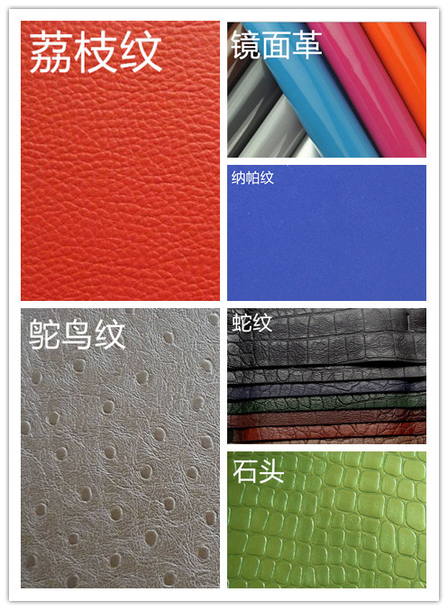
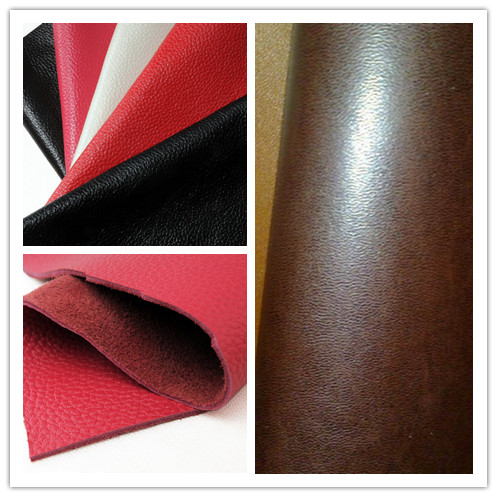
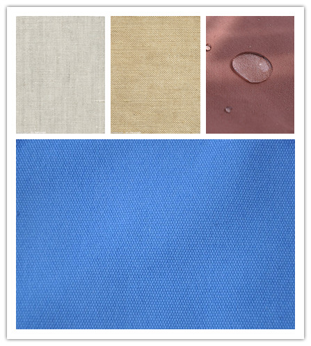
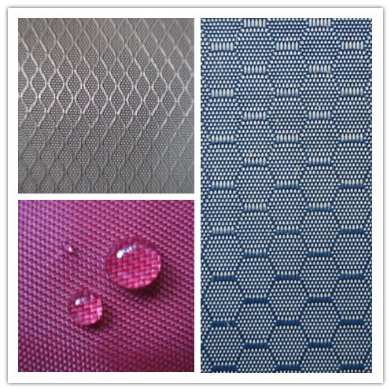
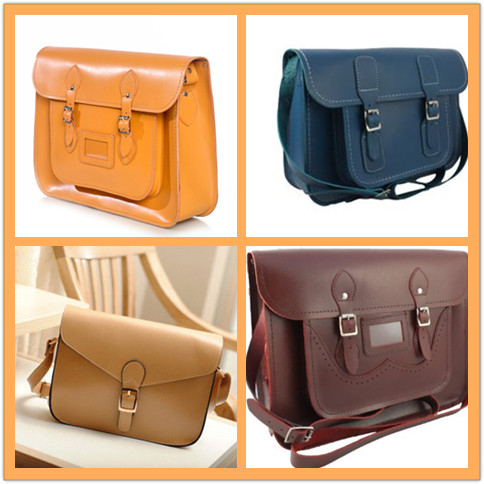
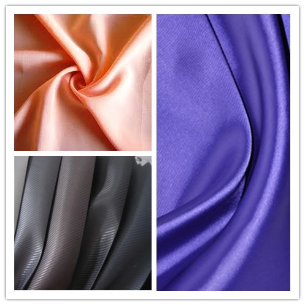

layout： post
title： "箱包材料"
category： Bags
---

## 面料

面料主要分为两大类，即皮革类和纺织布料类。皮革包括 PU 革、 PVC 革和真皮三大类，纺织布料类主要使用帆布和牛津布。

## 皮革

PVC 比较硬，比较好压力 LOGO，而 PU 较软，不容易压印。如果压下之后的颜色变成另外一种颜色，这种材料成为变色革。

皮革的厚度使用使用`丝`来衡量，1mm = 100丝。

皮革类面料需要注意色迁移的问题，要防止颜色渗到里布，导致里布的颜色洗不掉。

PVC的单位为丝，表示PVC厚度的单位，100丝等于1毫米。常见的有8丝和10丝的PVC。

皮革类（不包括真皮）的宽幅一般都是 1.35，纺织布料一般都是 1.45。一般用于复合的材料有杂革和无纺布，无纺布的宽幅是 1.55，如果和 PU 复合，就要使用较小的宽幅，及 PU 的 1.35。

### PVC

主要成份为聚氯乙烯，经过发泡而来，PU 是化学合成。所以 PVC 隔层之间会有小气孔，而 PU 比较实。

PVC 表面也有很多纹路。

- 色泽鲜艳、耐腐蚀、牢固耐用。
- 不存放食品和药品。由于在制造过程中增加了增塑剂、抗老化剂等一些有毒辅助材料来增强其耐热性，韧性，延展性等，故其产品一般不存放食品和药品。

根据特性，PVC 材料可分为：

- 彩边 PVC。彩色 PVC 比无色 PVC 较贵。
- 皮革 PVC
- 透明 PVC。常用于制作化妆包。

常用的为白的，透明的；还有一种是有压痕的，还可以压花，比较贵。

北欧等一些发达国家禁止使用 PVC 材料（常见女包、化妆包），因为 PVC 不容易降解，不环保。

根据材料的不同，又可分为 PE 和 EVA。EVA 比较薄，像薄膜。

### PU

PU是一种合成材料，具有真皮的质感，非常结实耐用，它与人造皮革是不同的。 PU合成革是用于代替PVC人造革，它的价格比PVC人造革要高。 它更接近皮质面料，它不用增塑剂来达到柔软的性质， 不会变硬、变脆，同时具有色彩丰富、花纹繁多的优点，价格又比皮质面料便宜。

PU 根据表面成份的不同分为：

- 全 PU
- 半 PU(SEMI PU)

区别在于：

- 相对全 PU 更薄，更柔软，弹性更大。
- 主要用厚度、手感（柔软度）、价格来区分。
- 价格：PVC < 半PU < PU，半PU与PU之间非专业人士很难鉴别。
 
PU 革从结构上分为纹路、表面和底。

- 常见的纹路包括荔枝纹（根据纹路大小可分为小荔枝纹和大荔枝纹）、石头纹、蛇纹、鸵鸟纹、纳帕纹、十字纹（大十字、小十字）、镜面革。有些工程并非使用这些形象的名字来命名纹路，而是使用比较文艺的名字，如水平如镜等。
- PU 一般是绒布底，PVC 一般是针织底和水刺底（或者无纺布底）。

### PVC 与 PU 的区别

属性 |  PVC | PU | 半 PU
-----|------|----|--------
柔软度 | 较硬，韧性较差 | 较软，韧性较好 | 最软
厚度 | 最厚 | 次厚 | 最薄
价格（元/米） | 7-16，环保 + 2.0 | 16-35, 环保 + 1.5 | 13.5-16, 环保 + 1.5
宽幅（有效） | 1.35米 | 1.35米| 1.35米
起订量 | 500m | 1000m | 1000m
耐力 | 用手能撕开 | 用手不能撕开 | 用手不能撕开
底布 | 较稀、较薄 | 较厚 | 较厚
比重 | 比重大 | 比重小| 比重小
纹路 | 纹路较深。中间的发泡层比较明显。 | 纹路较浅| 纹路较浅

PU、半 PU 和 PVC 一般用于女包、化妆包、公文包、背包、运动包。登山包一帮使用牛津布料，因为牛津布的防水，而且较 PU 和 PVC 轻。

半 PU 因为比较软，需要复合一层（或者加厚、胶水），使其撑起成型。考虑到价格原因，有时候可以使用半 PU 复合一层来代替 PU。

注意，广东的起订量单位为码，1 码 = 0.914米，核算价格时注意单位换算。欧盟和美国会提到环保，谈判的时候需要注意。

### 真皮

真皮分为头层皮和二层皮两类。真皮是从动物身上的皮，以块为单位。头层皮的价格在 800-1000元。有的供应商按 32*32/英寸,有的按 28*28/英寸来算，在采购的时候要问清楚。

头层皮是动物身上的皮，动物皮革带有疤痕和皮革自然的折皱。用手按下去，是有皱纹，穿后也是有自然的皮革皱纹。穿后不会发生掉皮和断裂。

二层牛皮是头层牛皮的边角料打碎后再加入聚乙烯材料重新粘合而成的皮革，再经化学材料喷涂或覆上 PVC 、 PU 薄膜加工而成。真皮二层皮皮面比头层皮要厚，使用久后，皮料要发生龟烈，严重的要断裂，它仍然保持牛皮的特性，但耐穿性及强度则不如头层牛皮。

二层皮覆涂一层硅胶可以制作为高级皮革，也称为”牛剖层移膜皮革“。高级硅胶皮比头层皮还要贵，高级男包大部分是用硅胶皮做的，不易磨损，比头层皮耐用，主要看这加工艺。皮角及碎皮碾碎再加化工加工成皮即是再生皮，作为皮带箱包内里定型衬层！

头层皮有为小牛皮、粒面皮、光面牛皮、修面皮、软面皮、碎皮（上述分类按价格进行分类，价格高的在前面，低的在后面），真皮面有自然的疤痕和血筋痕等，偶尔还有加工过程中的刀伤以及利用率极低的肚腩部位，进口头层皮还有牛只的编号烙印。全粒面皮可以从毛孔粗细和疏密度来区分属于何种动物皮革。

牛皮种类较多，如奶牛皮、肉牛皮、放牧的牛皮、母牛皮、公牛皮、未阉割的公牛皮及阉割过的公牛皮。在我国还有黄牛皮、水牛皮、牦牛皮和犏牛皮等。其中，水牛皮的毛孔较粗且疏些；黄牛皮则较水牛皮的毛孔细且浓密。

二层牛皮特性：其反面是牛皮的第二层皮料，在表面涂上一层PU树脂，所以也称贴膜牛皮。其随工艺的变化也制成各种档次的品种，如进口二层牛皮，因工艺独特，质量稳定，品种新颖等特点，为中低档皮革，价格与档次都不亚于头层真皮，但耐穿性不如头层牛皮，这就是二层牛皮非常热销的主因。

### 鉴别方法

在诸多的皮革品种中，全粒面革应居榜首，因为它是由伤残较少的上等原料皮加工而成，革面上保留完好的天然状态，涂层薄，能展现出动物皮自然的花纹美。它不仅耐磨，而且具有良好的透气性。

修面革，是利用磨革机将革表面轻磨后进行涂饰，再压上相应的花纹而制成的。实际上是对带有伤残或粗糙的天然革面进行了“整容”。此种革几乎失掉原有的表面状态，涂饰层较厚，耐磨性和透气性比全粒面革较差。

下面我们再介绍几种常用的方法：

1. 手感：即用手触摸皮革表面，如有滑爽，柔软，丰满，弹性的感觉是真皮；而一般人造合成革面发涩，死板，柔软性差。

2. 眼看：观察真皮革面有较清晰的毛孔，花纹，黄牛皮有较匀称的细毛孔，牦牛皮有较粗而稀疏的毛孔，山羊皮有鱼鳞状的毛孔，猪皮有三角粗毛孔，而人造革，尽管也仿制了毛孔，但不清晰。下面给大家介绍猪革、马革、牛革、羊革的特点和鉴别方法：牛皮革面细，强度高，最适宜制作皮鞋；羊皮革轻，薄而软，是皮革服装的理想面料；猪皮革的透气透水汽性能好，较适于制做内衣和儿童用品；马皮革的纤维结构较为紧密、强度也比较高，用于制作皮裤和皮靴效果较好。一般来说，皮革表面毛孔的粗细、疏密和分布情况是区分牛革、猪革、马革和羊革的主要依据。

区分水牛革和黄牛革：黄牛革和水牛革都称为牛革，但二者也有一定的差别。黄牛革表面的毛孔呈圆形，较直地伸入革内，毛孔紧密而均匀，排列不规则，好象满天星斗。水牛革表面的毛孔比黄牛革粗大，毛孔数较黄牛革稀少，革质较松弛，不如黄牛革细致丰满。马革：革表面的毛孔呈椭圆形，比黄牛革毛孔稍大，排列较有规律。

辨别方法：

摸手感

- 头层牛皮是价值较高的皮革，通常不会做很厚的涂层，所以手感基本保留了皮革的柔韧感和悬垂感。
- 二层牛皮因为要经过比较厚的涂饰或者经过覆膜，所以手感有些发硬发梗，比较死板，缺少悬垂感。
- 幅面尺寸
- 头层皮基本保留了蓝湿皮的全部面积，其皮材的张幅面积较大，而且皮面匀称。对二层皮而言，在剖离头层皮时，会有较大的损耗，皮面面积比头层皮会小很多，而且会有较多的伤残部分。

抗撕扯：按照整车厂的要求，真皮皮材抗撕裂能力在40公斤/平方厘米。具体来说，二层皮剪一个小口后，成年人能很轻松地撕裂。而头层黄牛皮剪一个小口，成年人也要费力才能撕裂。

粒面纹路：头层皮包含乳头层，具有自然的颗粒型粒面和毛孔。用手按下去，自然的皮革皱纹会发生伸缩。而二层皮虽然有人工仿制的纹路，但是没有毛孔，用手按下去，涂层或腹膜的仿皮革皱纹不会发生伸缩变化。

真皮价格：真皮计量单位：平方英尺（常规 1平方英尺=28*28cm ）

- 头层皮  15-16元/平方英尺
- 二层皮  8-9元/平方英尺
- 复合皮  6-8元/平方英尺

（注：询问真皮价格时，问清楚1平方英尺是按多少厘米算的，因为有些供应商按“1平方英尺=23*23cm ”计算）

真皮 损耗率≥40%(动物皮不规则，损耗较大)

## 纺织布料

### 色牢度

色牢度是纺织品的重要质量指标之一。所谓色牢度是指染色纺织品在物理和化学作用下，颜色保持坚牢的程度，即染色纺织品色泽受外界影响坚牢程度称为染色牢度。以试验后试样的色泽变化，白布沾色程度的评定等级表示色牢度的好坏。

纺织品的色牢度，分为5级: 1、2、3、4、5 （1级最差，5级最高，在中国市场达不到的。）

在评定不准时，或者商家只需要在色牢度范围内时，有大概参数等级：1-2, 2-3, 3-4, 4-5。

常规的色牢度为 3.5。

以下为织带所必须满足的织带标准：

1. 耐水洗牢度3.5级以上,通过 ISO105-C01:1989 测试标准
2. 耐摩擦牢度3.5级以上,通过 ISO105-X12:1993 测试标准
3. 耐日晒牢度4级以上,通过 ISO105-B02:1994 测试标准

## 帆布 Canvas

帆布是一种较粗厚的棉织物或麻织物。因最初用于船帆而得名。一般多采用平纹组织，少量的用斜纹组织，经纬纱均用多股线。

常用语斜挎包、背包、妈咪包、沙滩包。由于其具有耐磨的特性，也可以用于登山包。

没有涂层，化学成份为棉，而牛津的化学成份化纤。现在有些帆布表面会涂一层 PVC（过胶、雅膜）。

通常分粗帆布和细帆布两大类：

- 粗帆布又称篷盖布，常用58号（10英支）4～7股线织制，织物坚牢耐折，具有良好的防水性能，用于汽车运输和露天仓库的遮盖以及野外搭帐篷。
- 细帆布经纬纱一般为2股58号至6股28号（10英支/2～21英支/6），用于制作劳动保护服装及其用品。经染色后也可用作鞋、旅行袋、背包、等面料。

### 特点

- 耐磨
- 透气
- 可降解
- 耐洗
- 不防水

### 适用箱包

### 纱支

纱支简而言之，即指纱的粗细程度。

一磅（454克）重的棉纱（或其它成分纱），长度为840码（0.9144码/米）时，纱的细度为一支。如果一磅纱，其长度是10×840码，其细度是10支，纱支的表示方法英制式的表示符号是英文字母“S” 。单根纱的表示方法是：32支单纱，表示为32S。

股线的表示方法是：32支股线（两亘并捻）既为：32S/2，42支3 根并捻既为：42S/3。

纱支越大，纱越细。

### 密度

<small>这个概念实际很少用到。</small>

帆布织物密度的计算单位以公制计，是指一平方英寸内经纬纱排列的根数。密度的大小，直接影响织物的外观，手感，厚度，强力，抗折性，透气性，耐磨性和保暖性能等物理机械指标，同时他也关系到产品的成本和生产效率的大小。因此，密度越大防水性越好。

### 克重

克重：指一平方米布料的重量克数。

梭织帆布面料用`盎司`、`安`或 `OZ`，针织帆布一般用克重（g/m2）。其中 `安`是 `安士` 的缩写，英文表示为 `OZ`。

    1盎司 = 28.3495231g/m2

安数越大，经纬度越粗。

### 幅宽和起订量

幅宽：指帆布的纬向宽度，在国际上常用 `英寸`或 `"` 表示，如47"。在国内常用 `厘米` 或 `cm` 表示，如 120cm。

    1英寸=2.54厘米

帆布幅宽为1.45米。

起订量：理论上是 500米，有现货的情况下 100 米，200米 也可以。

### 帆布种类

根据材质不同分为涤棉帆布和纯棉帆布。

- 纯棉（100% cutton canvas）：手感好 不耐干 结实。
- 涤棉(TC canvas)：一般情况下：65%涤，35%棉。表面比纯棉亮滑。
- 再生棉：可回收再利用。用的不多。

按水洗分类：

- 水洗帆布：颜色比较复古，泛白，就像水洗过了一样。
- 染色帆布：色彩鲜艳，易掉色，但取决于质量。帆布的原始颜色为米黄色。

### 价格

常用帆布主要有：

- 10安=7.5元/码
- 12安=11.5元/码
- 14安=13.5元/码
- 16安=15.5元/码
- 22安=20元/码

## 牛津布

牛津布（oxford），又称牛津纺。牛津布有面料和涂层构成，表面为纺织布料，背面为图层。图层的材料分为 PVC 涂层和 PU 涂层。PU 图层几乎用肉眼看不到。

对于纺织布料，黑色和白色是最常规的颜色，一般都会有现货，其他颜色一般要定做。

### 特点

- 采用较细的精梳高支纱线作双经，与较粗的纬纱以纬重
- 平组织交织而成。
色泽柔和，布身柔软，透气性好，穿着舒适，易洗速干，多用作衬衣、运动服和睡衣等。
- 产品品种花式较多，有素色、漂白、色经白纬、色经色纬、中浅色条形花纹等；还有用涤棉纱线织制的。

市场上常见涤纶牛津布 有： 210D，300D，420D, 600D，1680D， 1800D

### 适用的包

可以用于背包、电脑包、腰包、书包、午餐包、背包、购物袋。女包一般不用涤纶牛津布，要用也使用尼龙牛津布，表面更亮一些。

### D 数的含义

D 是 DENIER（旦尼尔）的缩写，是化学纤维的一种细度表达方法，是指9000米长的丝在公定回潮率时的重量克数，也称为旦数。 

    旦尼尔（D）=(g/L)x9000，其中 g 为丝线重量(克), L为丝线长度(米)。

D 越大，表示纱线越粗，同样面积的布料就越重。常见于背包面料的材料强度指标。

一般用于300D，420D，600D，1680D。

### 分类

特性/材质     | 尼龙牛津布 |  涤纶牛津布
--------------|------------|-------------
感官 | 光泽度亮，手感滑    |  光泽度较暗，表面较粗糙
燃烧 | 冒白烟 | 冒很旺的黑烟，残物捏了会碎
性能 | 表面防水，耐磨，受力，色牢度 | 涂层防水，涂层会有白色划痕
涂层 | PU/优力胶/PVC涂层  |  PVC涂层
普通价格（元/米） |   7-16 | 4.5-6.5
环保价格 | + 1.5-2 | +1.5-2
宽幅 | 1.45米 |  1.45米
起订量 | 1000米 |  1000米

里布的起重量一般是 1400m。

牛津布的纹路分为正文和斜纹。

按照表层的纺织布料可以分为尼龙牛津布和涤纶牛津布。涤纶和尼龙的区分为：

1. 涤纶（聚脂纤维），又称 POLYESTER。

    特性是：

    - 良好的透气性和排湿性。
    - 较强的抗酸碱性。
    - 抗紫外线的能力。
    - 布料外表比尼龙暗，较粗糙。
    - 价格比尼龙便宜，用的比较多。
     
    按照表层的纺织布料的粗细程度分为不同的档次，210D，300D，420D, 600D，1280D，1680D， 1800D。210D 通常用于作里布。

    一般75D的倍数的布料为涤沦，如 75D，150D，300D，600D，1200D，1800D 均为涤沦。布料外表比尼龙暗，较粗糙。

2. 锦纶（尼龙），又称Nylon，聚酰胺纤维。

    特点：

    - 优点是高强度、高耐磨性、高抗化学性及良好的抗变形性，抗老化性。
    - 缺点是手感较硬。
    - 布料的光泽度比较亮，手感较滑。
    - 表层防水，水滴上去表层会形成水珠。仿的尼龙表层还是会湿，不能通过图层防水。
    - 尼龙的价格比涤纶的贵，用的比较少。
    
    比较有名的有PERTEX，CORDURA。

    一般 70D 的倍数的布料即为尼龙，如70D，210D,420D，840D，1680D均为尼龙材质，但是市面上因为价格的关系也用涤纶来制造的。

### 价格

600D 的牛津布分为 A、B、C、D 四个版本，A - D 版的价格渐高，更密，一般高在 10倍 放大镜下看。参考价格为：

- A 版：4.2元/米
- B 版：4.8元/米
- C 版：5.6元/米
- D 版：6.5元/米

其他牛津布的参考价格为：

- 210D：2.2~3.5元/米    
- 420D：3.6~4.6元/米
- 1680D：12~16元/米

## 里布

里布的价格一般比面料的价格更低。

里布尽量不要用白色，会增加次品率。

根据客人的询盘数量，告知是否可以定做材质，不同材质起订量不一样，数量少的只能用现有材料。

以下材料常用于女包和运动包的里布：

- 210D 牛津布、
- 无涂层（即看不到的 PU 图层）的 420D。
- 无涂层的斜纹 230D。
- T/C棉。涤纶和棉布混纺。一般都带有印花。
- 斜纹。
- 棉布。成本比较高，用得比较少。
- 190T，比 210D 更薄，也是牛津布的一种，也成为涤塔夫，不常用。
- 塔丝绒。旁边容易拉丝，不常用。
- 桃皮绒。

铝膜、复铝膜珍珠棉常用于冰包、午餐包的里布。使用其防水隔热的特性。复铝膜珍珠棉越厚，价格越高，厚度单位为 mm。

背包一般使用 210D 或者 230D 作为里布。__铝箔复合珍珠棉：__

__铝膜__

__珍珠棉：__

聚乙烯发泡棉是非交联闭孔结构，又称 EPE 珍珠棉 , 是一种新型环保的包装材料。它由低密度聚乙烯脂经物理发泡产生无数的独立气泡构成。克服了普通发泡胶易碎、变形、恢复性差的缺点。具有隔水防潮、防震、隔音、保温、可塑性能佳、韧性强、循环再造、环保、抗撞力强等诸多优点，亦具有很好的抗化学性能。是传统包装材料的理想替代品。 

__铝箔复合珍珠棉：__

__铝膜__

__珍珠棉：__

聚乙烯发泡棉是非交联闭孔结构，又称 EPE 珍珠棉 , 是一种新型环保的包装材料。它由低密度聚乙烯脂经物理发泡产生无数的独立气泡构成。克服了普通发泡胶易碎、变形、恢复性差的缺点。具有隔水防潮、防震、隔音、保温、可塑性能佳、韧性强、循环再造、环保、抗撞力强等诸多优点，亦具有很好的抗化学性能。是传统包装材料的理想替代品。 

## 网料

网布在箱包行业中一般用于包的两侧，前幅或后幅做于网袋用于放置物品，或者用于夹层来隔离物品！

### 分类

1. 三明治网布。布料分为三层，常用于制作外带。
    
    1.优越的透气性
    2.回弹性,有弹性,提供缓冲保护
    3.质地轻,易洗涤
    4.环保无毒
    5.网孔多样性,美观大方。

2. 六角网布
3. pvc塑胶网.发泡网布
4. 尼龙格纱网布
5. 不锈钢网布

    + 编织精密、零缺陷；
    + 网孔规则、精确；
    + 过滤精度可靠；　
    + 高抗压强度；　
    + 耐高温、抗化学腐蚀；　
    + 耐磨性好；　
    + 良好的可成型性。 不锈钢轧花网布也是不锈钢支撑网，煤炭筛分网布等也是工业用网布的不可缺少的网布部分。

### 价格

- 六角网：1.8~6.5 元/m
- 三明治网：5~9 元/m