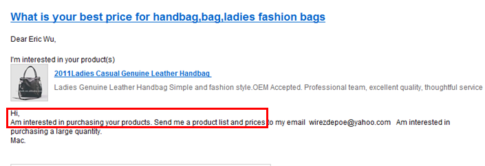
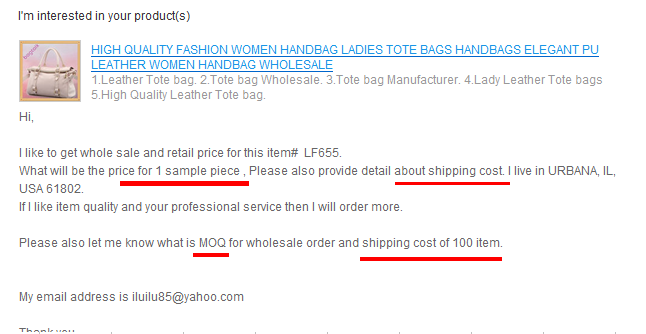

layout: post
title: "询盘技巧"
category: Marketing
tags: [marketing, inquiry]
---

## 分析客户询盘

1. 从询盘邮件内容分析客户意向

    + 客户（基本信息）
    + 客户所询问的问题或产品（客人所关注的问题）
    + 寻找邮件中客人提及的一些侧面信息，如客户的类型，对应的市场等等

2.  从客户的公司资料分析客户背景（公司规模，业务范围，公司性质，销售或代理的品牌，产品市场定位）

    + 会员的年份
    + 将公司名称通过搜索引擎了解一些公司情况
    + 公司地址：可通过街景搜索了解具体的位置，或辨别客人信息真实性
    + 邮箱：一般大公司会用自己公司邮箱,留意邮箱后缀，有些就是公司网站，如果是hotmail,yahoo。QQ等有即时聊天工具的邮箱，可尝试申请加客人为好友，方便更好，更快地交流
    + 公司网站：研究客户公司网站（几个主要页面以及下载客户的E-catalog, 研究并找出有价值的信息点）

## 回盘的五要素

### 标题

重要性：能让你的邮件在客户众多邮件中脱颖而出，决定客户是否会看你的邮件。

注意事项：突出卖点或邮件主题，可以是产品名称、产品系列、单价、客户名称、公司名称、邮件主要内容等等。

### 称呼
 
尽量简单口语化的称呼，无须使用如：Dear Mr.XXX之类的表达。具体称呼可以根据你和客人的熟悉程度而定，首次联系最好不要直呼其名，尽量简单口语化。比如“Hi Kelsey, Ms. Kelsey, Dear Kelsey…..etc

### 正文

投“客”所好，简洁明了。决定客户是否有兴趣回复你。

<pre>
Hi, xxx,

With the honor we received your inquiry dated _3rd March 2014_.
Thank you for your interest in our _kinds' toothbrush_.

About us:

We are manufacturer of kinds of _toothbrushes_ over 10 years' experience with FDA approval. 
We are professional in OEM and ODM service.

About your inquiry:

A quotation list is attached for your reference. These models have met a warm welcome in _Brazil market_.

If you have any question, please contact me freely.
We sincerely want to enter into business relation with you.

Best Regards
Linda
Sales Manager
</pre>

参考范本2：

<pre>
Dear Ms. Cen,

Good day.

Attached you will find the quotation of Wire Bag for your reference.
The unit price subject to the final confirmed sample.

Should you have further question, please feel free to contact us.

Best regards.
</pre>

正文和内容注意事项：

宗旨：简单明了，抓住重点，行列分明，服务第一。

* 正文无须太长，简明扼要，表达清楚即可，罗列要点时按分1、2、3点进行书写。
* 表达的内容要明确是客户所需要的，自己和公司的介绍可以用一句话带过，过多的介绍会让客人觉得有推销倾向。
* 公司实力等内容可以在后面的邮件中逐渐展示给客户。（如PDF版的公司介绍，合作过的一些知名公司或品牌的OEM加工等等）。
* 邮件正文字体、字号一致。用 12号 “Times New Roman”或者“Arial”，必要提醒时可用黑体加粗、变换字体颜色等等。
* 客人提的问题较多时，可将客人的问题复制，然后在每个问题的下方用不同的颜色回复。
* 当收到客人的询盘为中英文之外的其他语种或小语种时，可用过Google 翻译工具翻译大致了解客人需求，并用双语版(一句外语，跟一句英语)回复客人。

### 附件

附件的格式、精美度、附件内容，决定客户是否有机会能打开并看到它对其中的内容感兴趣。

1. 建议用PDF,JPEG格式作为优先选择，因为用手机查收邮件的客户越来越多。
2. 附件名称尽可能与正文提到的附件名称一致。
3. 在贴上附件的同时可以将附件插入邮件正文。

<pre>
Title: Quotation for Thai Air Line toothbrush
Content: 

Hi Dear:

Please check the quotation for TG toothbrush as attached. Any feedback please tell me freely. Thanks!
</pre>

文件命名格式：

1. 报价单：年月日-客户代号，Quotation from Reshine。如：R1412121CN01-Quotation from Reshine.
2. 核价单：年月日-产品核价单。如 R141212-产品核价单
3. 打样单：年月日-客户代号-打样单。例：R1412121CN01-打样单。
4. 样品发票：年月日-客户代号-样品发票。例：R1412121CN01-Sample Invoice.
5. PI: 年月日-客户代号-形式发票。例：R1412121CN01-Performance Invoice

### 落款（签名）

业务员姓名/职位/公司名/公司LOGO/地址/联系方式/公司网站/业务员手机及所有即时聊天工具ID。

决定客户是否能在以后想和你联系的时候能取得联系。

<pre style="font-family:Arial; font-size:8px">
Jiangshan Reshine Leather Products Co., Ltd.
Sale Manager
Off.add: 2/F, Building A, No.342 Wangdao Road, Beiyuan Street, Yiwu, 
             Zhejiang, China. | P.C.: 322000
Tel: +86-579-85600772 EXT 8018  |  Fax: +86-579-85575381-801  
E-mail: sales6@bagtalk.cc | Skype: reshinebags6
M.P.: +86-18157952012（Whatsapp & Viber available）
Web: http://bagtalk.en.alibaba.com
</pre>

## 询盘分析

### 客套话

<pre>
Many thanks for your email.
Firstly, I want you to understand that we are ready to build a continuous business with your company.
</pre>

<pre>
A quotation list is attached for your reference.
These models have met a warm welcome in Brazil market.
</pre>

### 销售渠道

<pre>
May I konw you are retailers or wholesalers?
And whether you have your shop or you sell the bag in web like Amazon or Ebay? We have many clients who have shop in Amazon and they also require high quality about the bag.

If we know more information we can supply better service for you.
</pre>

大数量的询盘或者是外贸公司的询盘，可以问客人是销往哪个国家？材质要求如何？
国外客户，可以问是批发、还是有连锁超市促销的等等。

<pre>
May I know if the bag is used for sales promotion or wholesale?
And which country are your main exported to?

If we know more information we can supply better service for you. 
</pre>

如果客人一直强调产品质量要好，可以问产品是在哪里卖的，零售还是批发？实体店?超市?还是网店 像Amazon or Ebay? 告诉客人我们也有很多在Amazon开店的客户，产品质量要求很高的，发相关客户的Amazon店链接给客人参考（Amazon平台对销售商要求高，产品质量好）。

### 数量

1. May I know your possible order quantity?
2. How many pieces do you want?

如果客人的数量大部多我们的 MOQ：

<pre>
trial order is acceptable, but the price will much higher,cause the production cost for trial order will higher than bulk order.
</pre>

根据数量，递推式报价：

<pre>
Dear Mrs/Ms,

Thanks for your kindly mail.

About the product you chose: (Item No.)
Size: __*__*__cm
Material:

To different Q’ty, best FOB price were below:
___pcs, ___USD/pcs, lead time: ___days;
___ pcs, ___USD/pcs, lead time: ___days;
___ pcs, ___USD/pcs, lead time: ___days;

Packing details: __ pcs/ctn, ctn size: __*__*__ cm, N.W./G.W.: __/__ KG.

Sample cost: ___USD, delivery time: ___ days, Q’ty over ___pcs, sample cost will be returned.

Requested detailed pictures were enclosed, please check.

Any other question or customized requests, please feel free to contact us, will reply you in the earliest.

Looking forward to your early reply.
</pre>

### 附件

According to your demands, attached our xxx for your reference. Pls. check it.

### 价格

### 运费

如果客人问：

Does $90 include freight?

这种情况下另外再告诉客人含运费总共是多少钱？问客人是否有到付账号，如果有，让客人提供到付账号，只需付样品费。

对于简单的包，打样费可以少收一点。购物袋 US$50 不含快递费，加快递费收US$85 左右
收样品费的时，是否含运费一次性写清楚不要等样品好了再收，客人要多付一次手续费。

关于海运费：

<pre>
Here are two shipping options. Air transportation-- fast but cost much. The fee is nearly XX from XX to XX.
Sea transportation --cheap but should spend many days. And the cost might be XX between XX port and XX port.
 
All of the shipping would be changed for different factors.
Wish you could know it. 
</pre>

### 定金

<pre>
Dear***,

Good day.

Attached the Proforma Invoice for your reference, please kindly let me know if you pay the deposit, so we can arrange to produce the bag as soon as possible.

Thank you so much.
Best regards,
</pre>

### 客户信息

- Company full name: 
- Consignee full name: 
- shipping address: 
- zip code : 
- cell phone number : (You use WhatsApp or Viber? tell me very important) 
- telephone number: 
- fax number : 
- MSN: 
- Skype: 
- Yahoo message: 
- Website:_____________________________________

### 样品

如果客户想要免费样品，完了还不想承担运费：

<pre>
We know you have high sincerity to corperation.
Personally I would like to give you free samle with freignt prepaid.
But for company's policy, free sample is the best we can offer.

The freight prepaid will much cheaper than collect. 
</pre>

适当表明自己为客人努力争取过，让客人感觉你和他站在一边，但公司规则不好打破，让客人妥协，语言委婉点。不要让客人感觉有贬低我们公司或老板的意思。

<pre>
Dear Paul,

Thank you for your email.
According to our company policy, we each salesman have 3times of free sample to new customer every year. And for old customer, we could offer free samples.

It is the new beginning of 2015 working day, I’ve tried my best to apply a free sample for you. If you have no FedEx or DHL collect account or can not pay for the freight, I feel deeply regret. It’s not a big and sincere company can do so.

We are also the supplier of MaryKay(Malaysia), Dove(The Netherland), Walmart(Argentina) etc. We also charge for samples for first time. Hope you understand.

Best regards.
Xxx
</pre>

关于询问或索要样品及快递费事宜的回复模版：

<pre>
Good day and thanks for your inquiry.

Please let we know the designs you want.

Those sample bags we have, most designs only have one piece of each in our sample room. 

Designs with more than 1 piece samples, sample cost will be charged, to be shipped by freight collect or prepaid.

Designs without stock, sample cost will be charged, varies from 50-150USD per design, once order confirmed and it’s over our MOQ, sample cost will be returned.

Will quote you the best price we could, looking forward to establish a long-term business relationship with your esteemed company. 
</pre>

### 公司

1. 公司经验

    We are manufacturer of kinds of _xxx_ over 10 years' experience with FDA approval. 

    Our company is a medium-size enterprise with 80 workers.

    Our company is one of the biggest manufacturers with 10 years experience in the field, who specialized in tool bags, handbags, cosmetic bags and promotional bags ect.

    High quality and reasonable price is our best competiveness.

    specialized in ... 后面的内容要根据客户想要的包的类型调整位置。

2. 供应商类型

    We are professional in OEM and ODM service. We offer high quality OEM service, using your own design and logo.

3. 服务大客户

    We are the supplier of Mr. Price(South Africa), Dove(Netherlands), Walmart(Argentina), Mary Kay, and NIVEA ect.

4. 大生产量

    Monthly producing capacity is 200,000 pieces, we could supplier super quility products with most competitive price.

5. 产品市场

    Our customers mainly from Europe and America, every year we export 10 billion dollars to the world, so I am sure we can provide you high quality goods with fast delivery .

6. 支付方式

    We accept L/C , T/T , Western union .Our mainly port of export includes NingBo ,ShangHai .More information you can skan our webste on alibaba: <www.bagtalk.en.alibaba.com>

7. 是否通过第三方验厂

    Sorry to tell you that we don’t have audit report like ISO9001, but we have the report which Audited by Bureau Veritas.

    Attached the report for your reference.

### 工厂

1. Two Production Lines: one for Leather (PU, PVC, Genuine Leather) Bags, one for Fabric. (Canvas, Polyester Nylon etc)
2. Kinds of Production Machines: Material Cutting Machine (1 Unit), Synchronous Flatbed Sewing Machine (30 Units), Flatbed Sewing Machine (10 Units), Post-bed Sewing Machine(1 Unit)
3. Our team:
    
    - Production Team: 60 people
    - Product Development & Research Team:  2 people
    - Sales Team: 15 people
    - Quality Control Team: 2 people
    - Purchase Team: 1 people
    - Warehousing Team: 1 people
    - Customs Clearance Team: 1 people
    - Finance Team: 1 people
    - Management Team: 3 people
4. Factory Size: 2000m²

    Yiwu Office Size: 1,400m²

### 报价

报价时，要说明是否包含运费：

<pre>
Price：$2.28/pcs base on xxxpcs
       $2.22/pcs base on xxxpcs
       ...

Which not including the shipping fee.
The final price will be subject to confirmed sample.

In addition, the picture in the email is just for your reference. 
We can produce the bag according to your design.
</pre>

## 客户分析

长期不回复客户（分析客户需求，发送客户感兴趣内容）购买意向，不回复原因：

- 收集产品信息—我们有新产品，请更新系统信息，甘愿做替补 
- 客人不相信--介绍客人本地我们的合作伙伴
- 价格问题—促销
- 客户没有接到订单—鼓励客户，作为工厂，我们是最坚强的后盾
- 款式问题 – 给客户专业的建议
- MOQ高
- 打样费高
- 需要验厂报告
- 材料要求较高
- 付款方式：中国出口信用保险公司。<http://sd.sinosure.com.cn/eplan/wstbcp/xwqyxby/index.jsp?channelno=3_016>

## 快递跟踪

### 样品快递跟踪信息

<pre>
The sample parcel of bags been picked up by xxx express today.
The tracking no.: xxxx
ETA: xxx

Pls. kindly let us know as soon as you received it.
Brds.
</pre>

附件：样品图片

### 货物运输跟踪信息

<pre>
All the products have been loaded and shipped to you on March 10th, 2014.
The estimated time of arrival is April 10th, 2014.
Please see the attached files of Invoice, Bill of Loading and Packaging List.
 
We will keep tracking the logistics and tell you the newest information of the products.
</pre>

### 产品售后跟踪

1.  刚收到货：Hope you have received the goods in sound condition.
2.  收到货物后：How is the selling of our bags?
3.  I think you already sold out the goods which you purchased from us last time.

## 群发短信

### 春节假期

<pre>
Dear %客户名称%:

Best wishes to you and your booming business!

As the Chinese Spring Festival is coming, and I would like to tell you that we will have a vacation soon. 

It is from January 25th to February 10th in 2014.

If you have any questions during this period. You could contact me in the following ways:
 
My Email: 
My mobile phone:
My Skype: 

We would try our best to support and help you.
Thank you!
</pre>

## 首封邮件回复模版

### 我方产品报价

客户发一个或数个我方产品图片的链接、型号、需要报价。

<pre>
According to your request, attached our latest quotation for your reference.

Please feel free to let me know if you have any question.
Best Regards,
</pre>

客人询盘提到什么产品，就重点突出什么产品
 
### 客方产品报价

客户发一个或数个客人自己的产品图片的链接、型号、设计稿等 需要报价询盘。

<pre>
Attached our pet bags catalog for your reference. Hope you could find some interests. 

Pls. Send more pictures with details about your own design so that we could quota you accurate price.

Wait for your answer.
Best Regards,
</pre>

### 给出目标价的询价

<pre>
...
About your enquiry:

Attached our catalog for your reference. Should you have any question, pls. contact us freely.
...
</pre>

### 带有明确采购数量的询盘

<pre>
Our MOQ:500 pcs.
The price is $ xx for 50 pcs.
          $xxx for 500 pcs..
The price will be has a little higher for 50 pcs.Hope you could understand.

Should you have any question, pls. let me know.
</pre>

### 很笼统的询盘

没有明确产品要求，只要求我方给出报价单的询价。

TODO 找更好的模版。

### 较专业的产品

针对性较强，专业度较高的询盘（有详细的细节要求，如产品颜色、数量、尺寸、logo、证书要求、目的港及付款条件的询价）。

<pre>
May I ask you a question?
Could you tell me your request about bag color, material, and quantity, so 
I can quote you asap.
</pre>

### 询价明确

在第6点基础上再增加样品费、快递费、MOQ、海运费等更详细的内容。

<pre>
About your inquiry:
-LF655 sample charge US$100/pc(Shipping not included)
-Shipping by DHL cost about US$35/pc;
-Our MOQ 500pcs, trial order acceptable.
-100pcs shipping by DHL cost xxx.
</pre>

### 关于MOQ的首封询盘

<pre>
Dear Sir / Madam
Thank you for your interests in my item.
I am glad to tell you that trail / small order is acceptable , and our MOQ is 500 pcs .Before placing an order , you should pay for $100 for the sample considering the quality and style .As you know , we cannot make any changes after the item has been put into mass-production .if you are satisfied with the sample , we will deliver your item in 15-30 days after your payment , also , we will return the sample fees back to you .
How do you think ?
Looking forward to your early reply
</pre>

## Templates

- [从报价到收款的18个外贸模板！](http://mp.weixin.qq.com/s?__biz=MjM5NTc5NDQzMg==&mid=209094830&idx=1&sn=760676a45414ad8eef57c651342b0303&scene=5&srcid=0905zq3cFXrYpjrRoQquTVyO#rd)