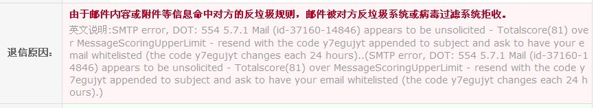
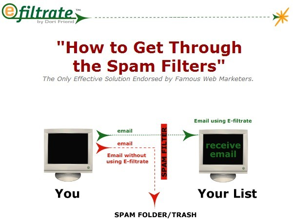

layout: post
title: "开发信"
category: Marketing
tags: [marketing]
---

高回复率 =Basic Search, Target Right (初步调查，有的放矢) + 避开SPAM过滤词 + 少图片少链接 + 好的标题 + 行文简洁清晰 + 有吸引客户的Key Point + 运气or时机（排最后但是占了不少权重！）

##  Basic Search, Target Right （初步调查，有的放矢）

### Basic Search（初步调查分析）

你对客户有多少了解，你的开发信中就能多出多少亮点，这些都是可能引起对方兴趣的地方。具体怎么调查和分析客户，之前我也有粗略地写过一篇文章。一般来说，我是这样来调查分析的： 

1. 客户公司网站的研究。几个主要页面以及下载客户的E-catalog，研究并找出有价值的信息点。
2. 搜索引擎的搜索技巧（谷歌，谷歌地图等）了解客户的实力，网络活跃度，网上B2B询价记录，行业目录的自我简介，上下游客户，供应的主要客户群体等。 
3. 海关数据（北美/南美客户）来研究采购习惯，周期频率，数量和供应商等。 
4. 其他外贸小工具如Whois 网站域名信息查询，了解域名注册时间（很多时候是公司成立的时间），注册的地点（看看现在网站上的地址和当初注册地址是否不同，结合google地图看一下实景，了解客户公司是否在发展壮大）以及网站的反链数量等一些SEO方面的信息侧面了解公司。 

对于客户的分析和调查这样的工作，需要有一定的综合职业素质。做外贸，不是口语好，跟进积极，认真负责，发产品，回询盘就能成为优秀业务员。外贸业务员的自我修炼，脑子要灵活，内心要强大，情商智商双发展，对信息要敏感，知识面要自我拓宽，善于总结，要善于假助外物。（OH NO~ 我知道你们最烦这些说教的文字） 
  
打个比方，如果你对搜索引擎的原理、应用和技巧都熟练，那么很多事情就好办得多。比如：

- “客户公司名” B2B OR leads OR MarketPlace。看看客户有没有在国际B2B平台上询价或者登记过信息。
- “客户公司名” Exhibitor OR Fair。看看客户有没有参加过国际展会。
- “客户公司名” “Vendor:” OR “Vendor Code” OR “Vendor Part#” OR “supplier:” 。查询客户上下游的客户信息，有时候可以发现很多上游客户，有时候又可以发现一些下游供应商，也可能成为你的客户。

### Target Right（发给正确的人）

有些对口的客户，网站上只有info,sales这些邮箱的，我建议果断打电话，因为电话更直接。先问到负责采购的邮箱，再行发送。大多数国外的公司接线员是很友善的。如果电话这条路不通，用google并配合whois信息，尽可能地找出这个公司的其他邮箱地址。再利用人名和邮箱名，去国外社交网站上搜搜，有时候也有意外的收获。社交平台没有任何发现，再发送你找到的那些邮箱。

对于SNS平台，看看我的老客户有什么高见：

Sam, I suggest you try to make initial contact via phone call if you’re sure they are real buyers. It is too easy for people to ignore emails, especially when emails are from somebody who with poor acknowledge and morals of e-mail marketing.

If telephone contact is not possible then you can work via email. Remember that, do not make the email full ofselling-language or words, such as “FREE”, “OPPORTUNITY”, ”CHEAP”, ”PRICE”,“DISCOUNT”, when you’ve got buyer’s reply, it doesn’t matter but if this is just the first email, NEVER USE THEM. 

Addtionally I would strongly suggest LinkedIn,there are a lot of professionals on there now, and it's growing every day. It’s easier to check what’s new. Maybe you can find your target customer there.

## 避开SPAM 过滤词

E-mail Marketing还是外贸中常用的网上营销手段，然而至少有80%的人对E-mail营销缺乏正确的认识，造成营销的泛滥。因此我觉得有必要给大家说一下一些基本的知识点： 

邮件地址中的符号@是英语“at”的含义，所以我们的电子邮件地址如sam@sohu.com 的完整解释为“sam在sohu.com这个服务器上面的一个邮件帐号”。 

一封邮件，从发送到最后收到，必然要经过以下的路径： 
A方邮件客户端，A方邮件服务器（SMTP服务器），B方邮件服务器（POP3），B方邮件客户端。 

一般来说，邮件服务器含有众多用户的电子信箱。A如果使用的是企业邮箱，那么A向企业邮箱服务器的SMTP服务器发送。如果A使用的是公共邮箱，如搜狐，那么A向sohu邮箱服务器的SMTP服务器发送。 

A方的SMPT服务器识别邮箱中B的地址，并向管理B地址的B方邮件服务器的POP3服务器发送消息。B方POP3邮件服务器将邮件转存入B的邮箱内，并告知B有新邮件到来。B通过邮件客户端程序连接到服务器后，就会看到新邮件。当B回复了A邮件，A收到B的回复。这样一个过程就被记录为可信可允许的通信，并且A的地址也被记录为可信。 

为什么建议发国外开发信用企业邮箱，因为公共邮箱服务器上承载的邮件账号太多，可能之前有很多其他人的邮件账户都发过未经接收方许可的垃圾邮件，不利于邮件服务器的评级。所以最好的邮箱还是企业邮箱，也就是你的用户名@你公司网站域名。这样是一个干净的无不良记录的邮件服务器。

多说一句，公司网站的建设也很重要，是面子问题，要给客户看的，增加信任。很多企业网站做的一塌糊涂，毫无美感。现在都进入WEB 2.0 时代了，还在用TABLE布局，用ASP+ACCESS，用国内主机空间，无FAQ, 无SITEMAP, META标签中的Keywords和Description 还是留空，TITLE仅写了个公司英文名。 

什么样的邮件会被判定为垃圾邮件？ 

根据国际电子邮件协会的判定规则：未经收件人允许的在一段时间内，发送频率过快，内容重复度过高；对方未订阅但发件人发送附件的；邮件中含有SPAM高频词 

因此，即使你是用模板发送开发信，也请尽量设置多种不同内容的模板，并且不要发的那么频繁。

邮件中的词语也是需要十分注意的。我们来看一下我公司新业务员的一个开发信： 

<pre>
Dear Larry, 

We know your company from alibaba.com. Your company seems sell safety vests, right ? I want to know do you need XXX products? 

We are Chinese professional manufacturer specializingsafety products, we can provide various types of safety vests with cheap prices. Hope it’s a good opportunity to work with you. 

Enclosed is the catalog, please check it. If our products meet your need, please feel free tocontact me or call me. I will send you more details. FREE Samples can be provided. 

Thank you very much. 

Best regards, 
Cliff 
</pre>

发送之后，收到退信：

于是我们应该来对这个开发信进行修改： 

- 首先一定要拿掉附件Catalog。第一封邮件的价值永远是确保对方能够顺利收到，当然最好能产生兴趣。完全没有必要附上任何图片和catalog，客户可以从你的签名中去看你的网站。 

    开发信发附件Catalog是非常不明智的，很可能就会被发垃圾邮件系统拦截。另外即使客户收到了你的邮件，可能会顺手来一句。Send me your pricelist of all products. 

- We know your company from alibaba.com  

        这句不好，直接就暴露了你是一个unsubscribed sender 或者说 “The Uninvited”。（其实国外对于垃圾邮件的反感以及法律完善度超过我们国人的想象，这个我在后文再提。） 

- Your company seems sell safety vests, right? 

    此句问得很多余。既然对客户公司有了个基本了解，就不必要多问。Sell这个敏感词不要用。 

- Do you need XXX products ? 这句最傻最天真，删除。
- We are Chinese professional manufacturer specializedin safety products, we can provide various types of safety vests withcheap prices. Hope it’s a good opportunity to work with you.

    CHINESE目前还不是Spam词，但天朝的sales如此之多，说不准哪天就被列入Spam，尽量不用。SPECIALIZED, CHEAP, PRICE 以及 OPPORTUNITY 都是SPAM高频词，触目惊心。。换用其他表达。 

- Enclosed is the catalog, please check it.If our products meet your need, please feel free to contact me or call me. I willsend you more details. FREE Samples can be provided. 

    前面说了，拿掉Catalog。另外，CHECK 也是SPAM高频词，换掉或者不用。另外句式稍显啰嗦。CALL ME 这个如果是美国人给美国人发的邮件还好，时差最多也才三小时。物流配送也很方便，电话上谈好网上支付后很快就能发货。但是国际贸易中就不太合适也不正式。 

- FREE，这个是SPAM超高频词！！很多人都有误区！看看国外知名网络服务商Godaddy怎么评价“FREE”这个词的：Keep the tone light. Avoid selling-language -- "Free" is a loser in e-mail marketing 

注：以下为与销售有关的SPAM高频词： 

Free, Discount, Oppotunity, Win, Winner, Cheap, Deal, Debt, Income,Insurance, Loan, Money, Mortgage, Price, Rate, Profit, Save, Merchant, Stock, ActNow, All New, Call Now, Subscribe Now, Million, Dollars, Opportunity, Compare, Check,Cash, Bonus, Credit, Loans, Buy Direct, Get Paid, Order Now, Specializing,Specialized, Offer, Please Read, Don't Delete, Special Promotion, SatisfactionGuaranteed, You've Been Selected. 

经过修改之后，我们看看这封开发封如何： 

<pre>
Hi Larry, 

Glad to learn you’re on the market of labor safety products. 

（让他摸不清你是不是展会上和他见过，有过一面之缘，或者给他voice mail留过言，或者给他打过一次电话。。） 

We are a leading manufacturerof personal protective workwear, as well as 4 years Walmart’s vendor. Our mainitems are reflective vests (不用safety vests，避免safety单词重复过多。能不重复尽量不重复) 

At present, For German market, our superior type is XXX, quality meet EN471 and ANSI107 standard. 

Please contact us if any questions. 

Best regards, 
Cliff
</pre>

这算是一封很“安全”的开发信了。对于“PRICE”这个字眼，我们只字未提。原因有二，一是为了尽可能避免SPAM，二是RPICE这个词已经用滥了，你用这个词不是在引导买家顺手回复一句Send me pricelist 吗？

为何我的开发信中有PRICE这些词，照样可以收到客户回复？为什么有时候我也偶尔能收到国内一些公司甚至国外发来的开发信，他们的开发信里好像也有SPAM词？ 

每个邮件服务器运营商都不一样，他们预设的spam keywords list也不一样。打个比方，为了方便理解，假设你是买家。如果你用万网的企业邮箱和使用网易的企业邮箱，你可能会发现同一封包含某个特定SPAM高频词的邮件，你用万网企业邮箱可能就收不到，可是用网易企业邮箱就能收到。为什么？不同的邮件服务器运营商的垃圾邮件关键词列表中罗列的关键词不可能会是完全相同的。 

一个道理，不同的客户，他的邮件服务器运营商不同，spam keywords list 内容的设定也是有差异的。上文中列出的一系列SPAM词，是知名国外网络服务商godaddy做出的统计。并不是所有的国外邮件服务器都是相同的spamkeywords list。但普遍来说，国外的邮件服务器的反垃圾邮件的英文关键词力度甩国内服务商几条街。

至于你也能收到国内甚至国外的开发信，也是这个原因。大部分国内邮件服务商中文的垃圾邮件关键词列表都不完善，英文的spam keywords list 收录更不够。我就不多说了。 

现在国外已经有软件能够让发邮件者穿透对方邮件服务器的反垃圾邮件机制，截个图发给大家看看：

## 好的标题

一个好的标题也是非常重要的，当买家收到一封邮件时，他最多用3秒钟就能决定看或者不看直接delete。所以开发信的标题我们也不可大意。无论在家里还是在工作中，人们都很忙。另外客户的邮件积累得也多，他们会注意压缩文件以使得邮件客户端程序运行速度保持迅速。因此如果标题行不抓住他们的注意力，删除你的开发信仅仅一个点击即可完成。 

如果你经常收到国外的新产品推广信，比如我是从我们行业内一个美国巨头品牌的网站上subscribed的邮件订阅服务。你会发现欧美人邮件标题反而通常都是一些非正式性的，轻松的语句，比如 We’ve got you coveredby xxx working apparel. 就这么简单的一句，也没有使用什么的组合结构，和我们的思维就完全不同。 

<pre>
REQUEST: Quick offer for 150,000 lab coats 
RECHECK: Best price for 150,000 lab coats 
ATTENTION: Delivery time too long ! 
URGENT: Need samples 
INFO: Samples have been received 
REQUEST: Good quality but change color ? 
INFO: NEW PO#XXXXX 
REMIND: Typing mistake on PI ?? 
CONFIRM: Revised PI No.:XXX2012014 Labcoats 
ACTION: Send me shipping documents by thisweekend 
</pre>

（写action就是让我一定要这个周末前给他寄单据，都不写request了，NND下次你再来个COMMAND吧。）

还有时候，会收到邮件标题如：I will let you know soon eom. 

邮件只有签名，无正文。猜想eom可能是END OFMESSAGE，多收到几次后证实如此。当邮件内容太短，所说的内容标题里就能说完的时候后面接一个eom. 

其实很多老外都很习惯于移动办公，在 blackberry, iphone 上收发邮件。所以这里也劝大家，开发信真心不能过长。

接着说怎么写个好的开发信标题，这里先说个福步常见的经典的： 

举个例子吧，假设我是做太阳能灯的公司 DEF Co. Ltd，目前公司最大的客人是美国的Home Depot，尽管可能是通过贸易商做的，不是直接合作，但是完全可以当作一个开发新客人的筹码！如果我要写一封开发信给美国的ABC inc（名字是编的），我从google上了解了一些这个公司的信息，知道他们是美国的进口商，有做太阳能灯系列，希望能试着开发这个客人，我一般会这样写主题，“Re: ABC inc/Home Depotvendor-solar light/DEF Co., Ltd.”

其中，ABC inc代表了客人的公司名，你在写给他的主题上首先加上他公司名，表示对他们公司的尊重；Home Depot vendor-solar light明确表示你是北美第二大零售商Home Depot的太阳能灯供应商，既表明了实力，也勾起他的兴趣；最后的DEF Co., Ltd.代表自己公司。这样一来，假设你找对了人，这个正是ABC公司太阳能灯的buyer，又或者是他的某一个主管，突然某一天收到这么一个主题的邮件，哇，homedepot的供应商找上来了，太棒了，应该看看是不是有合作机会，是不是比原有供应商更好？他打开邮件的概率会非常非常大！再说了，这个主题设置的还有一个好处，就是客人即使暂时不回你邮件，只是放在收件箱里，但是将来某一天他突然想让你报报价，很容易就能找到这封邮件！只要关键词输入home depot，保证一下子就找到。

以上只是给大家提供一个思路，大家思维也不要太模式化。结合自己的想法，就是好的。

__一点争议：关于标题加上 RE:  FW:__

最近我也很困惑，因为我的一个客户说，Re: FW: 这些标记你不要随便用，因为人们不喜欢欺骗性。如果打开以后根本这个人不认识，或者这个人准备推销，那么邮件读了个开头就被会删除。如果你和对方素不相识，那么可能你的开发信要经过几次转手才能到采购的邮箱中。而这途中被删除的可能太高。所以我现在发开发信，标题我已经开始注意尽量不用RE： FW： 开头。 

客户给了我一个建议，比如：Exciting Update from PIS Company–Walmart Approved Supplier  我觉还不错！ 

再分享补充我的一些思路： 

1. 客户网站上找素材 

    还是那句话，对口的客户不能轻易放过，不抛弃，不放弃！看看他的网站上，有没有公司明显的标语，核心价值(core value)，总裁致辞等等。。好好看看，然后借用内容过来，放在标题里。这样对方想不打开都不行。 

    打个比方，我曾经找到一个客户，经过初步调查分析，客户是真实的买家。我激动地准备些邮件。当时我邮件标题是这么写的： 

    Attn:GDP Inc - Professional Manufacturer – Safety vests，发了等了两天都没回复。重新发送，还是没回复，这时我在客户网站上看到一行大字：“Secure Your Daily Work” 

    好吧，我把标题栏换成了： Secure Your Daily Work, can we involved ? 

    结果没用多久，对方的采购就回复了：Thanks for your interest in applying for our supplier… 

    所以，我也常跟业务员说：Try one last time before you quit! 放弃之前再试最后一次！ 

    其实这个道理很简单，却很少有人使用。比如： 

    你是一家ABS面板制造商，给格力空调的采购部发开发信，想给格力供面板。邮件标题是“ABS面板材料供应商- XXX公司”，但实际上是，给格力发过邮件的公司有五六十家，对方采购也比较忙，看到这个邮件标题，这公司没联系过啊，删了。 

    可是如果你的邮件标题是“好空调格力造”，那对方是什么反应？？肯定相当好奇，急切点开看看是什么邮件。 

    再多思考一步，如果你的邮件标题是格力的最大竞争对手美的的标语，那对方又是什么反应，恐怕点开速度比前一种更快。（当然也许不太恰当，我还没亲自实践过这种。。有勇气的我不负责啊） 

2. 以客户利益为目标，越具体越好 

    比如，客户行业对口，但是网站上没有看到你这类产品，不知道对方是否做这类产品： 

    初步设定：Expand your safety products line with economy items – PIS company 

    接着进行改造：Economy safety products –Revenue 20% up – PIS company   

    加上对方公司，最终改造为： 

    Attn:GDP INC - Economy safety products getRevenue up – PIS company 

    Attn:GDP INC - Economy safety products getRevenue 20% up – PIS company 

3. 以主打产品为标题，一目了然 

    Attn:purchasing - Featured products/ Safetyvests  – PIS company 

4. 以市场信息为标题 

    例如： 

    PIS Company: Nonwovenmaterial rise in April 

5. 直接表明意图 

    PIS Company: How could we be your possible vendor?

## 少图片 少链接

第一封邮件中尽量不使用图片和超链接。 

图片：很多反垃圾邮件机制对图片很敏感！ 

图片会很直接，但是垃圾邮件过滤器却不这么认为。有些国外邮件客户端默认就不显示图片，这样你的图片就变成了blocked images ！我们再来看看对方客户有什么建议！ 

For security reasons, my email client is configured not to display embedded messages. I know, it makes reading fancy sales pitches less enjoyable, but it keeps my system cleaner. And I'm not the only one - several webmail systems don't display images by default (in some, the user needs to opt to turn them on per message). What's the worst is that: some people lack of acknowdge of email rules and using entirely image-based email. 
 
（因为安全的问题，我的邮件客户端默认设置不显示内嵌的信息…这样可以保持我系统干净…很多网页邮件系统也是默认不显示图片的…最让人讨厌的是有些营销的邮件整个就是完全的用的一张大图片。OH NO~）

如果一定要放图片，还要控制好图片的大小，尽量不超过50K。 

超链接：能不用超链接就不用。 

文中千万不要写类似：For more details, pls visit our website <www.xxxx.com>之类的文字！ 

签名处，别写MSN和你的Email地址。客户如果想回复你就直接回复了，没必要还要在签名中写一遍邮件地址。MSN的账号是邮箱形式，最好MSN不写。网址是一定要写的，不过不要带超链接。只是显示网址而已，但不跳转链接。

具体方法：如果是FOXMAIL，可以在签名管理里面在网址上鼠标右击“取消超链接”。 

OK，这样一分析，我们基本上做到了 NO Image, NO Hyperlink  ！！ 

## 行文简洁清晰

邮件的正文也非常重要，务必在有限的空间中把意思表达清楚，能用一个词表达就不要用两个词，尽量压缩压缩再压缩，主动改被动语态，可省略的尽量省略。我就不发任何内容了，相信很多人都收藏了各种版本的模板。也有看了我之前那个回复率20%的开发信范例的。这里还是继续用那个开发信范例，但是结合前面说到的SPAM词，来做修改：

<pre>
Dear Henry, 
Glad to learn you're on the market of XXX products. 

260 workers, 25000 ㎡ non-dust workshop, 12 years experience, 3 years' vendor ofWal-mart, ISO, CE & FDA certificated, one hour reach Wuhan port, this ishow we keep good quality and reliable cooperation for global valued customers. 
Our main products cover most of PPE industry products while ourfeatured products are all type of safety vests. 

If any product meet your demand, please contact us. We are sure anyyour question will get our prompt reply. 

Best regards, 
Sam 
</pre>

这样的表达算是比较简洁清晰，我们已经注意到SPAM词，因此内容应该算比较安全。因此做到了简洁，展现实力，内容清晰。 
但是仍然不够，我们仍有可以改进的地方！那就是 KEY POINT !! 

## Key Points!!

开发信中，一个很明显的规律是：你对客户公司有多少了解，你的内容就有多少能引起对方兴趣的地方。说白了，为了进入对方的视野，你需要前期了解这个客户。然后你的邮件才能有“料”，有吸引对方注意力和兴趣的内容或者是否对对方有价值，有帮助。 

我举这样一个例子： 

很多人经常会收到各种海关数据的营销邮件。很多人的本能是不相信此类数据，原因在于它颠覆了外贸业务开发客户的思想，让你轻松地获得了很多进口商的资料。此类邮件如果一周收到一封，那你要烦死了。不过我们转换一下思路，如果我是卖海关数据的，看看我会怎么去引起潜在客户的注意：   

第一封邮件：列出你公司去年出口的北美客户的提单数据，买家公司名，只截取一小块，然后告诉你，试试海关数据开发客户的威力吧，它有真实的数据让你信服。 这封你有些好奇了，还真的找到了我的北美客户。但是仍不是完全相信，没回复。好吧。我们接着来：） 
  
第二封邮件：我们为您列出了客户，他们或许是你的同行，你的竞争对手。他们已经在使用海关数据找客户了，列出两个行业内有代表性的进口商。你还在保持沉默吗？ 你被调动了极高的兴趣，但是又犹豫效果真的这么好吗？你还是没有回应。好吧，再来！ 
  
第三封邮件：很简单，就一句话：很多你的竞争对手在关注你的北美出口记录，你还不行动起来？？  （影响到自己的切身利益了，赶紧电话过去咨询了解。）   

目前很少有卖海关数据的营销人员能思考到第三个问题的层次，而这样多思考一层就能有效地激发客户兴趣和行动！   

举这个例子，是为了说明，当你还没有进入客户的视野时，你应该多思考，怎样引起客户的注意和兴趣，让你能够进入客户的视线并对你有兴趣。多和他谈一些他市场上的信息，以及告诉他你对他们公司的了解，包括他可能的竞争对手，或者同行什么的，这样你才能进入他的视野。他会觉得你说的就是他行业的事情。 
你能带给客户什么价值？传递什么服务？你和别的供应商有哪些不同？你有哪些参考客户？你能帮我们具体解决什么问题？ 等等，这些都是外贸业务员需要深层次去考虑的地方。 

好了，看到这里的朋友，你一定是我的忠实的读者！好，那么我就来贡献一下，我再改一下上面的开发信，让它省级，更显威力！ 

<pre>
Attn: GDP INC - Economy safety products get Revenue 20% up – PIS company
 
Dear purchasing manager,

We are professional manufacturer of labor safety products. (简洁地介绍自己。不再花费语言去展示实力，不过多说我如何如何，准备说我能为你做什么！)

With reference to your safety products on your website, we found it’s a pity that there is no economy choice for customers such as SAFETY VESTS, which are just our featured products.  (存在的问题以及和你有什么联系)

We have some reference cases and solutions of US safety companies like you, with our superior quality products, they got a 20% revenue up. We believe it’s a good supplement to your product offering. ( 可信的合作获益保障 )

Should you have any interest, please contact us for possible deal, thanks !

Best regards,
Sam
</pre>

怎么写的有“料”，我就不多说了，这里引申到此，仁者见仁，智者见智。总之多动脑筋，销售才能做好！

## 运气 OR时机 !!

这个没什么好说的，但却非常重要！！有的时候时机好，甚至可以颠覆以上所有内容！！

有时候，一封平淡无奇的开发信，只要客户正处于想更换供应商，或者增加供应商，或者正有比较比价的需求，照样会回复你。
 
但是我们不能靠运气，因为成功，永远不是只靠运气！共勉！

