layout: post
title: "阿里巴巴排名"
category: Marketing
---

## 阿里巴巴排名

See [2015年阿里巴巴新规则解读之总结篇(八) -外贸名人堂- 阿里巴巴外贸圈外贸论坛](http://waimaoquan.alibaba.com/bbs/read-htm-tid-2444393-fid-309.html)

1. 第一个篇章：信保在阿里平台引流过程中对卖家的影响，即信保数据通过平台展现，让买家在选择卖家的时候，信保数据在潜移默化的改变买家的采购行为，进而改变店铺和产品的曝光、点击和反馈等一系列数据； 
2. 第二个篇章：买家偏好直接影响自然排名产品的数据变化，进而改变自然产品的排名； 
3. 第三个篇章：重点跟大家讲解了数据积累对整个P4P排名和出价高低的决定性影响； 
4. 第四个篇章：跟大家讲解了商业因素中，流量资源对自然产品排名和P4P竞价产品的影响； 
5. 第五个篇章：跟大家分解了，影响我们店铺和产品的数据，分别来自于哪些流量渠道，以及我们应该如何去对待这些流量的询盘； 
6. 第六个篇章：重点分享了店铺和产品的数据，给P4P的星级和竞价带来了哪些影响； 
7. 第七个篇章：跟大家分享了在发布产品中，应该如何填写最佳的文本信息，以及文本信息在整个排名中的重要性； 
8. 第八个篇章：通过直观的思维导图，将前面7个篇章的内容以一定的逻辑关系展示出来，如下图所示，依次通过案例给大家做讲解；

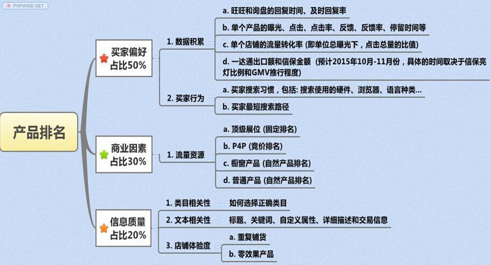

产品排名取决于三个重要的因素，即由买家偏好+商业因素+产品信息质量三者共同决定，且这三者在整个排名中，我在第三个篇章里面推断的是: 买家偏好占50%的权重，商业因素占比30%，产品信息质量占比20%。

为了证明这个假设的合理性，我就随机从后台列举一个三好产品，即买家偏好(产品的数据好)+商业因素好(橱窗和P4P资源)+文本信息好(买家搜索使用的关键词与产品文本信息的匹配度)，如下剪切图（1）所示(剪切路径为: 打开数据管家→我的产品→有效果产品→按月统计→选择橱窗→反馈从高到低排序): 

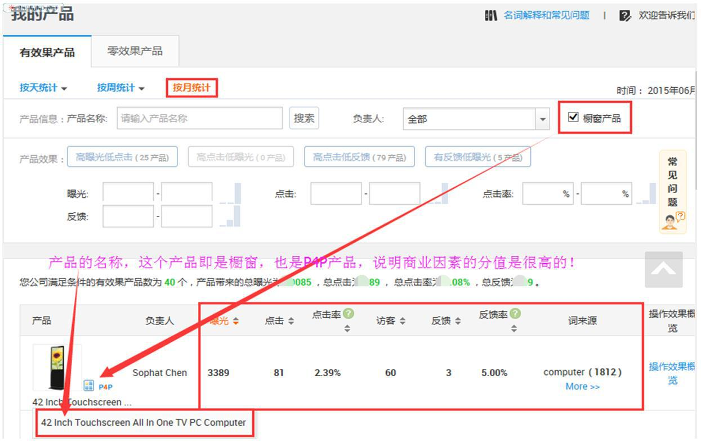

- 买家偏好所对应的：产品的曝光、点击、点击率、访客、反馈和反馈率都很好。 
- 商业因素: 这个产品所使用的流量为：即是橱窗，也是P4P推广产品。 
- 文本相关性：依次如下图:

    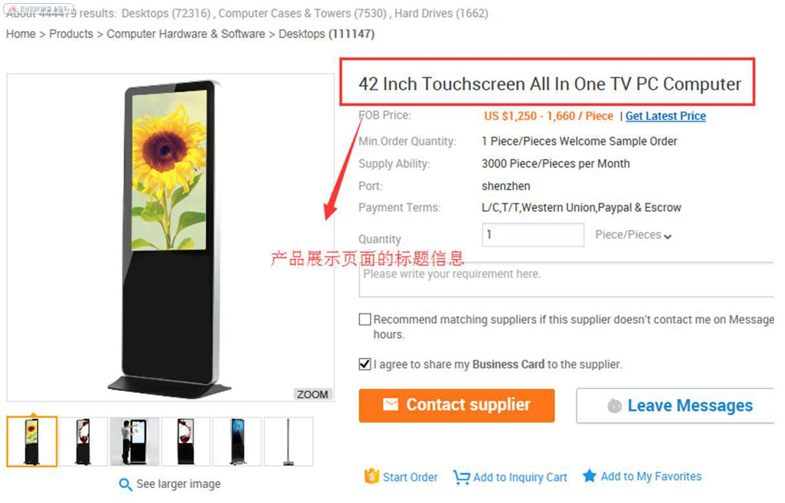

- 产品的名称为: 42 Inch Touchscreen All In One TV PC computer, 搜索引擎抓取的时候会优先匹配标题，很多关键词都隐藏在标题当中。 

    在文本信息出现与标题匹配的信息为红色框所示:

    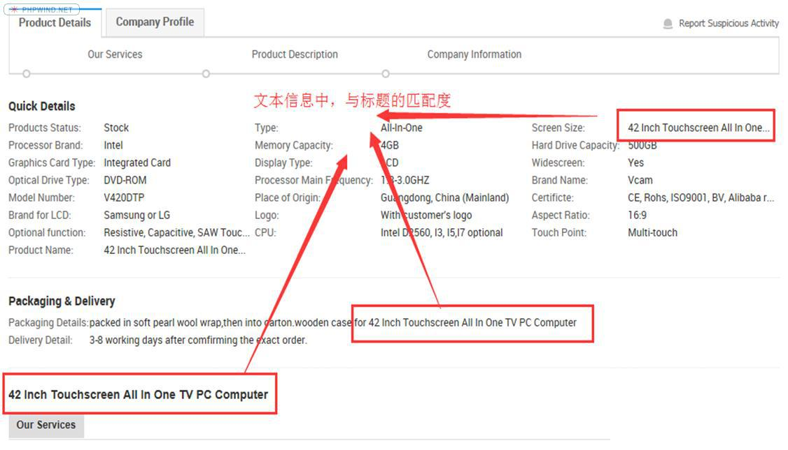

    在详细描述中与标题匹配：

    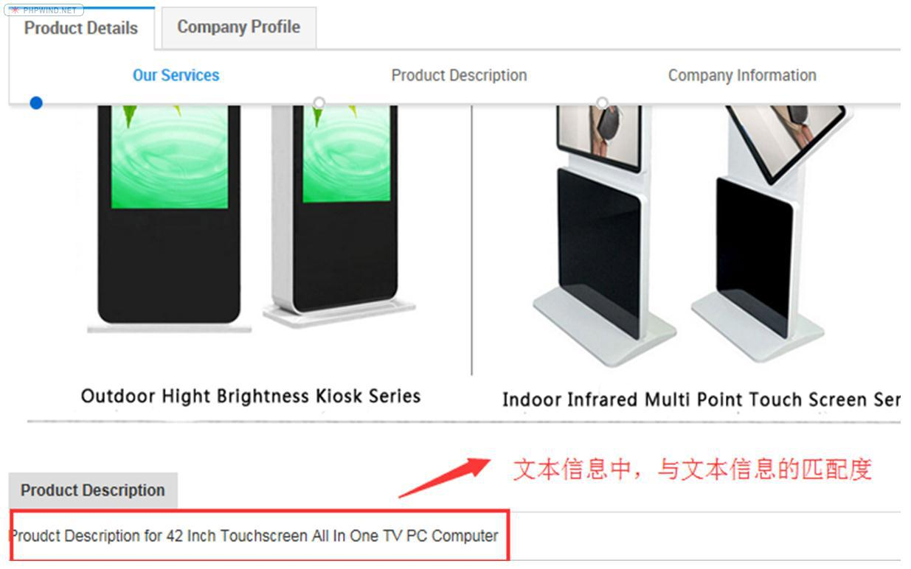

    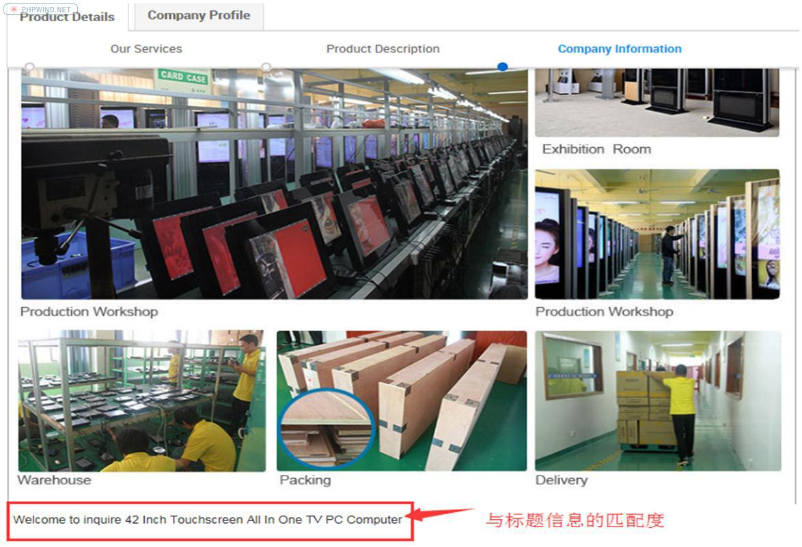

产品设置的三个关键词依次为(Keywords=k): 

- K1：All InOne TV PC Computer 
- K2：TVPC Computer 
- K3:  42 Inch PC Computer 

依次在alibaba.com首页去查找关键词的排名，排名显示为: 

- K1排名为首页自然排名第5名 
- K2排名为首页自然排名第5名 
- K3排名为首页自然排名第21名 

这还不足以说明这个产品的排名很好，产品设置的关键词，都是我们根据自己的想法设置，实际上，我们不可能知道买家是通过什么样的关键词找到我们产品的，但不管怎样，客户能找到这个产品，肯定是与标题中的词语离不开，所以我们现在以PC Computer为核心词语，用标题中的其他词语与核心词语搭配去搜索，看能否有对应的排名，随机选择的关键词如下，并查找排名为: 

- K4：PCComputer     首页自然排名第28名 
- K5：AllIn One PC Computer   首页自然排名第10名 
- K6：TouchscreenTV PC Computer 首页自然排名第10名 
- K7：42Inch Touchscreen PC Computer  首页自然排名第2名 
- K8：42 Inch TV PC Computer 首页自然排名第10名 

通过以上K4到K8的关键词验证得知，一个阿里搜索引擎所偏好的“三好”产品，即使只发布一个产品，这个产品也会覆盖很多关键词，即使没有在K1/K2/K3中设置，依然会被搜索引擎优先抓取而展示在买家面前。 

通过新规则的推导，也可以解决很多大家提出的疑问，比如: 

1. 为什么排名是实时变化的？ 

    买家偏好，是由数据积累和买家行为共同决定，数据积累是实时动态变化的一个过程，当对应产品的数据高于前面或者后面产品的时候，买家偏好所占的比重就会跟着变化，自然排名就在实时变化…. 

2. 为什么发布普通产品排名效果不好？ 

    发布普通产品的时候，尤其是很多有热度的词语，最多只能做到产品信息质量拿到20%的权重，买家偏好和商业因素的权重都很低，导致整个产品的权重分上不去，排名自然就上不去….. 

3. 为什么产品信息优化的很好，但就是没有排名？ 

    产品信息好，只表示信息质量拿到了20%的权重值，但缺少买家偏好和商业因素分值。 

4. 为什么新规则变化之后，后台数据急剧下降？ 

    新规则变化之前，很多产品是靠信息的优化排名上去的，这些有排名的产品，没有实实在在带来数据积累，只有30%的商业因素权重和20%的信息质量权重值，产品的总权重值上不去，排名就会下降……. 
总结：新规则变化之后，买家偏好的比重加大，这也是互联网的一个最大特征，以买家为导向，将贯穿整个平台的始终，正是这一点的变化，我们运营店铺的思维一定要改变，之前我们可以通过SEO的方式排名靠前，来获得较好的店铺数据和产品数据，当以买家为导向之后，SEO的作用已经被弱化，那如何快速提高店铺的效果呢？无疑是P4P投放，因为P4P可以迅速让产品的排名靠前，即店铺和产品获的流量数据(爆点反…)最快，即通过一定量的P4P投入，来给店铺和产品引流，让流量变成数据(曝光、点击、点击率、反馈、访客…等买家行为)，并最终转化成询盘。所以，2015年是一个节点，接下来将是一个流量为王的时代，流量的变现能力将是衡量一家店铺竞争力的重要指标！ 

## 信保

2014 年听过我分享的朋友，都应该记得我有讲到：__排名取决于产品和店铺的权重值，权重值又由很多权重因子构成__，从排名算法上，这条核心没什么变化，变化最大的是阿里巴巴B2B平台未来的战略方向发生了革命性的改变。大家也应该还记得，每次跟大家分享，我都会从平台的本质出发剖析B2B平台的本质: 在我们原本的原本的意识里，B2B还是一个在买家和卖家之间，以信息交易为主的平台，但是从2015年开始，这个以信息交易为主的平台开始过渡到以成交额为主的平台了，这就是我们每天都必须谈论的---信保 (Trade Assurance)。

阿里从2014年开始就在着手做一件非常有颠覆性的工作: 阿里要给所有的买家和卖家分级，所有经过阿里认证的买家，在发询盘的时候都会有一个蓝标的标志，而且阿里已将世界500强的企业和所有阿里系统活跃的买手全部锁定在认证系统里面，只要他们有采购需求，系统就会主动给卖家提示，这个就是买家的分级，那卖家分级呢？卖家分级就是通过信保的额度分级，信保额度越高，当买家搜索产品的时候，排名系统就会优先把这些信保额度高的卖家匹配给买家，在匹配这些信息的时候，信保额度的比重是相当大，所以，信保额度非常非常重要。因此，我要再次提醒大家，请没有亮灯的卖家一定尽快亮灯，—亮灯之后就会有对应的信保额度。

2014年底，阿里开始推信保，有同学会发现：有些信保额度高的账号，询盘就多，但有些信保额度低的，询盘就少了很多，甚至排名也下降了很多。

过去，中国海关记录了咱们企业出口产品的所有数字，这些数字能很好的反应当地政府的政绩，但对企业呢，也仅仅是一组数字而已，一达通要做的，就是要将所有的出口数字变成一组数据，再将这些数据变成企业的商业信用推送给买家，这个就是信保。信，就是阿里给卖家授信，让买家信任卖家；保，就是阿里让买家的利益得到保证，快速促成贸易。信保背后纯商业信用的体现，在纯商业信用的保证下，加速买家和卖家之间的快速匹配及成交，匹配机制是所有搜索系统里面的核心，当成交变成数据之后，数据又通过一定的算法转化成了商业信用，就这就是在互联网的背景下，通过商业信用来颠覆整个传统的贸易方式，这才是阿里平台的未来制高点。

整个阿里的排名规则，权重值由三个大的维度来决定，__第一个维度是: 买家偏好；第二维度是:商业因素；第三个维度是: 文本信息相关性。__而在买家偏好当中，数据积累和买家行为是核心，信保只是数据积累中的一个重要环节，这个权重因子会在2015年的11月份左右正式引入到搜索匹配规则当中。

当下，信保的权重因子还没未被引入，引入后的权重比例也未知，但有一点大家务必清楚: 阿里B2B现有所有的流量端口都在主推信保，在这个风口之上，信保一定会间接影响一定数量产品的搜索排序，甚至包括P4P产品的竞价高低。 

不妨模拟买家行为去思考一下: 如果我是一个真实的买家，由于阿里的各个流量端口都在主推信保，无论我从哪个端口访问阿里巴巴，关于信保的所有内容都会主动推送给我，我可能因为好奇而被动的去了解，但我一旦了解到 __信保对我的交期和质量有保证，而我又不需要有任何额外的成本产生__，那我肯定就有想法去通过信保去了解我所要搜索的产品和供应商，这个时候信保的额度就开始起引导作用，因为信保的额度数字太容易引起买家的注意了，此时，信保额度越高的卖家，卖家被我点击的几率就越高，只要卖家被点击，被点击的这个产品所产生的曝光、点击甚至反馈就开始对整个产品的产品排序就开始发生作用。 额度越高，我就越有安全感，所以是信保在引导买家的行为，这种行为进而改变了产品和店铺的数据，自然询盘和排名都会受到影响。 

See [2015阿里巴巴排名规则深度解读（一） -外贸名人堂- 阿里巴巴外贸圈外贸论坛](http://waimaoquan.alibaba.com/bbs/read-htm-tid-2113195-fid-309.html)

## 买家偏好

产品搜索排名的位置是实时发生变化，而且这种变化跟浏览器，跟客户所在的区域，跟买家的搜索习惯密切相关。

数据分析流程如下: 

1. 打开阿里后台，直接选择“数据管家”中的“我的产品”； 
2. 在我的产品模块中选择有效果产品，并选择按周统计； 
3. 在按周统计的数据列表中选择“反馈”这个功能，并点击反馈右边的第二个倒三角形，此时会出现很多有反馈的产品，这些产品有些有P4P的标志，有些没有这个标志，选择一个没有P4P标志的产品，直接用这个产品的标题中对应的某个关键词 (旁边有个词来源) alibaba.com 搜索；搜索结果就是: 这个产品的排名很好。 

    

    图中所示红色方框中的产品非P4P产品，也没有橱窗的标志，在alibaba.com中搜索 digital photo frame 这个关键词，有6个固定排名，5个P4P，自然排名排在第19位，亲爱的同学们，这只是一个普通产品哦，产品示例如下: 

    

4. 记住这个产品，再次打开后台，并看下橱窗中是否有设置这个产品，很奇怪的时候，这个产品并没有被设置成橱窗，但排名却非常好。

排名权重值中，买家偏好中的 _买家行为_ 对整个搜索排名的影响。买家偏好有两个重要的权重因子，一个是数据积累，一个是买家行为，今天我所讲到的就是买家行为的重要性。而在买家行为中，阿里巴巴搜索系统最看重的是买家搜索的路径，即: 买家是通过哪些途径找到卖家产品，以及最终给卖家发送的询盘，在所有的买家搜索过程中，阿里巴巴的搜索引擎会选出一条最短的买家搜索路径，一旦阿里的系统认定是最短搜索路径，这个路径下对应的某个产品(不管是橱窗、P4P或是普通产品)的排名就会很快排名靠前，橱窗和普通产品的表现方式就是排名靠前，对应的P4P产品星级就会上升，并最终达到竞价下降的效果。 

在整个阿里后台里面，我们能找到搜索路径的板块并不多，后台中，“知买家”中的“访客详情”就可以找到访客的访问路径，如图所示：

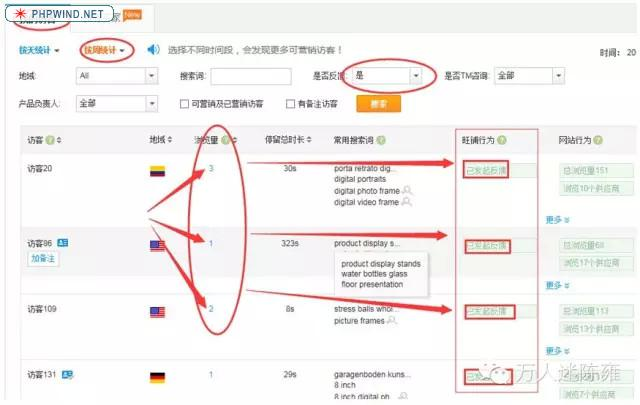

在都有反馈的前提下，浏览量越少，即表达买家越喜欢这个产品，在搜索引擎中的表达就是: 搜索路径最短，如果是普通产品，排名会越好，如果是P4P产品，所需要的竞价底价越低。 

今天我自己突然有个大胆的假设: 如果权重值由买家偏好、商业因素和文本相关性因素共同决定，那他们对应的比重值是多少呢？我的推想是:买家偏好占50%，商业因素占30%，文本相关性占20%。

See [2015年阿里巴巴排名规则深度解读(二) -外贸名人堂- 阿里巴巴外贸圈外贸论坛](http://waimaoquan.alibaba.com/bbs/read-htm-tid-2163196-fid-309.html)

### 买家行为

对于阿里平台本身来说，它是希望买家能在平台里面找到自己所需要的信息，但这些供应商的能力是参差不齐的。如果优质的供应商能排在首页，满足买家的需求的概率就会大很多，但平台本身是无法辨别出供应商的好坏，此时，必须要借助买家行为来判断。买家行为又通过什么样的方式来体现呢？就是数据。买家的行为可以直接通过曝光、点击和反馈的次数，以及买家在产品页面或者旺铺页面停留的时间等各种数据综合反应出来。即数据越好，买家可能会越喜欢，所以阿里的系统能根据综合数据，快速选出哪些供应商是买家所需要的优质供应商，最后通过搜索排名的先后展现在买家面前。 

当一个买家开始浏览一个页面的时候，买家浏览的页面搜索使用的关键词、以及产生的曝光、点击、反馈、点击率、反馈率….所有这些数据都会被系统所记录， 这些数据就能很好的去反应买家对其所浏览的页面偏好，在某种程度上，数据越好，反映出买家对浏览页面越偏好，从而平台的系统能迅速识别出那些产品页面好，哪些店铺好。 

为了能更好的留住潜在的买家，于是阿里的系统就会通过数据搜索算法的方式，通过自然排名或者商业因素(P4P)的方式，以最低的成本将这些优质的产品或者店铺排在首页，去服务好那些潜在的买家(当然这只是相对的，因为整个平台上的供应商，信息质量都不好，相当于矮子当中挑高个子来服务好买家)，只有这样，整个平台的用户体量才能做的更大。

其逻辑关系是: 用户变成流量，流量在网络平台里面通过买家行为，以数据的方式沉淀在店铺和产品里面，这些数据就变成衡量卖家好坏的重要指标，这些指标决定着产品的排名和P4P的出价高低，进而决定我们询盘数量的多少，并最终影响店铺的投入和产出比。实际上就是一个逻辑闭环: 流量变成数据—数据变成权重值—权重值改变排名—排名又影响流量。简单地说就是：流量-数据-权重-排名。 

当明白这个逻辑关系后，就不难理解，P4P产品的竞价底价是越做越低的，这也是为什么同一个关键词在不同的主账号中，P4P的竞价底价都不一样，以及同一个关键词在指向不同产品做P4P推广时，即使都是5星产品，他们的竞价底价都不一样。 

## 数据积累

在做数据对比之前，先给大家讲解一下三个账号的背景，我自己的行业属于电子类，具体的产品是液晶广告显示屏，为了让业务员有更多的询盘，我陆续对这个产品投入了3个主账号。

1. 第一个主账号已经有七年的年限，每年的投资方案分别是: 金品诚企 (69800元/年) +P4P (投放金额为2万/月)；如图所示-6年推广的关键词的数量为3474个。(注：金品诚企的价格有年限差异，年限≥5年为69800元/年；<5年为80000元/年)

    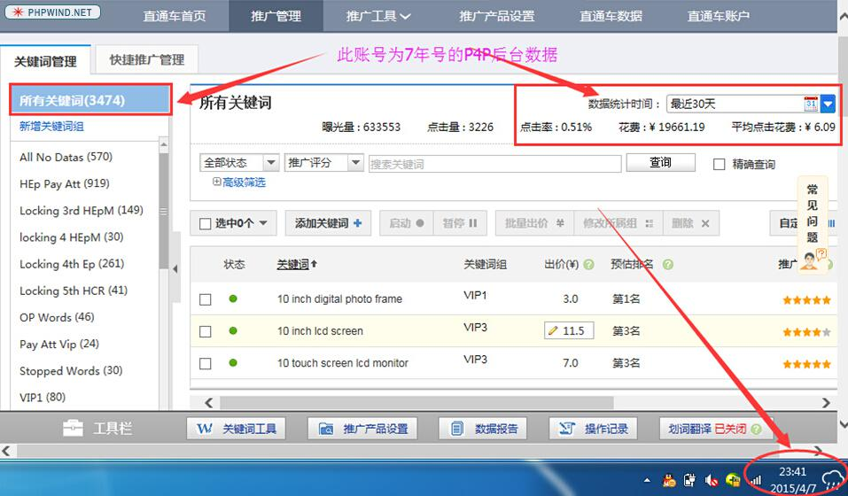

2. 第二个账号是3年的年限，每年的投资方案是: 基础方案(29800元/年)+P4P (投放金额为: +2万/月); 如图所示-关键词的个数为5918个，最近30天的P4P的投放金额为:21211.6元。

    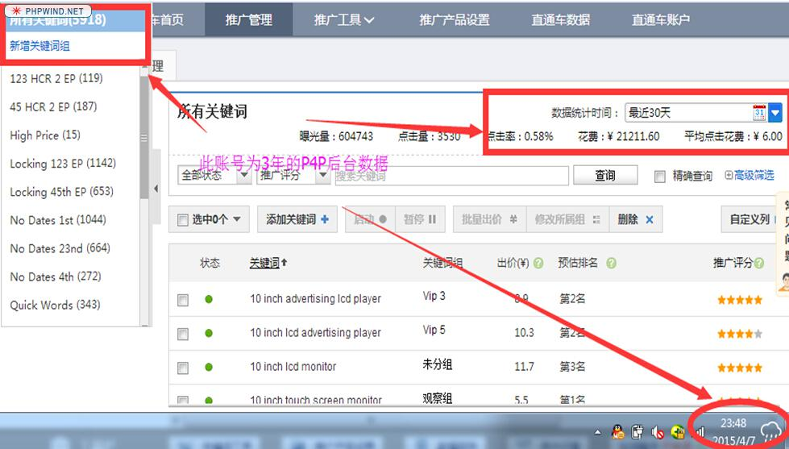

3. 第三个账号是2年的年限，每年的投资方案是: 基础方案(29800元/年)+P4P (投放金额为: +9000元/月)，如图所示，关键词的数量为208个，最近30天的投放金额是:

    选择 digital photo frame 这个词为例，在行业里面有两家供应商已经买了固定排名。

    

现在我要做这样一个数据对比：现将 digital photo 
frame 这个热门的关键词分别拿到我所介绍的三个不同的P4P账号里面，来检验一下各自的竞价有何特点？

1. 2 年号的P4P的竞价底价:

    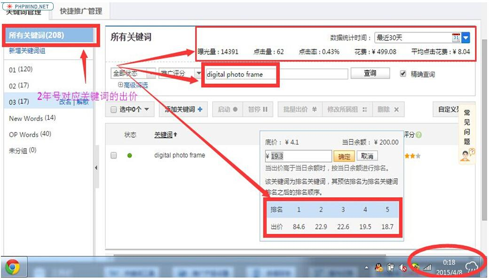

    2年号: Digital Photo Frame最近30天的数据为: 

    曝光-14391；点击量-62，点击率-0.43%，平均单价为：8.04元，对应的竞价分别为:

    1. 第一名: 84.6
    1. 第二名: 22.9
    1. 第三名: 22.6
    1. 第四名: 19.5
    1. 第五名: 18.7

2. 3年号的P4P的竞价底价:

    

    3年号：Digital Photo Frame最近30天的数据为: 

    曝光-10084；点击量-148，点击率-1.47%，平均单价为：5.52元，对应的竞价分别为:

    1. 第一名: 37.9
    1. 第二名: 10.2
    1. 第三名: 8.8
    1. 第四名: 8.4
    1. 第五名: 6.6

3. 7年号的P4P的竞价底价:

    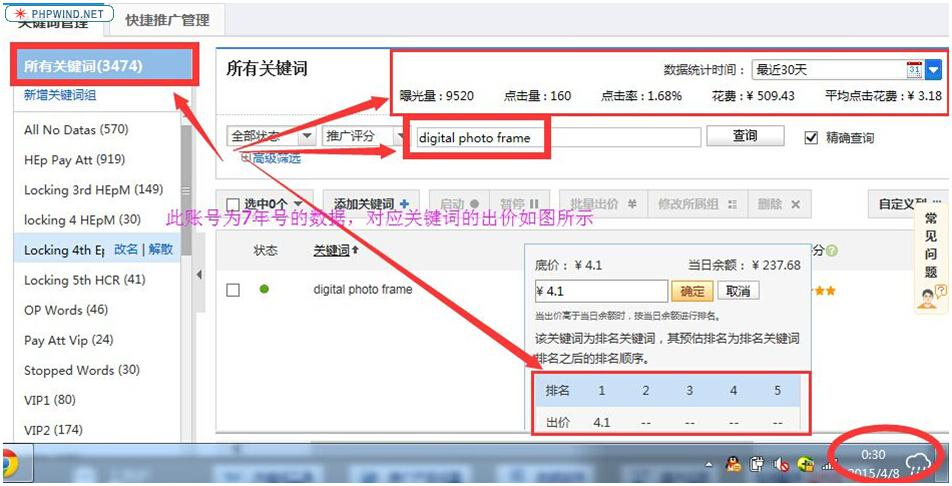

    7年号：Digital 
    Photo Frame最近30天的数据为: 曝光-9520；点击量-160，点击率-1.68%，平均单价为：3.18元，对应的竞价分别为:

    + 第一名: 4.1
    + 第二名: 0
    + 第三名: 0
    + 第四名: 0
    + 第五名: 0

同一个关键词，7年号的第一名只要4.1元，没有任何竞争对手可以与之匹配，但2年的第一名却要84.6元，足足相差21倍，即使是第5名，也相差4.5倍的出价。这三个账号完全可以看成是同一个行业的三个不同的供应商----也就是我们的同行，原来同行与同行在竞争出价的时候，我们每个店铺的竞价底价都是不一样的

把对应的数据放在一起，请大家看以下三张数据剪切图:

  
  

通过如上三个图的数据对比可知：__P4P平均点击单价的高低取决于点击率高低，点击率越高，所需要花费的单价越低，反之越高。__

依次点击打开数据管家中---我的产品---按月统计---反馈

1. 如7年号的剪切图所示:

    

2. 3年号剪切图所示:

    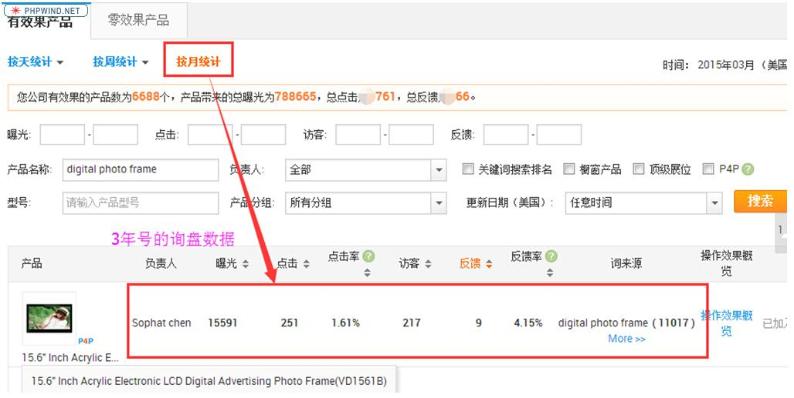

3. 2年号剪切图所示:

      

通过以上数据再次对比发现：

1. 账号年限(在运营好店铺的前提下)和对应的询盘数量是成正比的，年限越长，数据越好(数据指的是点击率、点击量…)，询盘就越多，对应的P4P点击单价就越低。
2. 询盘越多的产品，则对应该产品在做P4P推广的时候，关键词所对应的竞价底价越低。

综上所述，可以总结出: 同一行业中店铺与店铺，和同一店铺中产品与产品有着很大的差异性，这些差异性很大程度上，取决于店铺和产品的数据积累（这些数据积累决定着卖家在这个平台当中的投入和产出比），在阿里巴巴B2B平台里面，这些积累的数据更直观的反应出买家在搜索过程中的行为表现，这些行为表现实际反应的就是买家的搜索偏好。

__其中的逻辑关系是: __

买家在平台中进行产品需求搜索--便产生曝光、点击、停留时间、点击率、询盘数量和对应产品的反馈率等一系列的数据，这些数据平台会全部记录下来。在曝光一样的情况下，系统就会对比点击量；在点击量一样的情况下，就对比点击率；在点击率一样的情况下，就对比反馈率；在反馈率一样的前提下，就对比询盘的数量。这是由平台的性质决定了必须以询盘结果为导向(在平台原理中，我反复强调: B2B目前是信息平台，信保的出现，表示这个信息平台正在向交易平台转变，以后很可能就是一个交易平台，当变成交易平台，就会以成交量为结果导向)。

当这些数据的比值出来之后，买家搜索最短路径就非常容易辨别，此时阿里的搜索引擎和对应的P4P的出价系统便立刻开始通过价格高低的形式来差异化供应商的店铺权重值和产品权重，这个时候自然排名和P4P的竞价排名就开始及时变化，变化的准则是：让优质的卖家优先与买家匹配。

具体的表现形式为: 让买家偏好高的产品或者店铺优先排名靠前，也就是说即使是数据很好的普通产品，也要比橱窗的排名要靠前多。这就是为什么当新规则实施后，很多店铺的橱窗排名下降了，而很多普通产品却排在了首页的前面位置，大家不妨去验证一下，这些排名很好的普通产品，在后台所对应的数据一定会很好(新规则解读第二个篇章中已做解读) 
，如果是P4P产品，P4P出价系统就会主动让那些数据好的产品，通过更低的价格，甚至是低价获得第一名的排名位置，此时这些排名好的产品便会进入一个良性的循环，形成马太效应: 低价获得好位置，好位置带来更多的流量，流量又能转化成数据(曝光、点击、点击率…..)沉淀在店铺和产品中, 
数据越好，越是能反映出买家的偏好，直至循环到通过低价就能排名第一(这一点我会在平台原理的课程中讲解透彻)。

数据积累中的数据指的是:

1. 单个产品的曝光、点击、点击率、停留时间、反馈率和询盘数量；
2. 整个店铺的曝光、点击和询盘的反馈总量；
3. 整个店铺的流量转化率: 总的曝光到总的点击的转化率；
4. 询盘和旺旺信息的及时回复率；

See [【超级干货】2015年阿里巴巴排名规则深度解读(三) -外贸名人堂- 阿里巴巴外贸圈外贸论坛](http://waimaoquan.alibaba.com/bbs/read-htm-tid-2265162-1-fid-309.html)

## 商业因素

一共有如下五种资源是我们要通过商业方式去购买的, 依次分别是: 顶级展位，固定排名，P4P产品、橱窗产品和金品诚企。就是这些商业化的资源，间接影响了我们店铺和产品的数据。

其中的原理就是: 

平台通过商业因素改变产品和店铺的排名，让买家去选择这些产品，即买家偏好会通过数据闭环(曝光、点击、点击率、反馈、反馈率、最短搜索路径等因素)，最终以询盘结果为导向去影响自然产品的排名和P4P的竞价高低，这就是30%的商业因素对产品和店铺的影响。

我再通过时间维度去介绍这些商业性的产品，分析下他们与平台操作之间的某种逻辑关系：

1. 首先，阿里巴巴在1999成立之初，全球宝里面就有橱窗资源，根据企业的不同实力，可以选购固定排名；
2. 其次，2010年11月底，在广东试点P4P(直通车-竞价排名)；
3. 再次，2011年10月，推出金品诚企，金品的三个核心价值是: 40橱窗+2分钟的视频拍摄+一份第三方认证报告；
4. 最后，是2014年4月，宣布取消固定排名，同年6月推出顶级展位，8月正式上线。

以上就是阿里巴巴的几个商业产品依次推出的时间段，今天我想给大家总结出，随着这些产品的推出，我们曾有过以及即将有哪些时间机会窗口。大家对比一下，这些机会窗口，我们都把握住了吗？！

1. 1999--2005年: 阿里巴巴成立于1999年，在初期，国际站B2B是唯一的产品。2003年有了淘宝， 2005又收购了雅虎中国，我把收购雅虎中国视为一个时间节点，原因在于2005年之前，B2B和淘宝平台，都没有一个完善的搜索匹配技术，即两个平台不能精确地在买家和卖家之间通过搜索达到高效匹配的原则。但还是得益于互联网刚开始快速发展，以及整个国际商业环境，都处于卖方市场，所以1999年到2005年之间，__只要是阿里国际站的会员，不管是付费，还是免费，供应商都能接到很多订单，付费会员的订单量会更多__。

2. 2005 --2007年: 淘宝和国际站引入雅虎的搜索技术后，国际的付费会员和免费会员出现分水岭，通过搜索技术，平台能快速将那些付费的会员排名在首页，所以付费会员的订单量会更多，即使从不操作后台，都会收到询盘，然后这些询盘很快就能转化成订单；免费会员的订单开始急剧减少，只能接到少量的订单，因为平台限制了免费平台在搜索排名中的展示机会，导致的结果就是询盘更少。所以2005年-2007年期间，__只要是阿里的付费会员，账号在7年之上，且大量使用固定排名资源的企业，他们一定赚得盆满钵满__！

3. 2007--2011年:搜索技术已经在阿里平台应用得非常成熟，并在2010年底推出P4P竞价排名。然而在2008年爆发全球经融危机——这是一个由卖方市场向买方市场转变的标志，这期间，__只要是阿里的付费会员，即使是19800元的方案，并懂一点平台排名的SEO技术，哪怕SEO的技术就是每天多发一些产品，你的询盘都会比你的同行多得多__。但2007年--2011年之间，真正懂这一点的人，真的不多，所以只要做到这一点的个人或者企业，也是闷声赚大钱，陈老师就是一个非常典型的案例。

    我06年毕业，07年12月才开始接触阿里平台，07年大年三十的晚上，一个人在深圳过年，实在是无聊得没办法了，就在阿里后台靠子账号发布产品，一个晚上能收到122条询盘。看到商机后，08年8月开始创业，09年7月就有了自己的工厂，2012年就已经初具规模，然后就顺理成章得有了现在的样子；相反，对这个平台，不做任何规划和操作的话，那就很可能订单不饱和，甚至人工成本都收不回，所以这期间的机会窗口就是:懂一点平台操作技巧，订单更多，付费会员有订单，免费会员基本接不到订单。

4. 2011--2014年：2011年是另一个节点，为什么这样说呢？2010年10月底，阿里推出了P4P竞价；2011年阿里开始在全国推商圈和橙功营；2011年4月我自己开始对外分享，2011年年底阿里推出金品等等，在阿里的大力推动下，网商生态蓬勃发展，学习分享的风潮更甚， 2012年又开启全国各地的寻梦之旅。正是这股风潮让我从后台走到讲台，开始给全国各地的网商分享精细化运营和后台数据分析，中小外贸企业老板和能吃苦爱学习的外贸人对平台的钻研和热衷达到了野蛮式的发展程度；但是大家听再多的分享都抵挡不住新变化的大势: __光靠发布普通产品和SEO的效果开始越来越差，倒是橱窗和P4P的资源开始越来越好用__。

    好的时候，一个橱窗可以10个关键词都排在首页，P4P就更不在话下。在2012年业绩最高峰的时候，我的3个主账号一共有270个橱窗；在2013年7月，我开始把我后台的产品数量从13万个删除到只有4500多个。当产品减少的时候，询盘数量和质量却不断提高， 2013年的全年销售比2012年多，2014年又比2013年高出500多万人民币。所以我胆敢总结出: 在2011年--2014年之间，只 __要懂阿里平台优化技巧，合理的多投入一点橱窗和P4P，即能充分利用排名资源的付费会员，订单会更多，有部分付费会员开始接不到充足的订单，免费会员完全接不到订单__。

5. 2015--2017年:一到2015年，很多同学，就更急了，急的原因是完全摸不着阿里的规则了，而且原有的排名变得一塌糊涂。甚至在我发布第一篇新规则解读的文章之后，有同学义愤填膺留言: 陈老师，你的文章通篇都在写信保，根本就看不到什么新规则！还好有另外一个同学在后面又补充到:不管什么时候，一定要学会借势！

    我非常认可这个同学的这句话，古曰“商场如战场”，今有“风借火势，火借风威”。既然，我们要做阿里巴巴这个平台，就要看得懂它的出牌规则，就要按照他的规则去借势，对于中国的中小微企业来说，“接更多的订单、赚更多的钱、养活更多的员工”才是王道，这样的企业才是“道德的”，这也是我们要在这个平台上做生意的初衷！所以，对于企业在阿里平台2015年—2017年之间的生存规则，我的预测如下:

    1. 能专业运营店铺：专业的运营人员、店铺运营方案的投入产出比；
    2. 充分利用流量资源: 高效使用P4P (竞价越用越低) 和橱窗资源；
    3. 具备一定信保额度，并能熟练的运用信保接订单，信保额度越高，在P4P的高效引流作用下，订单会更多；
    4. 品牌和供应链体系开始影响订单的多与少；
    5. 供应商一定要养成淘客户的习惯，即: 从众多客户中挑选出优质的客户，并慢慢培养成我们的大客户；过去等待大客户的时代已经不存在，尤其是小公司接到大订单，肯定性会随着时间推移慢慢变小；
    6. 2016年年底，免费的会员，但能专业运营店铺，并能在国际B2B平台，快速通过信保转化流量的微型企业、会快速崛起。

6. 2017--2020年: 在2012年底，阿里B2B网站的总负责人在给马总汇报时就谈到，未来3-5年，B2B国际总体规划里面，就已经把信保视为了唯一的支点，来撬动整个全球的出口贸易，所以信保是不可逆的，在这个前提下，我预测出，要想保证2017年到2020年之间的业务会一直保留较好的发展态势，至少需要做到如下几点:

    1. 有较高的信保的额度和较好的诚信体系；
    2. 有好的供应链及品牌优势, 好的供应链是指: 新产品的开发、创新、产品个性化需求程度、价格、质量、交货期等，在加上自己的品牌优势；
    3. 专业运营店铺是最基本的要求，快速转化平台流量才是王道；
    4. 老客户的数量——老客户的多少，直接决定着公司未来发展是否可持续。

通过上述的解读，请大家一定要在正确的时间窗口做正确的事情，否则会事倍功半。就像现在: 如果一拿到店铺，就开始让业务员或者一个新来的员工开始大量发布产品，这肯定是错误的，往往大多数的同学，都是这样在操作，结果不用说，肯定不会好；或者我们只做一个29800的方案，然后请2-3个人来操作店铺，这也是不科学的。3个人也是成本，为什么不要一个专业的人操作后台，然后另外两个人的成本直接用来投P4P买流量，既好管理，效果来得又快！

运营好一个店铺，实际上很简单，最为核心的因素:

1. 首先，一定要有专业的人或者团队来操作店铺，且这个人或者团队一定要非常了解我们的产品、了解我们的客户、了解我们的目标市场…
2. 其次，是我们愿意和能够投入少钱去买流量(流量即客户，通过曝光、点击和反馈的形式存在), 最后将流量转化成订单。29800元只代表我们在万达广场有一个门面，但这个门面需要装修(这个是投入)，需要展示产品(这个也是投入)，然后是通过广告(这个也是投入)的形式引流，最后有客户来了，就必须要请两个客服人员来接待客户并转化成订单。

    这是一个互联网快速发展的的时代，物质非常丰富，不缺钱，缺的是客户的体验度和精神上的认可度，所以客服人员一定要专业和敬业；线下如此，线上更亦如此，所以阿里B2B变了，不管是买家偏好，还是商业因素，归结于一点:都是以用户为主，在阿里平台里面，没有买家这个引线，平台和卖家都走不远；如果买家满意了，平台就有流量，卖家就有客户。

    所以，作为商家的我们，我们必须快速提高并不断优化企业的电子商务能力。因为阿里的发展方向我们改变不了，阿里代表着的是源源不断的潜在客户，更多的时候，我们只能不断地去适应，在适应的过程中，去影响买家，阿里的规则会一直变下去，而且还是以买家变化为主，武功练到最后，就是无招胜有招！写了这么多，我真心希望大家能从文章中找出能回去执行落地的点，并坚持做下去！

3. 最后，还是给大家做个推断, 且这个推断会解开大家心中的很多疑惑，2015年之前，阿里权重值有三大影响因素: 买家偏好+商业因素+文本信息相关性。变化之前的比重是: 20%买家偏好+30%商业因素+50%的文本信息，以信息为核心的平台特征；变化之后的比重是: 50%的买家偏好+30%商业因素+20%的文本信息。这样说吧, 变化的最大特征是: 弱化了文本信息的SEO的权重，强化了买家的权重，这样做的目的，或许是为了给信保体系做铺垫，即让更多的买家愿意直接在平台上面成交订单，形成以产品的成交量为核心的平台特征。以上观点仅代表我的个人推断，欢迎大家一起探讨和追溯！

## 阿里流量

先从第一个问题开始切入，阿里巴巴B2B平台的流量来自于哪些渠道？我归结为如下四个大的渠道：第一个渠道，是直接输入alibaba.com进行访问；第二个渠道，是阿里巴巴参加全球的各种大型的线下展会，让买家主动去了解阿里巴巴B2B平台；第三个渠道，是搜索引擎引流；第四个渠道，是各种社交媒体的引流。接下来，我逐个分析一下这四个渠道。 

通过流量的来源渠道综合分析，我们一定要改变对待询盘的态度。之前，绝大部分买家通过PC端给我们发送询盘，所以询盘的内容和资料都比较全，询盘质量的高低很容易鉴别；但随着移动互联的发展，很多买家开始通过手机端来找买家，手机端的优势就是方便快捷，但不足之处是内容不能写太多，所以很多通过移动端过来的询盘，询盘内容很简单，我们的业务员一看，就觉得质量不高，然后随便处理一下，可能在不经意间导致潜在优质客户流失。在此，我提醒大家：优质客户有一部分是自然存在的，另一部分是卖家培养出来的。之前是等待优质询盘和买家，现在一定用“淘”客户的思维去对待这些询盘，从众多询盘中淘出优质的买家；如果是小买家，我们一定要学会去培养买家，这种方式成长起来的客户一定是粘度很高的客户。 

See [2015年阿里巴巴排名规则深度解读(五) -外贸名人堂- 阿里巴巴外贸圈外贸论坛](http://waimaoquan.alibaba.com/bbs/read-htm-tid-2314563-fid-309.html)

### 直接访问 alibaba.com

随着互联网和移动终端设备的快速发展，由单一的PC端直接访问alibaba.com，演变成与移动终端设备两分天下的局面。据有关数据显示，截止目前，在直接访问阿里平台的所有流量里面，PC和移动端各占50%，而移动端流量的比重还在不断上升。 

在50%的PC端口，又细化成如下小的渠道: 

1. 搜索结果页面、产品详细展示页面、询盘页面、旺铺页面、RFQ等各个小的搜索结果页面，这些界面都是买家最终到达的页面； 
2. 买家端的后台页面 (MA=My Alibaba): 这个界面应该与供应商的页面有些类似，只要是在阿里平台里面注册的买家，都会有一个自己的My Alibaba平台界面，很多买家每天都通过这个端口进入到alibaba.com的搜索界面； 
3. 阿里系统每天给所有在阿里平台里面注册的买家和卖家推送邮件信息，很多买家会通过这个链接直接返回到alibaba.com的界面； 

在50%的移动端口中，又细化成如下两个的渠道: 

1. 无线买家APP端口, 阿里开发了App，只要买家在手机上安装，买家可以通过该App在手机直接访问alibaba.com平台，进行产品的搜索； 
2. 手机端浏览器，阿里也开发了属于自己的浏览器，只要买家使用对应的浏览器，买家就会在浏览器的引导下，主动进入到 alibaba.com 的搜索页面。 

### 线下展会及地方报刊

阿里巴巴每年都会定期参加全球各种大型的线下展会，让买家主动去了解阿里巴巴B2B平台，这些买家会直接通过输入alibaba.com进入搜索页面；其次阿里巴巴很会“来事”，作为舆论的宠儿，时常能轻易赢得媒体的亲睐，各大报刊和媒体就会变成阿里平台推荐的免费通道。就像2014年9月19日，阿里赴美IPO的时候，全球的报纸都在刊登阿里巴巴的故事，那一天整个平台的流量暴增，举个例子：平时我的P4P只要投放500元就够了，但是那一天却花费了2000元。 

### 搜索引擎优化

这些搜索引擎包括: Google、Yahoo，Bing，MSN，以及各种本地化的搜索引擎。在阿里的公司内部，有一个SEO技术团队，他们每天都会通过免费和付费的方式在这些搜索引擎里面优化alibaba.com这个平台的链接地址去引流，这些流量会直接进入到产品详细页面，或者旺铺页面，或者RFQ页面等，这些链接地址很多都是卖家发布的产品。 

### 各种社交媒体的优化推广

这些社交媒体包括Facebook、LinkedIN、Twitter、Block等社交媒体，阿里的技术团队会定期通过免费或者付费的方式去这些社交媒体里面引流。

## 产品数据对P4P星级和竞价底价的影响

See [2015阿里巴巴排名规则深度解读（六） -外贸名人堂- 阿里巴巴外贸圈外贸论坛](http://waimaoquan.alibaba.com/bbs/read-htm-tid-2415889-fid-309.html)

我认为P4P产品推广里面的关键词和产品的星级，取决于如下三点: 

1. 正确的类目；
2. 推广关键词与推广产品标题的匹配度；
3. 推广产品本身的数据。

### 如何选择正确的类目

输入发布产品所需要的核心关键词，弹出对应的类目，依次点开对应的类目，并查看其属性。 

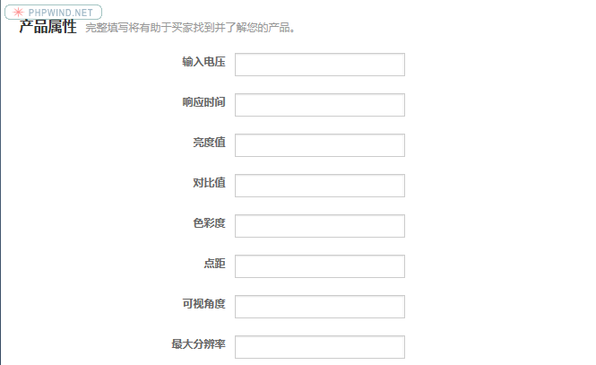

根据对产品属性的了解，依次查看对应的类目，选择与产品属性最匹配的类目发布产品。 

### 推广关键词与推广产品标题的匹配度

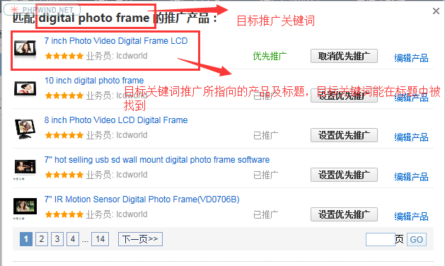

 所推广的关键词和产品的星级，最直接的因素就是目标推广关键词与推广产品标题的匹配度，如果不匹配，就是3星以下，如果是匹配，至少是三星级，如果这个产品之前有数据，那可能就会立刻变成5星级。 

总结: 标题是搜索引擎抓取的第一要素，必须要确保所推广的关键词与产品标题的匹配度。 

### 被推广产品本身的数据

在后台点击数据管家---点击我的产品---点击有效果产品----点击按月统计---点击反馈，从高到低排序，如下图中红色框框所示所示，该产品的数据是所有产品里面最好的。

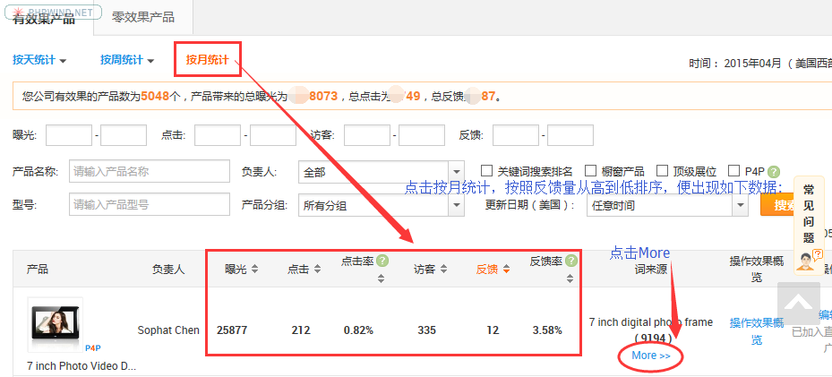

如下图，选择词来源，并点击 More，会弹出红色框框中的关键词以及对应的曝光和点击，红色框框中的两个关键词为: 7 inch digital photo Frame 和 digital photo Frame，这两个词语所对应的数据都非常好！

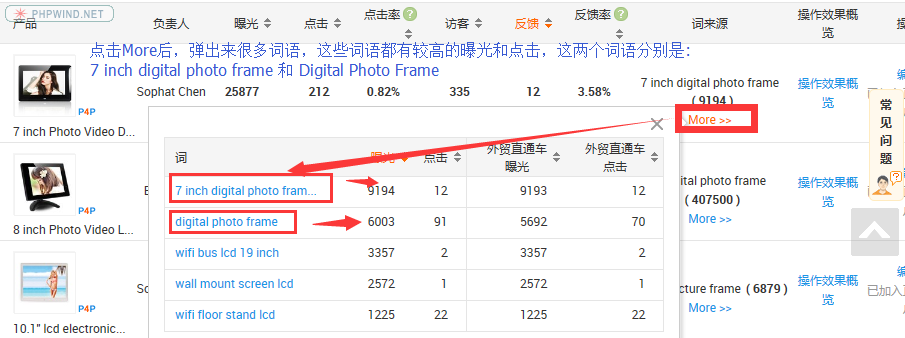

为了验证数据对该关键词竞价底价的影响，分别将两个词语 7 inch digital photo frame 和 digital photo frame, 拿到七年号和三年号的P4P后台里面搜索，如图3所示: 在下午18.09分的时刻，该关键词的竞价底价为3.7元，而且没有同级别的供应商与之竞价: 

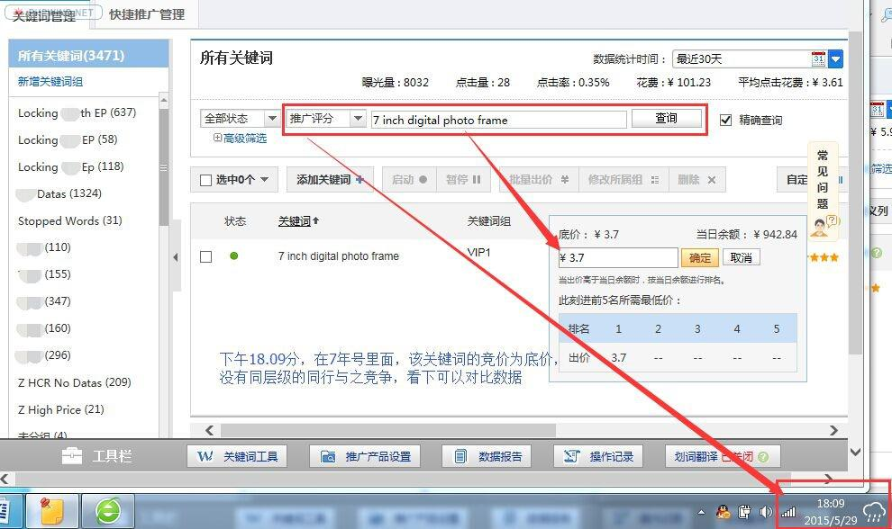

总结: 数据高的产品，分别对应的关键词在P4P的出价过程中，竞价是很低的！

接着，在把同样的词语拿到3年号的P4P后台里面去搜索，如图4所示: 发现在18.02分的时候，同样的关键词，竞价底价却截然不同，而且同级别的同行有很多都在竞价: 

接着，在把同样的词语拿到3年号的P4P后台里面去搜索，如图4所示: 发现在18.02分的时候，同样的关键词，竞价底价却截然不同，而且同级别的同行有很多都在竞价: 

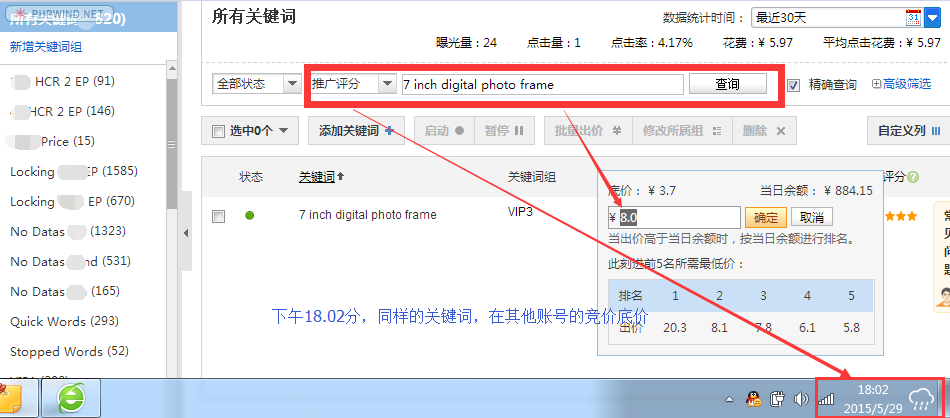

总结: 如果没有数据做支撑，同行与同行之间的竞价差异非常大，即投入产出截然不一样；

在把digital photo frame拿到7年号里面搜索，在下午18.12分的时候，该关键词在竞价中为底价，而且没有同级别的同行与之竞价，如图5所示 

总结: 数据高的产品，分别对应的关键词在P4P的出价过程中，竞价是很低的！ 

把同样的关键词拿到3年号中查看，在下午18.07分的时刻，该关键词的竞底价，如图5所示，有很多同级别的同行与之竞争，而且价格相当高: 

总结: 由以上5张剪切图的数据告诉我们，如果一个产品的数据很好(数据代表买家偏好)，这个产品在参与P4P竞价时，这个产品标题中所包含的关键词(推广关键词)的竞价底价都很低，即: 阿里平台通过商业的手段，将优质的产品和供应商，通过最低的成本，让他们展示在首页，去引流并服务好潜在的买家！ 

为了更加清晰的阐述数据、星级和出价的关系，请看如下四张图: 

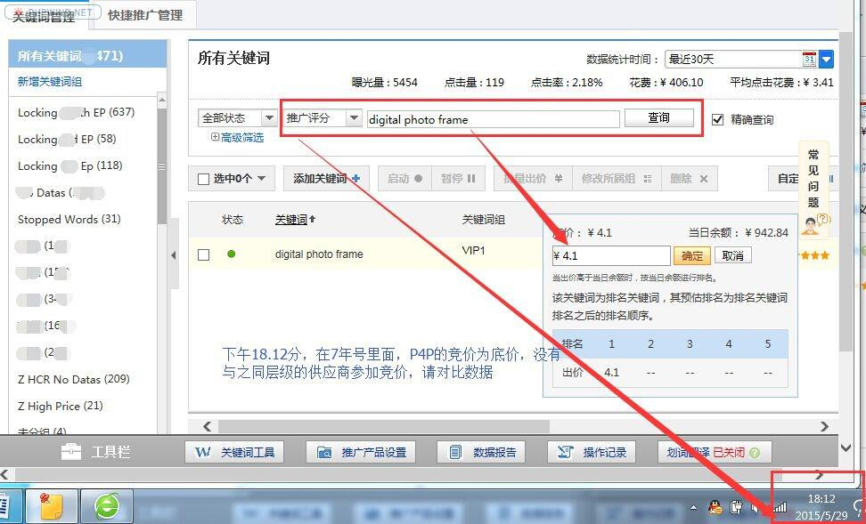

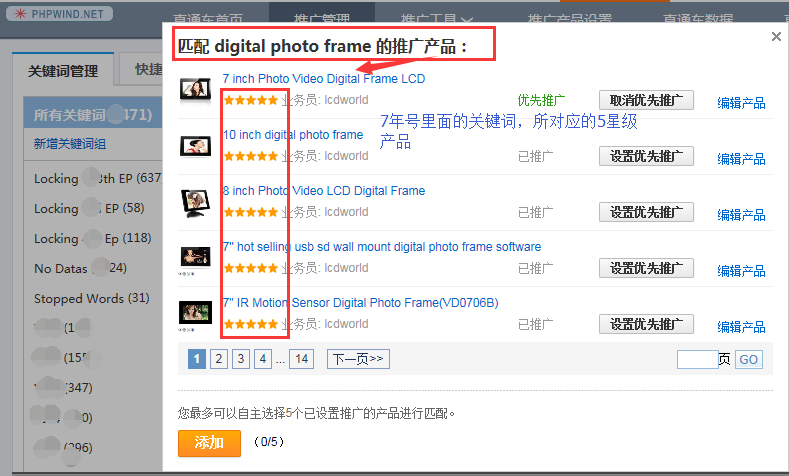

该数据为七年号的P4P推广关键词的竞价及对应的推广产品，该推广关键词所指向的产品，均为5星级，优先推广的5星级产品所对应的关键词竞价为底价: 

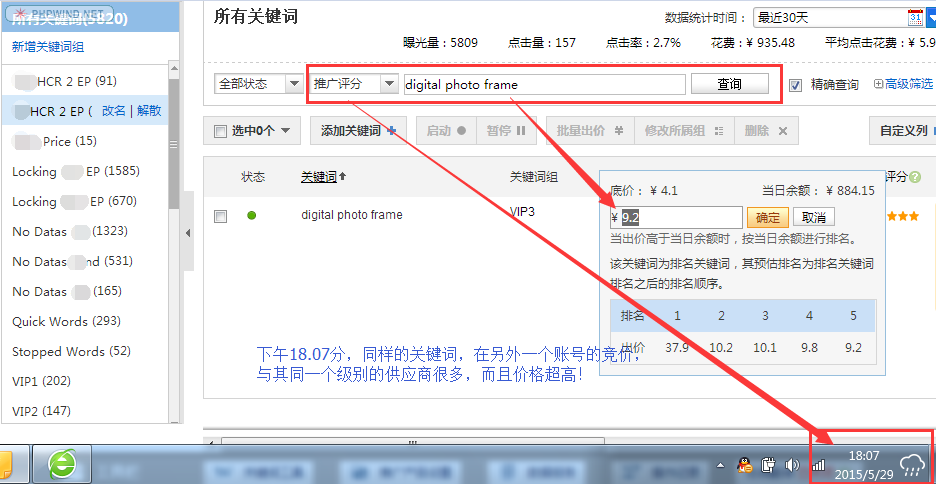

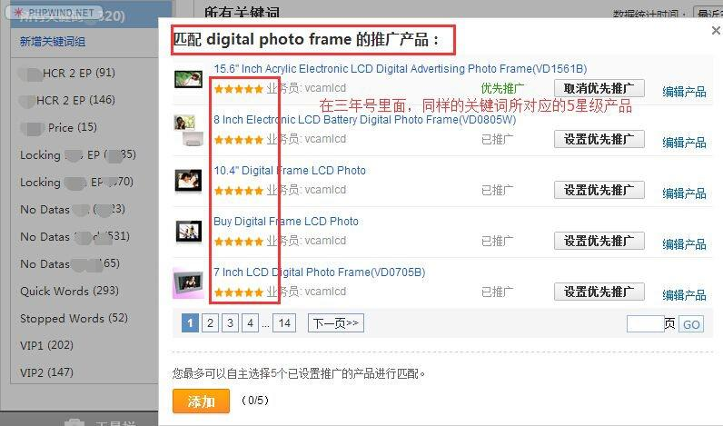

该数据为三年号的P4P推广关键词的竞价及对应的推广产品，该推广关键词所指向的产品，均为5星级，优先推广的5星级产品所对应的关键词竞价第一名要37.9元，第5名要9.2元，竞价是7年号的2倍多； 

总结: 在同一个账号或者不同的主账号中，即使关键词指向的产品均为5星级产品，它们各自的竞价底价仍然不一样，数据越好的5星级产品，竞价底价越低，反之亦然；也就说: 产品的数据才是决定产品竞价底价高低的关键词因素，因为数据代表着买家偏好； 

## 文本信息

See [2015年阿里巴巴排名规则解读(七) -外贸名人堂- 阿里巴巴外贸圈外贸论坛](http://waimaoquan.alibaba.com/bbs/read-htm-tid-2436468-fid-309.html)

什么是文本信息呢？不难理解，就是文字信息。在网络推广平台里面，文本信息一般体现在哪些板块呢？但凡SEO或者网络推广专员，文本信息体现在推广产品的产品名称、关键词、产品的详情描述等，在阿里后台中，文本信息还包括产品自定义属性和产品交易信息等。 

### 核心属性

今天就跟大家解析，在产品信息推广的过程当中，应该如何写出高质量的文本信息。要想做到高质量的文本信息，我们必须要深刻地理解产品信息在网络推广中，相当重要的两个核心属性： 

1. 第一个核心属性是: 产品文本信息的丰富度，体验对象是人(买家)，即产品文本信息的专业性、多样性和完整性，也就是说，当买家在浏览产品文本信息的时候，买家能通过信息获得买家想要的、有价值的信息，最好让能产生依赖； 

2. 第二个属性是: 产品文本信息的相关性，体验对象是代码(搜索引擎)，即买家搜索用的关键词与产品文本信息的匹配度，这个匹配是靠算法说了算，匹配度越高，相关性就越好。相关性越好，搜索引擎算法给出的分值就越高，分值越高，排名就越好，简单一点说，就是文本信息的相关性越好，搜索引擎越易抓取该文本信息。 

当明白产品信息的两个核心属性后，就不难理解: 产品信息的相关性，决定着搜索引擎是否优先抓取而排名靠前。产品排名靠前以后，产品信息的丰富度决定着买家是否给我们发送询盘，产品信息的相关性和丰富度前后的逻辑关系务必要清晰，否则，在实际的运营中就会走入误区。例如: 当我们在阿里巴巴搜索端口查找自己公司产品排名的时候，发现自己很认真的发布了产品的图片和信息，但排名就是上不去，而那些产品图片不好的，信息看上去不怎么样的产品，反而排名却排在我们产品的前面，这就是产品文本信息的相关性和丰富度导致的。 

我们产品发布的信息好，只能说客户的体验度好，但搜索引擎的体验不一定好，所以排名差，撇开数据因素和商业因素，相关度高的产品信息，搜索引擎就会优先排名，展现的结果就是排名好，说到这里，我只表达一点: 要想有询盘，必须掌握基本的店铺运营能力。用网络推广语言表达就是: 要想把产品文本信息的相关性和丰富度做好，就必须学会如何专业运营店铺。 

### 标题

明白了产品信息相关性和丰富度的重要性，现在就开始跟大家讲解，如何在产品名称、关键词、详细描述、自定义属性和交易信息等文本信息中，做到高质量的相关性和丰富度，为了大家能快速掌握知识点，我就以Iphone6为例给大家做讲解。 

为了更好的体现产品信息的丰富度，我们必须要很好的了解Iphone6这款产品，否则，很难做到产品信息的专业性、多样性和完整性。在了解Iphone6这个产品的时候，我们应该首先了解这个产品有哪些属性，属性就是这个产品的特征、特点和功能。Iphone6的属性有哪些呢？总结了一些常规的，差异性的，我们感兴趣的产品属性，有如下5个: 

1. Iphone6的屏幕尺寸---4.7inch &55.5inch, 
1. Iphone6的外观颜色----Black/White/Silver/Golden 
1. Iphone6的存储容量-----16GB/64GB/128GB 
1. Iphone6的网络制式-----Mobile/Unicom/Telecom 
1. Iphone6的网络类型-----3G/4G

当清楚目标产品的属性之后，我们就要从文本信息的相关性和丰富度着手去优化产品的标题。在优化之前，我们必须要清楚客户的习惯，如果我是一个买家，我在搜索我所需要的产品的时候，我使用的关键词会偏离产品的属性吗？答案：否，不然搜索的产品就是客户不需要的产品，既然是这样，那客户搜索的关键词一定是与产品的属性离不开的。 

经过我们大量的测试和检验，客户搜索的关键词一般都是属性词与产品核心名称之间的组合，不管怎么组合，都是跟核心产品名称和属性词语相关，更多的时候，只是属性词语在核心名称的前面或者后面而已，既然这样，我们可不可以优化这样的一个产品标题出来呢？ 

比如： 

- Black 4.7 Inch 64GB Telecom 4G Iphone6 
- Silver 5.5 Inch16GB Mobile 4G Iphone6 Plus 
- Golden 4.7 Inch16GB Mobile 3G Iphone6 
- Golden 5.5 Inch128GB Unicom 4G Iphone6 Plus 

如果你是买家，你会使用什么词语搜索这个产品呢？64G Iphone6/Iphone 6 Plus、Golden Iphone6with 16G…我想，不管使用什么词语，客户搜索的词语都会在我的标题中体现，体现的越多，说明相关性越高，而且客户的体验度也相当高！ 

### 关键词

标题优化好后，然后就是填写关键词，绝大多数人，把重心都放在关键词上面，结果事倍功半，甚至为零，为什么呢？难道关键词不重要？ 

核心原因之一是: 搜索引擎会优先把客户搜索的关键词与标题进行匹配，然后是关键词；其二: 在阿里的后台里面只能写三个关键词，且三个关键词不一定刚好是客户搜索的关键词。 

在今年4月份的时候，阿里后台又发生了变化，原来的版本，在写关键词的地方，有三个空格，现在变成只可写一个就可以了，说明什么问题？产品发布中的关键词作用在被弱化。如果关键词弱化，一定会在标题、详细描述…等文本信息方面加强，所以在实际操作中，我们应该如何把关键词写好？ 

我的经验是：产品发布中的关键词一定来自于标题中的属性词和核心词的组合，任何一种组合都可以，只是用来加强标题和其他文本信息的相关性，比如产品名称是: Black 4.7 Inch 64GB Telecom 4G Iphone6 (此处不考虑侵权因素), 那我的关键词可以写成 Black Iphone6或者64GB Iphone6 或者Telecom 4G Iphone6……等。 

### 自定义属性

关键词写完了，就要讲到自定义属性，在第6个篇章中，我已经讲到，要想选择准确的类目，就必须通过产品自身的属性特征来判断，如果该类目下的产品属性与我们经营的产品是一致的，说明这个类目是我们要选择的正确类目，在类目选择正确的条件下，__自定义属性在填写的时候，一定要与标题相关联，即标题中出现的属性词语，在自定义属性当中，也最好写一次，这样能很好保证产品文本信息的相关性和丰富度__。 

交易信息板块中，能体现文本信息的，就只有两个位置：一个是交货期限，一个是常规包装。这两个地方，大家可以灵活的写一些内容来凸显出标题中的描述内容，要很自然的嵌入！

### 详细描述

最后一个板块是详细描述，详细描述是整个文本信息模块中最大的一个板块，而且文本信息的展现方式可以多样化，切记一点: 文本信息不可以做成图片直接插入到详细描述中，如果文本信息变成图片后，搜索引擎是匹配不到的，在填写详细描述的过程中，可以通过表格的方式，有重点的去凸显出产品标题中的属性词和核心名称，甚至是整个标题，在这里就不重点阐述，如果大家想看的更加具体一点，可以去浏览我的阿里网站（http://lcdworld.en.alibaba.com/）中的产品详细描述。 

在整个新规则的变化中，变化最大的是买家搜索的关键词与标题中内容相关性的应用，变化之后，灵活性更大了，相对于之前，只要是匹配度，排名直接靠前，所以优化的空间很大。同时，搜索关键词与标题匹配总分数权重值下降了，优化的空间一下子很少了，而平台更看重的是买家偏好(产品对应的数据)和商业因素的应用，但信息的丰富度还是影响买家的反馈，所以，要想询盘多一些，还是要把每一个细节都做好！ 

Also see:

- [02号数据达人陈雍-达人总决赛PPT&视频 -广东外贸人- 阿里巴巴外贸圈外贸论坛](http://waimaoquan.alibaba.com/bbs/read-htm-tid-75123-1-fid-95.html)

About 陈雍：

- [digital signage solution](http://www.vcam.cc/)
- 三年账号：[Shenzhen Videoinfolder Technology Co., Ltd. - video greeting card,video brochure](http://videoinfolder.en.alibaba.com/)
- 七年账号：[Shenzhen Fanray Electronic Co., Ltd. - video card,video greeting card](http://fanray-v.en.alibaba.com/)

