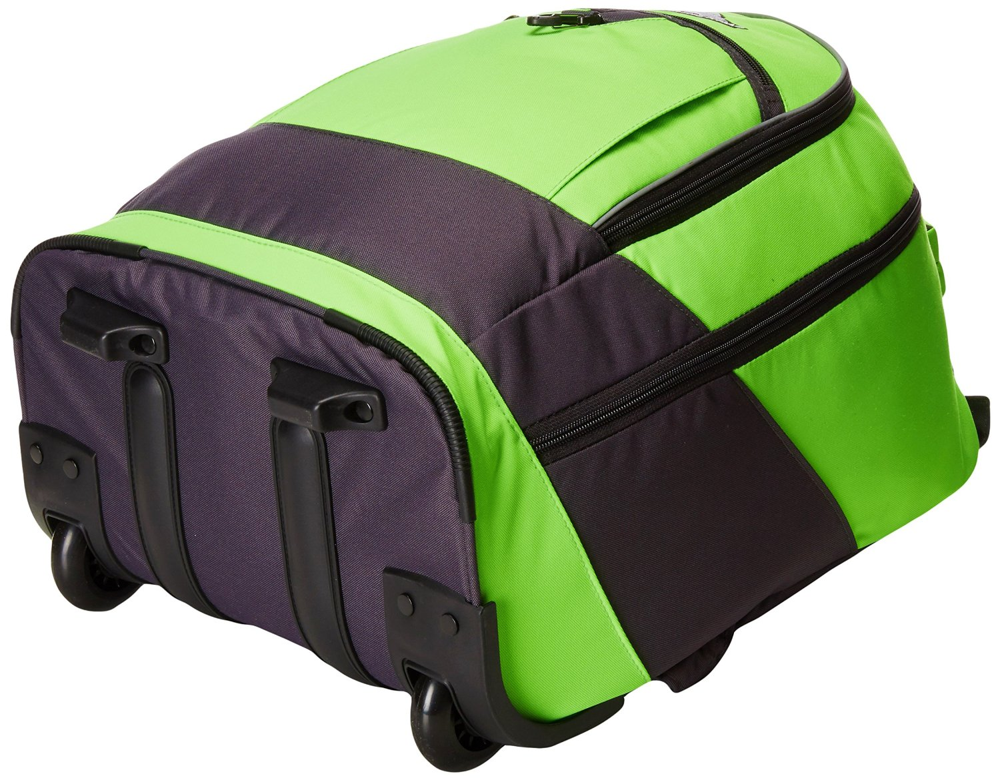

layout: post
title: "背包"
category: Bag
---

## 分类

在 Amazon 上 Backpack 分为：

- Casual Daypacks
- Kids' Backpacks
- Hiking Daypacks

ebags 上的分类：

按用途：

- School Backpacks
- Day Hiking Backpacks
- Laptop Backpacks
- Travel Backpacks
- Backpacking Packs

__Gender and Age__

- Women's
- Men's
- Girls'
- Boys'
- Kids'

__School Age__

- Toddler and Pre-School
- Elementary School
- Middle School
- High School
- College

Daypack
Ultra-functional school backpack

关于 Carry On 的详细部件介绍 [eBags TLS Mother Lode Weekender Convertible Junior - eBags.com](http://www.ebags.com/product/ebags/tls-mother-lode-weekender-convertible-junior/241465?productid=10209113)

## 常用的修饰词__

- durable
- cute
- boutique

elegant and fashionable. 

Vintage, comfortable/Comfy, 
Light weight
beautiful and practical 实用

Adorable 可爱的

Thickened Canvas Laptop Bag/ Shoulder Daypack / School Backpack/ Causal Style Handbag

## 材料 Material

- Fabric
- Polyester
- Nylon

## 特点 Feature & Design

This versatile backpack is made for convenience and functionality.

- waterproof/protect/water resistant. this bag is not waterproof but will keep your stuff dry in the rain.
- Light weight/lightweight
- Is there a way to attach to handle of carry-on bag
- the size of laptop can be put into
- Large multi-compartment backpack
- Scientific and reasonable pocket and lining design will make your goods lay in the bag systematically

classical and refining design

## Design

- designed to protect and hold your laptop while on the move.
- The backpack features multiple storage compartments and features for additional supplies and accessories.
- They design their products to be durable, functional, and versatile. 

flap top design 盖头设计

Single main compartment and front pocket with organizer for smaller items:

shell shape handbag purse:

Versatile. Personalized stylish looking, ideal for service as bookbag, rucksack schoolbag, casual daypack for daily use at school, work, weekend getaway, occasional travel, gyms, hiking etc.

Nice size admirably suits college students, teen girls boys and adults under 6.2ft in height

The durable, ballistic weave fabric makes the backpack long-lasting.

outdoor backpack, daypack, hiking back pack, school backpack, camping back pack

travel, hiking, school bag, shopping, placing laptop, ipad etc

Shoulder handbag purse-backpack

School, Excursion, Going out, window shopping etc.

Suitable for hiking camping climbing traveling cycling all outdoor activities

Convenient for hiking,traveling,camping,running,cycling,mountaineering. 

可能存在的问题:

- The nylon that separates compartments is very thin, and feels like it could easily tear or be punctured.

## 结构 Constructure

- 1 padded laptop compartment
- 1 thin compartment that can be used for papers and folders
- 1 main compartment that contains vertical dividers to keep things organized, a smaller interior mesh pocket, and an ipod/cell phone pouch that leads to a slit in the top of the backpack for a headphone cord
- 1 decent sized pocket on each side (I use 1 for my laptop charger and accessories)
- 2 stretchy water bottle pockets big enough for the big 1 liter bottles (good for umbrella too)
- 1 small pocket on the top front
- 1 pocket on the bottom front that contains a bunch of small organizer pockets found in every backpack that nobody ever uses

### Multi-compartment design

Large main compartments and multiple pockets allow you to keep all of your gear secure and organized.

### Shoulder Straps

contoured shoulder straps for enhanced comfort.

cushioned shock absorption.

Ergonomic S-curve shoulder straps

Shoulder harness

nylon webbing straps

Ergonomic adjustable, padded shoulder straps keep the pressure off

Adjustable padded laptop straps inside to fit different size laptops.

S-shaped, VAPEL mesh AIRFLOW padded shoulder straps with Suspension System with removable media pocket

Padded S-shaped shoulder straps with Suspension System. 这个悬挂系统指的就是 Sunglass 挂钩。: The Suspension System provides relief when carrying heavier loads. It does so by dampening the shock of weight transfer while transporting your gear.

The specially contoured shoulder straps are ergonomically designed with added padding for comfort and control. 

Straight-cut, padded shoulder straps 直切软垫肩带

Carry Comfortably: These are no simple backpack straps. Constructed with highly durable materials which are designed to balance out the weight of your bag, this backpackgives you the freedom to pack up and head out without the inconvenience of backpack fatigue. Heavily-padded and shock-absorbing shoulder straps give you the freedom to move comfortably so you can move forward with your day.

Rucksacks with Adjustable strap to make sure everything stays securely in place and holds almost anything you would need in several.

Padded Shoulder Straps 软垫肩带

Breathable mesh shoulder straps:

### Front Pocket

Front wide zippered pocket for convenient stashing storage. 

Front zip pocket keeps favorite things in easy reach

Secondary compartment has internal organization with a secure zippered pocket, 

### Side Mesh Pockets

- side mesh pockets for keys.
- Mesh beverage pocket

### Large Side Zip Pockets

Large side zip pockets for water bottles or laptop chargers etc.

### Water bottle pocket

The external dual pockets are made of elasticized mesh, which expands to secure various size water bottles.

Multi-compartment design with side mesh water bottle pockets.

Stretch-woven pockets accommodate a wide range of water bottle shapes and sizes

### Audio Interface

Audio and Media Pocket, Equipment Safe

Mobile phone pocket to keep you organized

Easy-access deluxe media pocket holds various sizes of cell phones, PDA's, and MP3 players.

### Tablet Pocket

Floating TabletSafe tablet pocket for superior electronics protection.

Dedicated, padded pocket that holds most 17" laptops is raised off the ground to protect electronics from impact

Versatile padded sleeve designed for a 3L hydration system or a 15" laptop

Padded, fleece-lined tablet sleeve located in the front compartment for quick access

### Laptop Compartment/Storage

an easy access laptop compartment. padded laptop compartment.

Padded computer sleeve.

Dedicated, lie-flat, fleece-lined laptop compartment allows for protected, checkpoint-friendly travel

Fully-padded CUSHION ZONE computer sleeve fits most 17" laptops

A fully padded CushionZone laptop compartment accommodates most 17-inch models. A dedicated TechSpot sleeve provides an ideal space for your tablet.

Highly protective laptop-only compartment with adjustable divider designed to fit most portable computers up to 17" in size. Fits most 17-inch laptops. Holds up to 17" notebook computer

The compartment even has an adjustable padded strap to fit different laptop sizes and quick side entry access.

有的客户认为：The opening for the laptop is on the side (not the top) which makes it a little awkward to get in and out. Not a big deal though.

I would have liked a little more padding underneath the laptop. The amount of padding is pretty similar to most other laptop cases though. You just need to be careful about setting it down to hard.

Open Viewing Comparent: Unique quick recognition window design accommodates most 17" laptops

可能存在的问题：

- Laptop compartment is too lightly padded. 笔记本区域的填充物不够。
- The back of the laptop backpack is padded, but the cardboard behind it bends and is right next to the laptop compartment inside. ??

Laptop and tablet storage：A fully padded CushionZone laptop compartment accommodates most 17-inch models. A dedicated TechSpot sleeve provides an ideal space for your tablet.

### Main Pocket

The main pocket provides protected packing for multiple binders, gaming peripherals, and other accessories.

With lots of pockets within the main compartment, which can carry all of your necessities around you.Large capacity design, most of your living necessities can be loaded freely

Dual-zip main compartment for secure, spacious storage.

Spacious large main compartment holds your daily essentials easily. 

Large packing capacity to fit binders and anything else you need.

Built-in padded laptop sleeve perfect for most 15.6" laptops, extra integrated storage pocket for 10" iPad tablet

there are seven organizational pockets within the main compartment designed for all of your urban gadgets: wallet, pens, camera, portable chargers, mouse, iPod, samll toys, handy beauty tools etc. 

### Organizer Pocket/Bottom Front Pocket

__Multi-pocket organzier with key fob: __ Multiple pockets including a zippered mesh pocket, pen pockets, lidded media pocket and key fob hook are perfect for keeping all of your smaller items secure.

The interior pocket organizer provides divider pockets for pens, pencils, cellphone, and anything else you need.

1 pocket on the bottom front that contains a bunch of small organizer pockets found in every backpack that nobody ever uses.

Front organization panel keeps small items in place and makes finding them a breeze

Zippered laminated mesh pocket inside is perfect for travel documents 主袋内的网袋

External fleece-lined pocket for sunglasses or electronics

Front compartment has internal organization with a fleece-lined media pocket, secure zippered pocket and elastic webbing for cord management

Front compartment has internal organization with a fleece-lined media pocket, secure zippered pocket and elastic webbing for cord management 也可以配一个羊毛里布用于放置眼镜和手机等。

常用的做法：

### Lay-flat Design

Unobstructed(通常的), lay-flat design（凭证设计）, helps speed through airport security(TSA X-ray machines)

With this backpack, getting through airport security is quicker and easier.  The laptop compartment opens quickly at the security checkpoint and the laptop window makes your computer visible while scanning. So, your computer stays inside your bag while it's scanned.

The laptop computer compartment is airport friendly allowing you to keep your computer safe when passing through security. At checkpoint, unfolds to flat position, keeping above and below the laptop sections clear.

The unique quick-recognition window design makes going through security less of a hassle.

### Airflow Back System

Airflow Back System: Multi-panel airflow design provides extra padding for comfort and maximum back support

AIRFLOW back panel

### Sunglass Holder

There is an elastic tab on the shoulder strap that keeps sunglasses secure and conveniently accessible.

The Suspension System provides relief when carrying heavier loads. It does so by dampening the shock of weight transfer while transporting your gear.

外袋的垂直拉链口常用于放置太阳镜。

### Adjustable side compression straps

可调侧腰缩带。

### Removable Key Fob

Organizer with key fob

a removable key fob to help you keep track of your keychain.

### Padded back panel

Padded backrest 

air exchange of bearing system

Increase air cushion gasket back and waist,breathable mesh and inner filling soft interlayer sponge,buffer shock absorption,reduce the pressure of body contact area,further enhance with comfort

thickening sponge

Padded back panel ensure cushioning comfort.

Padded back panel: Padding in the back panel provides comfort when carrying your gear.

the thickening sponge protection a good protection; it can effectively reduce the burden

Reduce the burden system design

Cool Durability: Breathable mesh panels on the backside of the pack provide a comfortable carrying experience for the long-haul, alleviating the discomfort of strenuous and perspiring jaunts! Plus, a secret zipper compartment on the backside of the backpack is the perfect hiding spot for a wallet, keys or an ID.

The FlexVent™ suspension system boasts custom injection-molded shoulder straps, a padded mesh back panel with a spine channel and a wicking lumbar panel for maximum support and ventilation

TODO

### Padded bottom panel

可能存在的问题：

- A reinforced bottom with another layer of canvas or leather, would be good for durability. 底部不耐用，容易磨损。

### Monster hook

### Media pocket integrated on shoulder strap

Integrated media pocket: A clever mesh pocket located on the shoulder strap is ideal for quick access items like a cell phone or MP3 player.

Deluxe media pocket, with headphone port

Also features a port for headphone wires on the top of right

### Adjustable sternum strap

Sternum strap with whistle buckle

可调节的胸带

### Daisy chain loops for attaching extra gear

### Wheels

Smooth rolling, corner-mounted wheels

Inline skate style wheels are corner mounted for stability and provide a smooth ride. Molded feet provide added stability.

The telescoping handle stores neatly under the zippered cover.

Soft and noiseless wheels for stable and controlled motion

### Reflective strip for added safety

Reflective bike-light loop, reflective water bottle tabs and reflective shoulder strap create 360-degrees of reflectivity

### Handle

Top grab handle/Top-mounted, reinforced haul handle

The top grab handle offers quick grab-and-go mobility

Hideaway telescoping handle/Telescoping

Sturdy molded plastic handle supported by metal grommets and cabling

Telescoping single handle 伸缩手柄

### Bottom

Rugged, anti-slip faux leather bottom stabilizes bag on the ground and protects the bag from dirt and wet. 

### Back Pocket

Bonus external zipper pocket on the back provide an easy access to the most-used items such as cellphone or keys. 

### Side sleeve Pocket

Side access exposed mixed metal zippered sleeve pocket

### Adjustable waist strap

Adjustable shoulder strap and waist strap to fit your need. 

Removable waist belt

### D-door

Front zippered D-door easily opens into a large compartment for gym clothes or shoes

### Large top-loading main compartment

### Crush-proof AC-Adapter garage

Crush-proof AC-Adapter garage that isolates heavy (or fragile) accessories from the rest of the pack. Positioned at the bottom for better load balancing. Removable for those times when you need extra storage capacity

## Closure

- zipper closure
- lockable zippers
- Leather zipper pulls

### Snap closure

Magnetic flap closure/Snap closure/Magnetic strap closures with metal pin clips. 

magnetic strap closures with metal pin clip

Buckle closure

Main compartment cinch top closure

### Adjustable drawstring closure

Thick gauge cording witheasy drawstring closure

### snap fastener

Branded magnetic mixed metal snap fastener.

### diagonal zipper

High strength zinc alloy resin zipper

### magnetic buckles 

磁性搭扣

### Full expansion zipper

Full expansion zipper adds over 10 percent of volume for all those treasures you pick up along on your journey

### hip belt zip/U-zipper

hip belt zip away for checking luggage

Full-access U-zipper allows the Redwing to work as both a top-loader and a panel loader, adding convenience to any adventure.

### Hip belt

Padded, tuck-away, load bearing hip belt to carry up to 70% of the load

腰带

## FAQ

- BP1009 材料。
- 17 英寸电脑的长宽。
- Airflow Backing System

