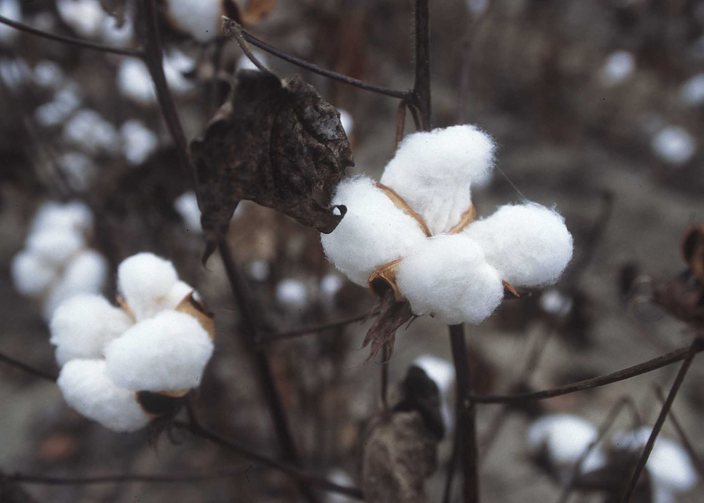
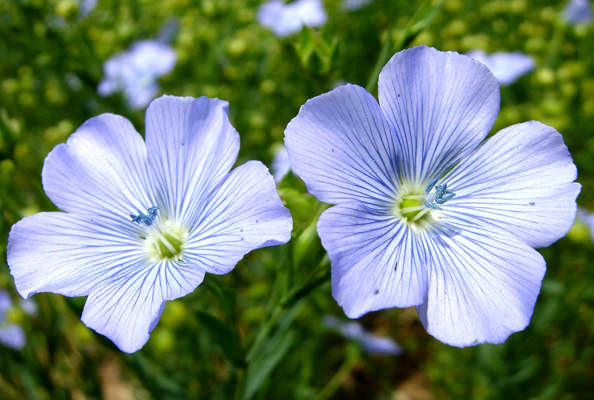
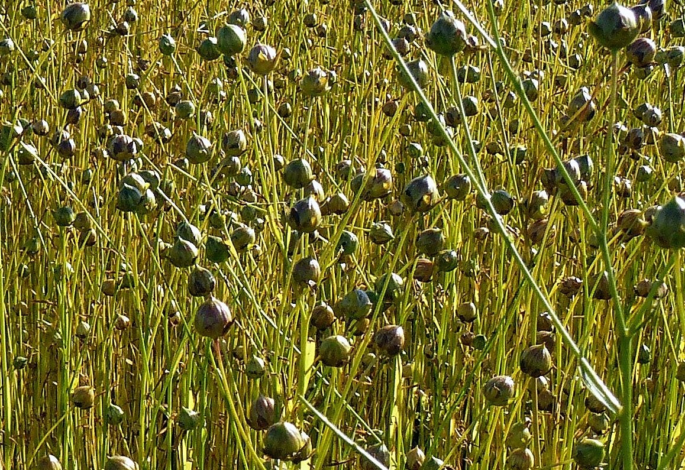
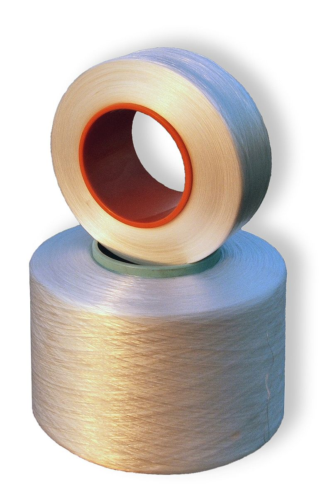
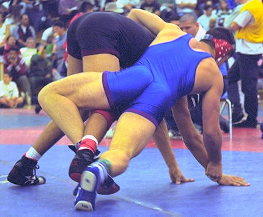
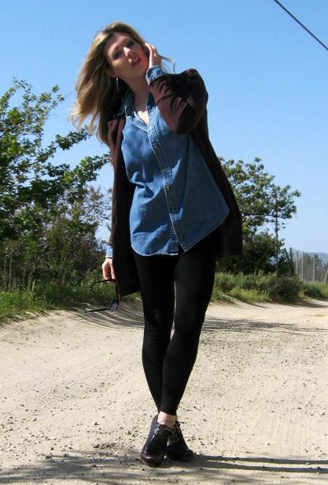

layout: post
title: "Textile"
category： Bags
---

## Textile

A _fabric_ is a textile material, short for "textile fabric".

A _textile_ or cloth is a flexible woven material consisting of a network of __natural or artificial fibres__ often referred to as thread or yarn. Textiles are formed by weaving, knitting, crocheting, knotting, or felting. 

纺织品是人工或天然纤维编制而成的柔软材料，这个纤维被称之为线或者纱。纺织品是由机织，针织，钩编，打结或毡形成。

_Cloth_ may be used synonymously with fabric but often refers to a finished piece of fabric used for a specific purpose (e.g., table cloth). 

布通常指的是织物成品。

_Yarn_ is produced by spinning raw fibres of wool, flax, cotton, or other material to produce long strands. 

纱线通过纺纱羊毛，亚麻，棉花，或其它原纤维材料，产生的长线。

Textiles can be made from many materials. These materials come from four main sources: animal (wool, silk), plant (cotton, flax, jute), mineral (asbestos, glass fibre), and synthetic (nylon, polyester, acrylic). In the past, all textiles were made from natural fibres, including plant, animal, and mineral sources. In the 20th century, these were supplemented by artificial fibres made from petroleum.

纺织品可以从许多材料制成。这些材料来自四个主要来源：动物（羊毛，丝绸），植物（棉花，亚麻，黄麻），矿物（石棉，玻璃纤维），和合成的（尼龙，聚酯，丙烯酸）。在过去，所有纺织品从天然纤维，包括植物，动物和矿物来源制成。在20世纪，这些都是由石油制成的人造纤维为辅。

Textiles are made in various strengths and degrees of durability, from the finest gossamer to the sturdiest canvas. Microfibre refers to fibres made of strands thinner than one denier.

纺织品可以制造不同强度和耐磨程度的材料，从最好的游丝到结实​​的帆布。微纤维是指由链多于一个旦尼尔更薄的纤维。

See:

- [Textile - Wikipedia, the free encyclopedia](https://en.wikipedia.org/wiki/Textile)

## Production methods 生产方法

_Weaving_ is a textile production method which involves interlacing a set of longer threads (called the warp) with a set of crossing threads (called the weft). 

织造是一个纺织生产方法，由一组长一些的线（称为经纱）与一组交叉线程（称为纬纱）交织而成。

_Knitting and crocheting_(针织和钩针) involve interlacing loops of yarn, which are formed either on a knitting needle or on a crochet hook, together in a line. The two processes are different in that knitting has several active loops at one time, on the knitting needle waiting to interlock with another loop, while crocheting never has more than one active loop on the needle. Knitting can be performed by machine, but crochet can only be performed by hand.

_Spread Tow_ is a production method where the yarn are spread into thin tapes, and then the tapes are woven as warp and weft. This method is mostly used for composite materials; Spread Tow Fabrics can be made in carbon, aramide, etc.

_Braiding or plaiting_(编织或编结) involves twisting threads together into cloth. Knotting involves tying threads together and is used in making macrame.

_Lace_(蕾丝) is made by interlocking threads together independently, using a backing and any of the methods described above, to create a fine fabric with open holes in the work. Lace can be made by either hand or machine.

Carpets, rugs, velvet, velour, and velveteen are made by interlacing a secondary yarn through woven cloth, creating a tufted layer known as a nap or pile.

Felting involves pressing a mat of fibres together, and working them together until they become tangled. A liquid, such as soapy water, is usually added to lubricate the fibres, and to open up the microscopic scales on strands of wool.

_Nonwoven textiles_(无纺织物) are manufactured by the bonding of fibres to make fabric. Bonding may be thermal or mechanical, or adhesives can be used. 无纺织物由纤维之间的结合，结合方法可以可以是热，机械，或粘合剂。

_Bark cloth_ is made by pounding bark until it is soft and flat.

## Animal textiles 动物纺织品

主要组成物质是蛋白质，又称为天然蛋白质纤维，分为毛和腺分泌物两类。

1. 毛发类：绵羊毛、山羊毛、骆驼毛、兔毛、牦牛毛等；
2. 腺分泌物：桑蚕丝、柞蚕丝等。

## Plant textiles 植物纤维

主要组成物质是纤维素，又称为天然纤维素纤维。是由植物上种籽、果实、茎、叶等处获得的纤维。根据在植物上成长的部位的不同，分为种子纤维、叶纤维和茎纤维。

1. 种子纤维：棉、木棉等；
2. 叶纤维：剑麻、蕉麻等；
3. 茎纤维：苎麻、亚麻、大麻、黄麻等。

Grass, rush, hemp, and sisal are all used in making rope. In the first two, the entire plant is used for this purpose, while in the last two, only fibres from the plant are utilized. Coir (coconut fibre) is used in making twine, and also in floormats, doormats, brushes, mattresses, floor tiles, and sacking.

草，灯芯草，麻，剑麻都用在制作绳子。前两种材料，整个植物被用于此目的，而后两个，只有植物中的纤维被利用。椰壳（椰子纤维）被用来制作麻线，也用于制作脚垫，门垫，刷子，垫子，地砖，和袋装。

Straw and bamboo are both used to make hats. Straw, a dried form of grass, is also used for stuffing, as is kapok.

稻草和竹子都用来做帽子。稻草（干燥的草），也可用于填充物，因为是木棉。

Cotton, flax, jute, hemp, modal and even bamboo fibre are all used in clothing. Piña (pineapple fibre) and ramie are also fibres used in clothing, generally with a blend of other fibres such as cotton. Nettles have also been used to make a fibre and fabric very similar to hemp or flax. The use of milkweed stalk fibre has also been reported, but it tends to be somewhat weaker than other fibres like hemp or flax.

棉，亚麻，黄麻，大麻，莫代尔（一种新型纤维素纤维），甚至竹纤维都被用于服装。皮尼亚（菠萝纤维）和苎麻，可以在衣物中使用，一般用的共混物的其他纤维，如棉花的纤维。荨麻也被用来制造纤维和织物非常相似大麻或亚麻。使用乳草秆纤维也有报道，但它往往比其他纤维如大麻或亚麻稍差。

### 棉花

See [棉花 - 维基百科，自由的百科全书](https://zh.wikipedia.org/wiki/%E6%A3%89%E8%8A%B1)

棉花，是锦葵科棉花属植物的种子纤维，棉花的纤维最常纺织成纱线，用来制作柔软透气的纺织品。

棉花喜热、好光、耐旱、忌渍，适宜于在疏松深厚土壤中种植。棉花主要有如下几种：

- 粗绒棉--也叫亚洲棉，原产印度。由于产量低、纤维粗短，不适合 机器纺织，目前已被淘汰。
- 长绒棉--也叫海岛棉，原产南美洲。纤维长、强度高是其特点，适合于纺高支纱。目前中国只有新疆生产。
- 细绒棉--也叫陆地棉，原产中美洲，所以又称美棉。适应性广、产量高、纤维较长、品质较好是其特点，可纺中支纱。

中国的细绒棉占棉花产量的98%。

_埃及棉_一般会指高品质的棉，不过埃及出产的棉只有少部分是高品质的，而大多数写“埃及棉”的制品多半也不是用埃及最好的棉制成。

_比马棉_（Pima cotton）一般会和埃及棉相比，二者都用在高品质的床单及其他棉制品上，一些权威人士认为比马棉的品质是仅次于埃及棉。比马棉长在美州的西南部，不过也不是所有写比马棉的都用最好的棉花制成。像秘鲁、澳洲及以色列等产棉国家会使用比马棉这个名称

外观性能：

- 棉的光泽较暗淡，风格自然朴实，故多用于日常的休闲装。
- 棉纤维的染色性好，色谱齐全，但色牢度不够好。
- 棉纤维的缺点是弹性差，不挺括，易起皱且不易恢复，为改善这一性能，常对棉进行免熨整理或树脂整理，如市场上出现的免熨衬衫、免熨休闲裤等棉制品。市场上常见的有DP(double press)或PP(permanent press)标记的衬衫表示具有“耐用熨烫”或“永久熨烫”性能。

舒适性能：

棉纤维舒适柔软，手感温暖，吸湿性好（棉纤维为多孔性物质，纤维大分子上存在亲水基因），穿作舒适，不刺激皮肤，且不易产生静电。

耐用性与加工保养性能：

- 具有良好的吸湿性，公定回潮率8.5%；但缩水率较大，约为4%~10%。
- 耐热性和耐光性好，熨烫温度可达190℃，若垫干布可提高20~30℃，垫湿布可提高40~60℃，棉织品最好湿烫，易于熨平。但长时间暴晒会引起褪色和强度下降。
- 强度较高，湿强高于干强，便于洗涤。
- 耐碱不耐酸，在张力和碱液的作用下产生丝光效应，使强度增大获得耐久的光泽。不加张力任其收缩，叫缩碱。
- 回弹性较差，耐磨性不够好。
- 棉纤维易受霉菌等微生物的侵害，引起纤维素大分子水解、发霉产生黑斑引起色变，尤其是高品质的棉制品色泽变化更为突出，保养时应该注意。

依照等级、纤维长度及成熟度来判别品质。

纤维长度：短纤、中长纤、长纤、超长纤

### 亚麻

See [亚麻 - 维基百科，自由的百科全书](https://zh.wikipedia.org/wiki/%E4%BA%9A%E9%BA%BB#/media/File:%D0%9B%D1%91%D0%BD_(%D0%B2%D0%B8%D0%B4%D1%8B_%D0%B8%D0%B7%D0%B4%D0%B5%D0%B4%D0%B8%D0%B9_%D0%B8_%D1%81%D1%82%D0%B0%D1%80%D0%B8%D0%BD%D0%BD%D1%8B%D0%B5_%D0%B8%D0%BD%D1%81%D1%82%D1%80%D1%83%D0%BC%D0%B5%D0%BD%D1%82%D1%8B).JPG)

亚麻（学名：Linum usitatissimum），是亚麻科亚麻属一年生草本植物。

象征：

- 亚麻花是白俄罗斯的国花；
- 亚麻是北爱尔兰议会的徽章图案；
- 亚麻是英国1986年和1991年发行的1英镑硬币上的图案，象征北爱尔兰。
- 白色人种中棕色头发的人一般被称为头发为亚麻色；

亚麻纤维：取其茎部韧皮纤维，因其坚韧耐磨，在水中不易腐烂，多用于制绳索、鱼网、降落伞等。亚麻的开发利用价值高，亚麻茎制取的纤维是纺织工业的重要原料，可纯纺，亦可与其它纤维混纺。由于亚麻纤维与动物纤维、其它植物纤维、合成纤维相比，具有许多独特的不可替代的优点，决定了它在国民经济中占重要地位：

1.  亚麻纤维强韧、柔细，其强度是棉纤维的1.5倍、绢丝的1.6倍，可纺支数高，织物平滑整洁，适宜制作高级衣料。
2.  亚麻纤维具有吸湿性强、散热快、耐摩擦、耐高温、不易燃、不易裂、导电性小、吸尘率低、抑菌保健等独特优点，适宜制作飞机翼布、军用布、消防、宇航、医疗和卫生保健服装及帆布、水龙带、室内装饰布及工艺刺锈品等。
3.  打麻下脚料和麻屑也有较高的利用价值，加工后的短纤维即麻棉，可与毛、丝、棉、化纤等生产混纺纱，也可纺纯麻纱；麻屑是制造人造板材或高级纸张的优质原料。

## Mineral textiles 矿物纺织品

Glass fibre is used in the production of ironing board and mattress covers, ropes and cables, reinforcement fibre for composite materials, insect netting, flame-retardant and protective fabric, soundproof, fireproof, and insulating fibres. Glass fibres are woven and coated with Teflon to produce beta cloth, a virtually fireproof fabric which replaced nylon in the outer layer of United States space suits since 1968.

玻璃纤维是用在生产熨衣板和床罩，绳索和电缆，加固纤维复合材料，昆虫网，阻燃和防护织物，隔音，防火，和绝缘纤维。玻璃纤维编织并涂有特富龙生产测试布，几乎防火织物，美国航天服的外层尼龙取代自1968年以来。

## Synthetic textiles 化纤纺织/合成纤维

See [合成纤维 - 维基百科，自由的百科全书](https://zh.wikipedia.org/wiki/%E5%90%88%E6%88%90%E7%BA%96%E7%B6%AD)

化学纤维是用天然高分子化合物或人工合成的高分子化合物为原料，经过制备纺丝原液、纺丝和后处理等工序制得的具有纺织性能的纤维。

合成纤维是由合成的高分子化合物制成的，常用的合成纤维有涤纶、锦纶、腈纶、氯纶、维纶、氨纶等。

All synthetic textiles are used primarily in the production of clothing. 所有的合成纺织品主要用于生产服装。

Polyester fibre is used in all types of clothing, either alone or blended with fibres such as cotton. 聚酯纤维用于所有类型的服装，无论是单独或者和棉花等纤维的混合。

Aramid fibre (e.g. Twaron) is used for flame-retardant clothing, cut-protection, and armor. 芳纶(芳族聚酰胺)纤维（例如特威隆）用于阻燃服装，切保护，和盔甲。

Acrylic is a fibre used to imitate wools, including cashmere, and is often used in replacement of them. 丙烯酸是用于模仿羊毛，羊绒，包括纤维，并且通常在更换并用。

Nylon is a fibre used to imitate silk; it is used in the production of pantyhose. Thicker nylon fibres are used in rope and outdoor clothing. 尼龙是用来模仿丝纤维;它被用于生产连裤袜。较厚的尼龙纤维用于在绳和户外服装。

Spandex (trade name Lycra) is a polyurethane product that can be made tight-fitting without impeding movement. It is used to make activewear, bras, and swimsuits. 氨纶（商品名​​莱卡）是可以作出紧身不妨碍移动的聚氨酯产物。它是用来制造运动服，胸罩，和泳衣。

Carbon fibre is mostly used in composite materials, together with resin, such as carbon fibre reinforced plastic. The fibres are made from polymer fibres through carbonization. 碳纤维主要用于在复合材料，与树脂一起，例如碳纤维增强塑料。纤维由通过碳化聚合物纤维制成。

__特点：__

- 粘胶(吸湿易染)

    是人造纤维素纤维，由溶液法纺丝制得，由于纤维芯层与外层的凝固速率不一致，形成皮芯结构（从横截面切片可明显看出）。粘胶是普通化纤中吸湿最强的，染色性很好，穿着舒适感好，粘胶弹性差，湿态下的强度，耐磨性很差，所以粘胶不耐水洗，尺寸稳定性差。比重大，织物重，耐碱不耐酸。

    粘胶纤维用途广泛而且环保，几乎所有类型的纺织品都会用到它，如长丝作衬里、美丽绸、旗帜、飘带、轮胎帘子线等；短纤维作仿棉、仿毛、混纺。

- 涤纶(挺括不皱)

    特点：强度高、耐冲击性好，耐热，耐腐，耐蛀，耐酸不耐碱，耐光性很好（仅次于腈纶），曝晒1000小时，强力保持60-70%，吸湿性很差，染色困难，织物易洗快干，保形性好。具有“洗可穿”的特点。

    缺点是吸湿性极差，由它纺织的面料穿在身上发闷、不透气。另外，由于纤维表面光滑，纤维之间的抱合力差，经常摩擦之处易起毛、结球。

    长丝：常作为低弹丝，制作各种纺织品；

    短纤：棉、毛、麻等均可混纺，工业上：轮胎帘子线，渔网、绳索，滤布，缘绝材料等。涤纶是目前化纤中用量最大的。

- 锦纶(结实耐磨)

    最大优点是结实耐磨，是最优的一种。密度小，织物轻，弹性好，耐疲劳破坏，化学稳定性也很好，耐碱不耐酸！

    最大缺点是耐日光性不好，织物久晒就会变黄，强度下降，吸湿也不好，但比腈纶，涤纶好。

    用途：长丝，多用于针织和丝绸工业；短纤，大都与羊毛或毛型化纤混纺。工业：帘子线和渔网，也可作地毯，绳索，传送带，筛网等

- 腈纶(膨松耐晒)

    腈纶纤维的性能很羊毛，所以叫“合成羊毛”。

    特点：耐日光性与耐气候性很好（居第一位），吸湿差，染色难。

    用途：主要作民用，可纯纺也可混纺，制成多种毛料、毛线、毛毯、运动服也可：人造毛皮、长毛绒，膨体纱，水龙头，雨伞布等。

- 维纶(水溶吸湿)

    最大特点是吸湿性大，合成纤维中最好的，号称“合成棉花”。强度比锦、涤差，化学稳定性好，不耐强酸，耐碱。耐日光性与耐气候性也很好，但它耐干热而不耐湿热（收缩）弹性最差，织物易起皱，染色较差，色泽不鲜艳。

    用途：多和棉花混纺：细布，府绸，灯芯绒，内衣，帆布，防水布，包装材料，劳动服等。

- 丙纶(质轻保暖)

    丙纶纤维是常见化学纤维中最轻的纤维。它几乎不吸湿，但具有良好的芯吸能力，强度高，制成织物尺寸稳定，耐磨弹性也不错，化学稳定性好。但：热稳定性差，不耐日晒，易于老化脆损。

    用途：可以织袜，蚊帐布，被絮，保暖填料、尿不湿等。工业上：地毯、渔网，帆布，水龙带，医学上带代替棉纱布，做卫生用品。

- 氨纶(弹性纤维)

    弹性最好，强度最差，吸湿差，有较好的耐光、耐酸、耐碱、耐磨性。

    用途：氨纶利用它的特性被广泛地使用于内衣，女性用内衣裤，休闲服，运动服，短袜，连裤袜，绷带等为主的纺织领域，医疗领域等。氨纶是追求动感及便利的高性能衣料所必需的高弹性纤维。氨纶比原状可伸长5-7倍，所以穿着舒适、手感柔软、并且不起皱，可始终保持原来的轮廓。

- 改性品种

    突出的有丙烯腈与氯乙烯共聚纤维，是将丙烯腈和氯乙烯共聚所得的共聚物溶于丙酮，再经干法纺丝或湿法纺丝制得。1949年，由美国联合碳化物公司首先生产，由于氯乙烯含量占50%～60%，因此阻燃性能良好，且具有自熄性，但染色性稍差。

### 腈纶[jīng lún] PAN

See [聚丙烯腈纤维_百度百科](http://baike.baidu.com/view/1248852.htm)

腈纶，学名聚丙烯腈纤维，聚丙烯腈或丙烯腈含量大于85%（质量百分比）的丙烯腈共聚物制成的合成纤维。

聚丙烯腈纤维的性能极似羊毛,弹性较好,伸长20%时回弹率仍可保持 65%，蓬松卷曲而柔软，保暖性比羊毛高15%，有合成羊毛之称。

腈纶的外观呈白色、卷曲、蓬松、手感柔软，酷似羊毛，多用来和羊毛混纺或作为羊毛的代用品，故又被称为“合成羊毛”。腈纶的吸湿性不够好，但润湿性却比羊毛、丝纤维好。它的耐磨性是合成纤维中较差的，腈纶纤维的熨烫承受温度在130℃以下。

聚丙烯腈纤维可与羊毛混纺成毛线，或织成毛毯、地毯等，还可与棉、人造纤维、其他合成纤维混纺，织成各种衣料和室内用品。聚丙烯腈纤维加工的膨体可以纯纺，或与粘胶纤维混纺。

### 维纶

See [维纶_百度百科](http://baike.baidu.com/view/972476.htm)

维纶是聚乙烯醇缩醛纤维的商品名称，也叫维尼纶。

维纶洁白如雪，柔软似棉，因而常被用作天然棉花的代用品，人称“合成棉花”。维纶的吸湿性能是合成纤维中吸湿性能最好的。另外，维纶的耐磨性、耐光性、耐腐蚀性都较好。但因其生产工业流程较长，纤维综合性能不如涤纶、锦纶和腈纶，年产量较小，居合成纤维品种的第5位。

__特点：__

- 最大特点是吸湿性大，合成纤维中最好的，号称“合成棉花”。强度比锦、涤差，化学稳定性好，不耐强酸，耐碱。耐日光性与耐气候性也很好，但它耐干热而不耐湿热（收缩）弹性最差，织物易起皱，染色较差，色泽不鲜艳。
- 维纶是合成纤维中吸湿性最大的品种， 吸湿率为4.5% ~ 5%，接近于棉花（8%）。维纶纺织布穿着舒适，适宜制内衣。
- 维纶的强度稍高于棉花， 比羊毛高很多。在一般有机酸、醇、酯及石油等溶剂中不溶解，不易霉蛀，在日光下暴晒强度损失不大。
- 耐热水性不够好，弹性较差，染色性较差。

__用途：__

维纶的柔软及保暖性好，它的相对密度比棉花要小，因此与棉花相同重量的维纶能织出更多的衣料。它的热传导率低，因而保暖性好。维纶的耐磨性和强度也比棉花要好，因此维纶在很多方面可以与棉混纺以节省棉花。维纶主要用于制作外衣、棉毛衫裤、运动衫等针织物，还可用于帆布、渔网、外科手术缝线、自行车轮胎帘子线、过滤材料等。

多和棉花混纺：细布，府绸，灯芯绒，内衣，帆布，防水布，包装材料，劳动服等。

__鉴别：__

维纶学名聚乙烯醇缩甲醛纤维，不易点燃，近焰熔融收缩，燃烧时顶端有一点火焰，待纤维都融成胶状火焰变大，有浓黑烟，散发苦香气味，燃烧后剩下黑色小珠状颗粒，可用手指压碎。

### 氯纶/聚氯乙烯 PVC

See [氯纶_百度百科](http://baike.baidu.com/view/106617.htm)

氯纶的优点较多，耐化学腐蚀性强；导热性能比羊毛还差，因此，保温性强；电绝缘性较高，难燃。另外，它还有一个突出的优点，即用它织成的内衣裤可治疗风湿性关节炎或其它伤痛，而对皮肤无刺激性或损伤。氯纶的缺点也比较突出，即耐热性极差。

氯纶的突出优点是难燃、保暖、耐晒、耐磨、耐蚀和耐蛀，弹性也很好，可以制造各种针织品、工作服、毛毯、滤布、绳绒、帐篷等，特别是由于它保暖性好，易生产和保持静电，故用它做成的针织内衣对风湿性关节炎有一定疗效。但由于染色性差，热收缩大，限制了它的应用。改善的办法是与其他纤维品种共聚（如维氯纶）或与其他纤维（如粘胶纤维）进行乳液混合纺丝。

氯纶的缺点也比较突出，即耐热性极差。一般用于服装制造业。

### 氨纶 Spandex/PU

See

- [氨纶 - 维基百科，自由的百科全书](https://zh.wikipedia.org/wiki/%E6%B0%A8%E7%B6%B8)
- [氨纶_百度百科](http://baike.baidu.com/view/115097.htm)

氨纶（英文：Spandex），俗称莱卡（英语：Lycra），是一种弹力纤维，由美国杜邦公司于1959年发明。其具有很强的弹性，伸展度可达500%，且能回复原样，比橡胶的强度更大，也更耐磨。当它第一次面世的时候，彻底改变了服装行业的许多领域。

氨纶是聚氨基甲酸酯纤维的简称，是一种弹性纤维，学名聚氨酯纤维(Polyurethane)，简写(PU)。它具有高度弹性，能够拉长6～7倍，但随张力的消失能迅速恢复到初始状态

氨纶纤维一般不单独使用，而是少量地掺入织物中，如与其它纤维合股或制成包芯纱，用于织制弹力织物。

### 丙纶 PP

学名聚丙烯纤维，近火焰即熔缩，易燃，离火燃烧缓慢并冒黑烟，火焰上端黄色，下端蓝色，散发出石油味，烧后灰烬为硬圆浅黄褐色颗粒，手捻易碎。

民用用途：可以纯纺或与羊毛、棉或粘纤等混纺混织来制作各种衣料。可以用于织各种针织品如织袜、手套、针织衫、针织裤，洗碗布，蚊帐布，被絮，保暖填料、尿布湿等。

工业用途：地毯、渔网，帆布，水龙带，混凝土增强材料，工业用织物、非织造织物等。如地毯、工业滤布、绳索、渔网、建筑增强材料、吸油毯以及装饰布等。
