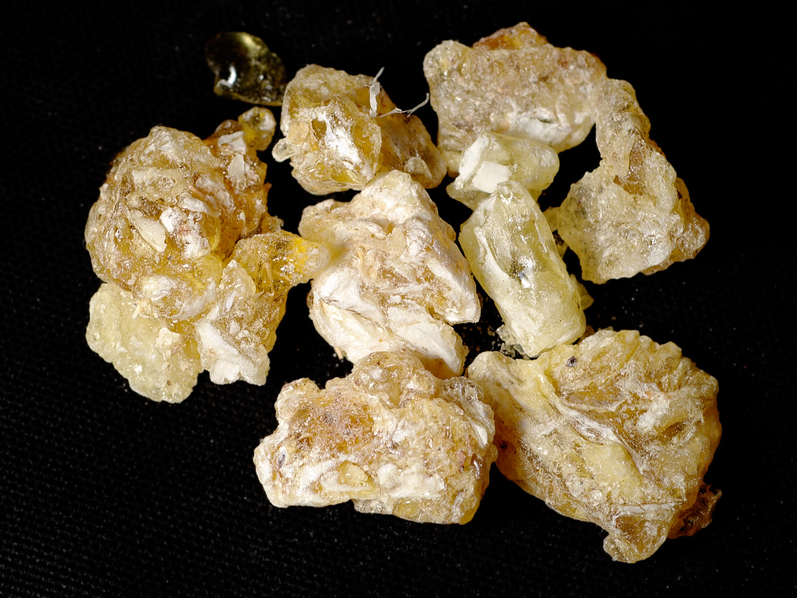

layout: post
title: "Plastic"
category: Bag
---

## 塑料

## ABS 树脂

See [Acrylonitrile butadiene styrene - Wikipedia, the free encyclopedia](https://en.wikipedia.org/wiki/Acrylonitrile_butadiene_styrene) & [ABS树脂 - 维基百科，自由的百科全书](https://zh.wikipedia.org/wiki/ABS%E6%A0%91%E8%84%82)

ABS树脂（丙烯腈-丁二烯-苯乙烯共聚物，ABS 是 Acrylonitrile Butadiene Styrene的首字母缩写）是一种强度高、韧性好、易于加工成型的热塑型高分子材料。

ABS树脂是乳白色固体，有一定的韧性，密度约为 1.04~1.06 g／cm3。它抗酸、碱、盐的腐蚀能力比较强，也可在一定程度上耐受有机溶剂溶解。

ABS树脂可以在-25℃~60℃的环境下表现正常，而且有很好的成型性，加工出的产品表面光洁，易于染色和电镀。因此它可以被用于家电外壳、玩具等日常用品。常见的乐高积木就是ABS制品。

## 聚氯乙烯 PVC

氯乙烯（英文为PolyVinyl Chloride，缩写：PVC）是氯乙烯经加成聚合反应得到的的高分子材料。

__阻燃：__

聚氯乙烯的最大特点是阻燃，因此被广泛用于防火应用。但是聚氯乙烯在高温下的燃烧过程中会释放出氯化氢、氯气和其他有毒气体[2]。

聚氯乙烯的燃烧分为两步。先在240℃-340℃燃烧分解出氯化氢气体和含有双键的二烯烃，然后在400-470℃发生碳的燃烧。

__物理和化学性质：__

稳定；不易被酸、碱腐蚀；比较耐热。

PVC是七大塑料中唯一必须使用增塑剂的材料，这使得它的状态可以从软而弹到硬而脆之间变化。而增塑剂就是媒体报道中的“塑化剂”。PVC既然可以呈现软而有弹性的一面，也就可以模拟橡胶或皮革的一些用途，比如小汽车内饰大量使用的人造革、一次性检查手套、地板、桌布、塑胶鞋，因为PVC价格比天然胶和聚氨酯人造革低得多。不过PVC工业通常要用到乙炔。

资源回收再利用：塑胶分类标志中，PVC代码是3（3字在三个循环再用箭号中心

__安全与危害：__

- PVC一定要有添加剂或增塑剂才可用，这些大多有害，可能渗出或气化。
- 部分添加剂会干扰生物内分泌（影响生殖机能），部分可增加致癌风险。
- 焚化PVC垃圾，会产生致癌的二噁英（Dioxin）而污染空气。

PVC 常使用邻苯二甲酸二辛酯（DEHP）为增塑剂，因DEHP易气雾化，其他乙烯基产品包括汽车内部、淋浴胶帘或铺地板物料等，也会释放化学气体入空气，且DEHP也易溶入油性液体中。另外，人们也开始关注到，儿童若咀嚼这些软塑玩具，会有添加剂渗出的安全问题。

## PP 聚丙烯 Polypropylene

See 

- [聚丙烯 - 维基百科，自由的百科全书](https://zh.wikipedia.org/wiki/%E8%81%9A%E4%B8%99%E7%83%AF) 
- [Polypropylene - Wikipedia, the free encyclopedia](https://en.wikipedia.org/wiki/Polypropylene) 
- [Polyethylene terephthalate - Wikipedia, the free encyclopedia](https://en.wikipedia.org/wiki/Polyethylene_terephthalate)

聚丙烯（Polypropylene，简称PP）是一种半结晶的热塑性塑料。具有较高的耐冲击性，机械性质强韧，抗多种有机溶剂和酸碱腐蚀。

聚丙烯的结构和聚乙烯接近，因此很多性能也和聚乙烯类似。但是由于其存在一个甲基构成的侧枝，聚丙烯更易在紫外光和热能作用下氧化降解。

耐热且化学稳定性比较高。本质上和高密度聚乙烯接近，结晶度比高密度聚乙烯略低，所以一般呈现半透明的状态，而硬度与高密度聚乙烯差不太多。

PP是安全的食品容器用塑料，但若老化就不安全，例如台湾就有热水器内PP塑料老化的先例。

资源回收再利用：塑料分类标志中，PP代码是5。 塑料本体底部或包装上须列明，以便消费者及回收商能分类妥当。

PP (Polypropylene)聚丙烯：

- PP 熔点高达167℃，耐热，制品可用蒸气消毒是其特点。
以ＰＰ制瓶的，最常见的是豆浆、米浆瓶，还有用来装100％纯果汁、优酪乳、果汁饮料、乳制品 (如布丁)等，
- 较大的盛器，像水桶、垃圾桶、洗衣槽、箩筐、篮子等等多是以ＰＰ做成。
- 近年来亦大量使用于制成免洗餐具或免洗杯(供速食餐饮业者装填冰品使用，如市面盛行之“快可利”连锁店所用之盛装容器)
- 该材质容器系属不透明或半透明容器，具备有耐酸碱、耐化学物质、耐碰撞及耐高温(约20℃~120℃)等优点。

市场上绝大多数微波炉专用塑料容器都是PP塑料，这是因为它的耐热且化学稳定性比较高。在食品方面的应用超过其他任何塑料，除了容器，还有软包装中的BOPP膜，香烟盒的最外层薄膜便是这种塑料。此外，目前的新建小区通常使用的家用水管推荐或强制使用PPR管，同样也是聚丙烯材料，除了安全性考虑以外，还因为它具有热熔的特点，易于加工。聚丙烯工业同样也是衡量一个国家产业水平的标准。

## PE 聚乙烯 Polyethylene

See [聚乙烯 - 维基百科，自由的百科全书](https://zh.wikipedia.org/wiki/%E8%81%9A%E4%B9%99%E7%83%AF) & [Polyethylene - Wikipedia, the free encyclopedia](https://en.wikipedia.org/wiki/Polyethylene)

聚乙烯（Polyethylene，缩写：PE）是日常生活中最常用的高分子材料之一，大量用于制造塑料袋，塑料薄膜，牛奶桶的产品，也是白色污染的主要原因。

化学性质：聚乙烯抗多种有机溶剂，抗多种酸碱腐蚀，但是不抗氧化性酸，例如硝酸。在氧化性环境中聚乙烯会被氧化。

物理性质：聚乙烯在薄膜状态下可以被认为是透明的，但是在块状存在的时候由于其内部存在大量的晶体，会发生强烈的光散射而不透明。

聚乙烯有：

- 高密度聚乙烯（HDPE, High Density Polyethylene）又称低压聚乙烯，因为在低压下生产，含有较多长链，因此密度高。主要用于制造各种注塑、吹塑和挤出成型制品。高密度聚乙烯属环保材质，加热达到熔点，即可回收再利用。

    须知塑料原料可大分为两大类：“热塑性塑料”（Thermoplastic）及“热固性塑料”（Thermosetting），“热固性塑料”是加热到一定温度后变成固化状态，即使继续加热也无法改变其状态，因此，有环保问题的产品是“热固性塑料”的产品（如轮胎），并非是“热塑性塑料”的产品（如：塑料夹板），所以并非所有“塑料”皆不环保。

    高密度聚乙烯的高度结晶，因此外观上也就呈现出不透明的状态（高分子材料不同于钻石，结晶度高往往会降低透明度），并且硬度也更高，甚至有点脆生生的感觉。正是因为高强度不怕摔而且不透光，奶制品常常偏好此种塑料。这种塑料耐水耐油性都非常出色，因此适应性很广。一般摄氏100度以上才会容易变形。这种塑料还特别耐酸耐碱耐腐蚀，所以工业中也是应用极为普遍。

    塑料分类标志中，高密度聚乙烯（HDPE）代码是2。

- 中密度聚乙烯（MDPE, Medium Density Polyethylene）
- 低密度聚乙烯（LDPE, Low Density Polyethylene) 用高压法（147.17—196.2MPa）生产，支链较多，强度低，多用来生产薄膜制品。

    非常软而且有些黏，同时由于结晶度很低，LDPE的透明度比较高，所以我们日常生活中主要在保鲜膜、塑料袋等方面。耐油性耐水性比较低。

    塑料分类标志中，低密度聚乙烯（LDPE）代码是4。

- 线性低密度聚乙烯（LLDPE, Linear Low Density Polyethylene）等多种产品。

## Resin 树脂

See [树脂 - 维基百科，自由的百科全书](https://zh.wikipedia.org/wiki/%E6%A0%91%E8%84%82) & [Resin - Wikipedia, the free encyclopedia](https://en.wikipedia.org/wiki/Resin)

树脂是一种来自多种植物，特别是松柏类植物的烃（碳氢化合物）类的分泌物。因为它特殊的化学结构，以及可以作为乳胶漆和胶合剂等材料作使用，因此树脂具有较高的商业价值。它是多种高分子化合物的混合物，所以有不同的熔点。树脂可分为天然树脂和合成树脂两种。大自然中原只有天然树脂这一种，但随着化工的发展，有很多由人工合成的聚合物产生，当中有些聚合物的化学性质及物理性质会和天然树脂很相似，因此，聚合物会被称为合成树脂。

