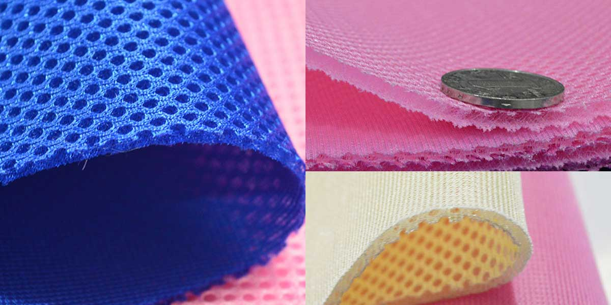
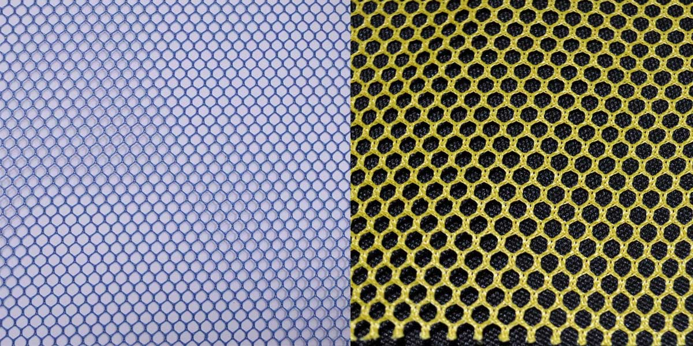
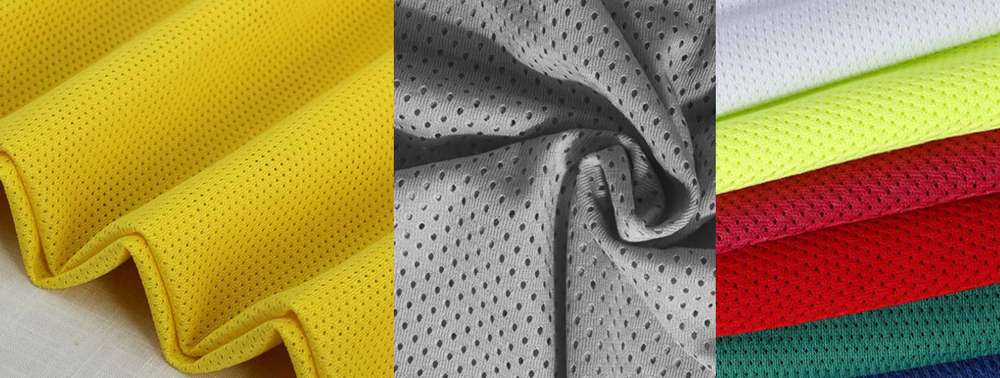
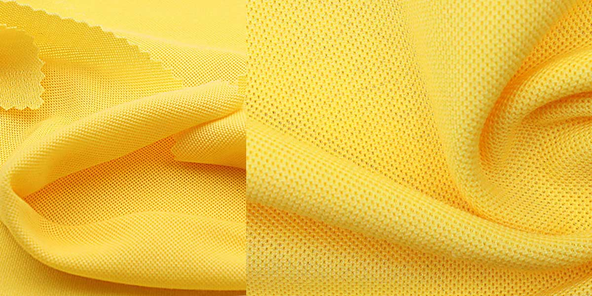
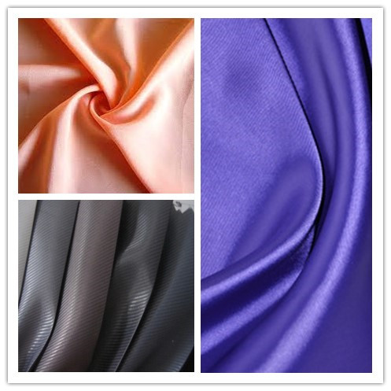
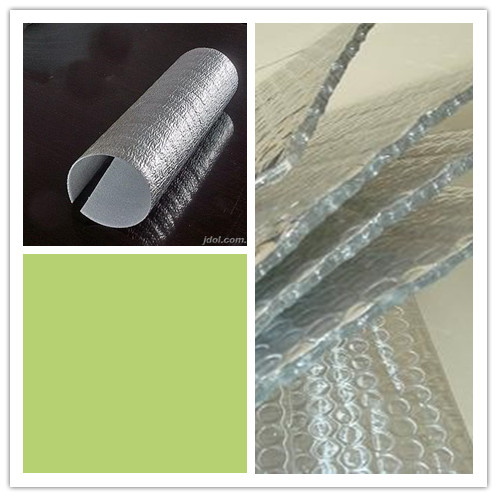
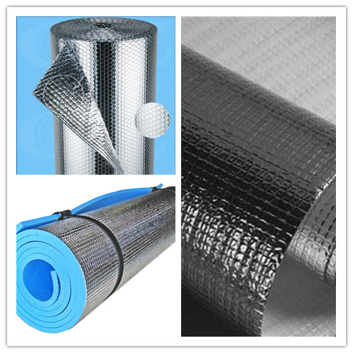
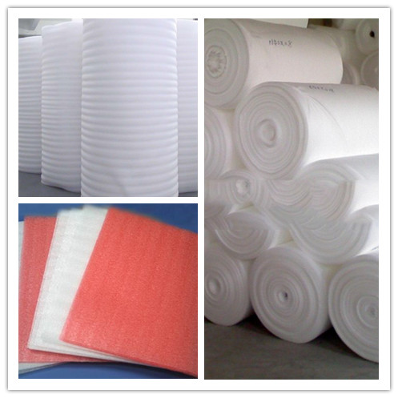

layout： post
title： "Fabric"
category： Bags
---

## 牛津布 Oxford

See [牛津布_百度百科](http://baike.baidu.com/view/358679.htm)

牛津布（oxford），又称牛津纺。起源于英国，以牛津大学命名的传统精梳棉织物，牛津布始于1900年左右。采用较细的精梳高支纱线作双经，与较粗的纬纱以纬重平组织交织而成。

起源于英国，以牛津大学命名的传统精梳棉织物，牛津布始于1900年左右。早期为该校学生校服面料的传统精梳棉织物。

起订量一般为 1400m。

可以用于背包、电脑包、腰包、书包、午餐包、背包、购物袋。女包一般不用涤纶牛津布，要用也使用尼龙牛津布，表面更亮一些。

按照表层的纺织布料的粗细程度分为不同的档次，210D，300D，420D, 600D，1280D，1680D， 1800D。210D 通常用于作里布。

### 特点

- 牛津布由面料和涂层构成，表面为纺织布料，背面为涂层。图层的材料分为 PVC 涂层和 PU 涂层。PU 图层几乎用肉眼看不到。
- 色泽柔和，布身柔软，透气性好，穿着舒适，易洗速干，多用作衬衣、运动服和睡衣等。
- 产品品种花式较多，有素色、漂白、色经白纬、色经色纬、双经单纬、中浅色条形花纹，2/2重平组织等；布面有清晰的色点效果。

可以用于背包、电脑包、腰包、书包、午餐包、背包、购物袋。女包一般不用涤纶牛津布，要用也使用尼龙牛津布，表面更亮一些。

### 分类

根据使用材质的不同，分为尼龙牛津布和涤纶牛津布。

牛津布是一种功能多样，用途广泛的新型面料，市场上主要有：套格、全弹、锦纶、提格等品种。

- 套格牛津布。专门用于制作各类箱包。

    该面料经纬线都采用涤纶FDY150D/36F。织物应用平纹组织在喷水织机交织而成，经纬密度为360X210，坯布经松弛、碱量、染色、防静电、涂层等处理后，具有质地轻薄、手感柔软、防水性好、耐用性好等优势。这样的牛津布做箱包是最好的，也是最常见的。

- 锦纶牛津布。主要制作防汛防雨用品。

    该面料经线采用200D锦纶空变丝，纬线采用160D锦纶空变丝为原料。系平纹组织结构，产品经喷水织造而成。坯布经过染整、涂层工艺处理后，具有手感柔软、悬垂性强、风格新颖、防水性能良好等优点，布面具锦纶丝光泽感观效应。因其质量优良、花色新颖，深受用户喜爱。其布面宽幅为150cm，据了解，面料以不褪色、不变形等优势立足市场。上市色泽有藏青、淡黑、虎黄、墨绿等不同种类，并可按客户需求批量选染各种不同的颜色。

- 全弹牛津布。主要制作箱包。
    
    该面料经纬丝都采用涤纶DTY300D丝，选用粗点变化透空组织在喷水龙头织机上交织而成。织物经松弛精练、预定型、碱减量、柔软定型后，面料反面再经橡塑涤层。用此面料制作的箱包以其时尚的外观、细腻的质地、良好的防水性，受到众多爱美的新潮女士追捧，成为当前女包市场上的新宠。其面料门幅150cm

- 提格牛津布。主要制作各种箱包。

    该面料经丝采用涤纶DTY400D网络丝，纬丝采用涤纶DTY丝400D。采用提格组织纹理，在喷水(带龙头)织机上交织而成。面料设计新颖、工艺独特，正面格纹凸现，立体感强，成为面料最突出的部位，同时还在反面采用涂层(PU)工艺，使其防水性更强，悬垂性更好，是制作各种箱包的时尚佳料。面料宽幅为160cm.上市颜色主要有黑色、藏青、咖啡系列等几种。

- 纬条牛津布。主要制作各种箱包。

    该面料经丝采用涤纶FDY68D/24F，纬丝采用FDY150D/36F为原料，织造工艺采用纬向提条在喷水织(带多臂龙头) 交织而成。布面条子清晰，集现代性、艺术性、悬垂性于一体。坯布经染色、压花或压延后，具有垂感性强、防水性好等优点。面料门幅为 160cm。

    该材料目前还应用到时尚休闲灰的鞋子制作，因为材料本身的特色给穿着搭配有丰富的选择！

### 600D

600D 牛津布分为 A、B、C、D 四个版本，A - D 版的价格渐高，更密，一般高在 10倍 放大镜下看。参考价格为：

- A 版：4.2元/米
- B 版：4.8元/米
- C 版：5.6元/米
- D 版：6.5元/米

其他牛津布的参考价格为：

- 210D：2.2~3.5元/米    
- 420D：3.6~4.6元/米
- 1680D：12~16元/米

## 涤纶 Polyester

涤纶/聚对苯二甲酸乙二酯/达克纶 PET

涤纶的学名叫聚对苯二甲酸乙二酯（英语：Polyethylene Terephthalate，简称PET或PETE），简称聚酯纤维(Polyester Fiber)。

商品名为 Dacron、Terylene、Lavsan（苏联时代或俄罗斯）、的确良、涤纶、达克纶，是生活中常见的一种树脂，可以分为 APET、RPET 和 PETG。

可以用于背包、电脑包、腰包、书包、午餐包、背包、购物袋。女包一般不用涤纶牛津布，要用也使用尼龙牛津布，表面更亮一些。

### 特点

__优点：__

* 强度高、耐冲击性好。
* 耐酸不耐碱，耐光性很好（仅次于腈纶），曝晒1000小时，强力保持60-70%。
* 良好的排湿性。
* 挺括，易洗快干，保形性好。具有“洗可穿”的特点。
* 价格比尼龙便宜，用的比较多。

__缺点：__

* 布料外表比尼龙暗，较粗糙、手感硬。
* 光泽不柔和、透气性。
* 吸湿性很差，染色困难。穿在身上发闷、不透气。
* 由于纤维表面光滑，纤维之间的抱合力差，经常摩擦之处易起毛、结球。

涤纶纤维面料的种类较多，除织制纯涤纶织品外，还有许多和各种纺织纤维混纺或交织的产品，弥补了纯涤纶织物的不足，发挥出更好的服用性能。涤纶织物正向着仿毛、仿丝、仿麻、仿鹿皮等合成纤维天然化的方向发展。

一般 75D 的倍数的布料为涤沦，如75D，150D，300D，600D，1200D，1800D均为涤沦，布料外表比尼龙暗，较粗糙。 

## 涤纶牛津布

See [涤纶牛津布_百度百科](http://baike.baidu.com/view/1196144.htm)

涤纶牛津布面料（布料）：主要制作防汛防雨用品 该面料经线采用200D锦纶空变丝，纬线采用160D锦纶空变丝为原料。系平纹组织结构，产品经喷水织造而成。坯布经过染整、涂层工艺处理后，具有手感柔软、悬垂性强、风格新颖、防水性能等优点，布面具锦纶丝光泽感观效应。

涤纶是一种材料，牛津布是一种纺织方式，其中可能含有涤纶。其中套格牛津布，提格牛津布，全弹牛津布，都是涤纶牛津布.

## 尼龙/锦纶/Nulon

尼龙/锦纶/聚酰胺纤维/尼龙/锦纶/耐纶 Nylon/PA。

发明于1935年2月28日，发明者为美国威尔明顿杜邦公司的华莱士·卡罗瑟斯。

一般 70D 的倍数的布料即为尼龙，如 70D，210D，420D，840D，1680D均为尼龙材质(但是市面上因为价格的关系也用涤纶来制造的），布料的光泽度比较亮，手感较滑。 

但是市面上因为价格的关系也用涤纶来制造的。

Nylon is a thermoplastic, silky material, first used commercially in a nylon-bristled toothbrush (1938), followed more famously by women's stockings ("nylons"; 1940) after being introduced as a fabric at the 1939 New York World's Fair.

尼龙是一种丝滑的，具有热塑性的材料，第一个商业应用在尼龙毛牙刷（1938年），其后更著名女性的丝袜（“尼龙”，1940年）。尼龙是第一个商业成功的合成热塑性聚合物。

用途：长丝，多用于针织和丝绸工业；短纤，大都与羊毛或毛型化纤混纺。工业：帘子线和渔网，也可作地毯，绳索，传送带，筛网等

__Ripstop nylon__ is a light-weight nylon fabric with interwoven ripstop reinforcement threads in a crosshatch pattern. 

- Diamond Ripstop
- Mini-Ripstop

### 特点

__优点：__

Water-repellent and tear-resistant Nylon Material. 

- Excellent abrasion resistance 最大优点是耐磨。
- Durability: its high tenacity fibers are used for seatbelts, tire cords, ballistic cloth and other uses. 结实耐用：其高强度纤维可用于安全带，轮胎帘线，防弹布和其他用途。
- 密度小，织物轻
- Softer "Hand" 柔顺
- Pleats and creases can be heat-set at higher temperatures 可以高温定性褶和折痕
- Highly resilient 高弹性，如钓鱼用的尼龙线
- More compact molecular structure 更紧凑的分子结构
- Paved the way for easy-care garments 免烫
- 耐疲劳破坏，化学稳定性也很好，耐碱不耐酸
- High melting point (256 °C/492.8 °F) 熔点高（256℃/ 492.8°F）
- Superior colorfastness 色牢度高
- Variation of luster: nylon has the ability to be very lustrous, semilustrous or dull. 光泽变化：尼龙可是有光泽，半光泽，或无光泽。

__缺点：__

- 锦纶的缺点与涤纶一样，吸湿性和通透性都较差。
- 在耐日光性不好，织物久晒就会变黄，强度下降，吸湿也不好，但比腈纶，涤纶好。
- 干燥环境下，锦纶易产生静电
- 短纤维织物也易起毛、起球
- 锦纶的耐热、耐光性都不够好，熨烫承受温度应控制在140℃以下。
- 锦纶的保形性差，用其做成的衣服不如涤纶挺括，易变形。
- 但它可以随身附体，是制做各种体形衫的好材料。

On the other hand, nylon 6 is easy to dye, more readily fades; it has a higher impact resistance, a more rapid moisture absorption, greater elasticity and elastic recovery. 另一方面，尼龙6是容易染色，更容易褪色；它具有较高的耐冲击性，更快速的吸湿性，弹性较大和弹性回复。

__优点：__

* 优点是高强度、高耐磨性、高抗化学性及良好的抗变形性，抗老化性。
* 布料的光泽度比较亮，手感较滑。

__缺点：__

* 表层防水，水滴上去表层会形成水珠。仿的尼龙表层还是会湿，不能通过图层防水。
* 尼龙的价格比涤纶的贵。

比较有名的有PERTEX，CORDURA。

## 涤纶与尼龙区别

特性/材质     | 尼龙 |  涤纶
--------------|------------|-------------
感官 | 外表光泽度亮，手感滑    |  外表光泽度较暗，表面较粗糙
用指甲刮 | 痕迹不明显 | 有明显痕迹
燃烧 | 冒白烟，燃烧后成塑，残物不能捏碎 | 冒黑烟，残物可以捏碎
性能 | 表面防水，耐磨，受力，色牢度 | 涂层防水，涂层会有白色划痕
涂层 | PU/优力胶/PVC 涂层  |  PVC 涂层
普通价格（元/米） |   7-16 | 4.5-6.5
环保价格 | + 1.5-2 | + 1.5-2
宽幅 | 1.45米 |  1.45米
起订量 | 1000米 |  1000米

__尼龙和涤纶燃烧现象：__

- 尼龙，近火焰即迅速卷缩熔成白色胶状，在火焰中熔燃滴落并起泡，燃烧时没有火焰，离开火焰难继续燃烧，散发出芹菜味，冷却后浅褐色熔融物不易研碎。 
- 涤纶，易点燃，近火焰即熔缩，燃烧时边熔化边冒黑烟，呈黄色火焰，散发芳香气味，烧后灰烬为黑褐色硬块，用手指可捻碎。 

## 无纺布/Non Woven Fabric

See [无纺布_百度百科](http://baike.baidu.com/view/15374.htm)

无纺布（英文名：Non Woven Fabric 或者 Nonwoven cloth）又称不织布，是由定向的或随机的纤维而构成，是新一代环保材料，具有防潮、透气、柔韧、质轻、不助燃、容易分解、无毒无刺激性、色彩丰富、价格低廉、可循环再用等特点。如多采用聚丙烯（pp材质）粒料为原料，经高温熔融、喷丝、铺纲、热压卷取连续一步法生产而成。因具有布的外观和某些性能而称其为布。

__特点:__

无纺布没有经纬线，剪裁和缝纫都非常方便，而且质轻容易定型，深受手工爱好者的喜爱。

它不是由一根一根的纱线交织、编结在一起的，而是将纤维直接通过物理的方法粘合在一起的，所以，当你拿到你衣服里的粘称时，就会发现，是抽不出一根根的线头的。非织造布突破了传统的纺织原理，并具有工艺流程短、生产速率快，产量高、成本低、用途广、原料来源多等特点。

__无纺布与纺粘布的关系：__

纺粘布与无纺布是从属关系。无纺布的制造有许多的生产工艺，其中纺粘法是其中的一种无纺布生产工艺(包括纺粘法、熔喷法、热轧法、水剌法，现市面上大部分都是用纺粘法生产的无纺布)

无纺布根据成分，有涤纶、丙纶、锦纶、氨纶、腈纶等；不同的成分会有截然不同的无纺布风格。而纺粘布，通常指的是涤纶纺粘、丙纶纺粘；而这两种布的风格非常接近，通过高温测试才能判别出。

无纺布是一种非织造布，它是直接利用高聚物切片、短纤维或长丝将纤维通过气流或机械成网，然后经过水刺，针刺，或热轧加固，最后经过后整理形成的无编织的布料。具有柔软、透气和平面结构的新型纤维制品，优点是不产生纤维屑，强韧、耐用、丝般柔软，也是增强材料的一种，而且还有棉质的感觉，和棉织品相比，无纺布的袋子容易成形，而且造价便宜。

优点：

1. 质轻：以聚丙烯树脂为主要生产原料，比重仅0.9，只有棉花的五分之三，具蓬松性，手感好。
2. 柔软：由细纤维组成(2-3D)轻点状热熔粘结成型。成品柔软度适中，具舒适感。
3. 拨水、透气：聚丙烯切片不吸水，含水率零，成品拨水性佳，由100%纤维组成具多孔性，透气性佳，易保持布面干爽、易洗涤。
4. 无毒、无刺激性:产品采用符合FDA食品级原料生产，不含其他化学成分，性能稳定，无毒、无异味，不刺激皮肤。
5. 抗菌、抗化学药剂：聚丙烯属化学钝性物质，不虫蛀，并能隔离存在液体内细菌及虫类的侵蚀；抗菌、碱腐蚀、成品不因侵蚀而影响强度。
6. 抗菌性。制品具拔水性，不发霉，并能隔离存在液体内细菌及虫类的侵蚀，不霉蛀。
7. 物性佳。由聚丙烯纺丝直接铺成网热粘结而成，制品强度较一般短纤产品为佳，强度无方向性，纵横向强度相近。
8. 在环保方面，使用的大多数无纺布的原材料是聚丙烯，而塑料袋的原材料是聚乙烯，两种物质虽然名字相似，但在化学结构上却相差甚远。聚乙烯的化学分子结构具有相当强的稳定性，极难降解，所以塑料袋需要300年才可分解完毕；而聚丙烯的化学结构不牢固，分子链很容易就可断裂，从而可以有效地降解，并且在无毒的形态中进入下一步环境循环，一个无纺布购物袋在90天内就可以彻底分解。而且无纺布购物袋可重复使用10次以上，废弃后对环境的污染度也只有塑料袋的10%。

缺点：

1. 与纺织布相比强度和耐久性较差。
2. 不能像其他布料一样清洗。
3. 纤维按一定方向排列、所以容易从直角方向裂开等等。因此生产方法的改善主要放在防止分裂的改良上。

## 帆布 Canvas

帆布（canvas）是一种较粗厚的棉织物或麻织物。因最初用于船帆而得名。一般多采用平纹组织，少量的用斜纹组织，经纬纱均用多股线。

常用与斜挎包、背包、妈咪包、沙滩包。由于其具有耐磨的特性，也可以用于登山包。

没有涂层，化学成份为棉，而牛津的化学成份化纤。现在有些帆布表面会涂一层 PVC（过胶、雅膜）。

### 分类

市场上有全棉帆布和涤棉帆布之分，全棉帆布较贵。

帆布通常分粗帆布和细帆布两大类。

- 粗帆布又称篷盖布，常用58号（10英支）4～7股线织制，织物坚牢耐折，具有良好的防水性能，用于汽车运输和露天仓库的遮盖以及野外搭帐篷。
- 细帆布经纬纱一般为2股58号至6股28号（10英支/2～21英支/6），用于制作劳动保护服装及其用品。经染色后也可用作鞋、旅行袋、背包、等面料。

粗帆布又称蓬盖布，具有良好的防水性能，用于汽车运输和露天仓库的遮盖以及野外搭帐篷。细帆布用于制作劳动保护服装及其用品，经染色或印花后，也可用作鞋材、箱包面料、手袋、背包、桌布、台布等等。此外，还有橡胶帆布，防火、防辐射用的屏蔽帆布，造纸机用的帆布。

帆布织物 _密度_ 的计算单位以公制计，是指一平方英寸内经纬纱排列的根数。密度的大小，直接影响织物的外观，手感，厚度，强力，抗折性，透气性，耐磨性和保暖性能等物理机械指标，同时他也关系到产品的成本和生产效率的大小。因此，密度越大防水性越好。

__根据材质不同分为涤棉帆布和纯棉帆布。__

- 纯棉（100% cutton canvas）：手感好 不耐干 结实。
- 涤棉(TC canvas)：一般情况下：65% 涤，35% 棉。表面比纯棉亮滑。
- 再生棉：可回收再利用。用的不多。

__按水洗分类：__

- 水洗帆布：颜色比较复古，泛白，就像水洗过了一样。
- 染色帆布：色彩鲜艳，易掉色，但取决于质量。帆布的原始颜色为米黄色。

### 特点

- 耐磨
- 透气
- 可降解
- 耐洗
- 不防水

### 幅宽和价格

帆布幅宽为1.45米。

常用帆布价格：

- 10安=7.5元/码
- 12安=11.5元/码
- 14安=13.5元/码
- 16安=15.5元/码
- 22安=20元/码

## 斜纹

## 花瑶

花瑶因为有加捻，看上去有一丝丝像蛔虫似的暗纹，注意是暗纹哦，锦涤纺最薄的和最厚的差别很大，一般有双色的和单色的，薄的做服装里料，厚的做面料，有部分品种也叫变色龙，做唐装用的。锦涤纺部分品种也有纹路的，不过比较显眼，像裂纹，闪电形状的。

## 网布

网布在箱包行业中一般用于包的两侧，前幅或后幅做于网袋用于放置物品，或者用于夹层来隔离物品！

* 优越的透气性
* 回弹性,有弹性,提供缓冲保护
* 质地轻,易洗涤
* 环保无毒
* 网孔多样性,美观大方。

### 分类

__根据网眼形状可分为：__

1. 三明治网布。布料分为三层。
    
    

2. 六角网布

    

3. 菱形网眼布
4. 方格网眼布
5. 提花网眼布
6. 鸟眼网布
    
    

7. 珠地网眼布。珠地网眼，广义的意思是以针织线圈之凹凸风格类面料的泛称，狭义的意思为针织单面圆机所织的4路一个循环的凹凸组织面料。由于面料有排列均匀整齐的凹凸效果，和皮肤接触的面在透气和散热，排汗的感觉舒适度上优于普通的单面汗布组织，一般常用做T恤、运动服等。

    

__根据网布使用的原材料可以分为：__

1. PVC 网布
2. 涤纶网布
3. 尼龙网布
4. 蕾丝网布

### 价格

- 六角网：1.8~6.5 元/m
- 三明治网：5~9 元/m

## 里布

Taslon, 亚麻

服装里料就是通常听说的服装里子（夹里布），它是指用于部分或全部覆盖服装里面的材料。

里布的价格一般比面料的价格更低。

里布尽量不要用白色，会增加次品率。

根据客人的询盘数量，告知是否可以定做材质，不同材质起订量不一样，数量少的只能用现有材料。

以下材料常用于女包和运动包的里布：

- 210D 牛津布。
- 无涂层（即看不到的 PU 图层）的 420D。
- 无涂层的斜纹 230D。
- T/C 棉 。涤纶和棉布混纺。一般都带有印花。
- 斜纹。
- 棉布。成本比较高，用得比较少。
- 190T，比 210D 更薄，也是牛津布的一种，也成为涤塔夫，不常用。
- 塔丝绒。旁边容易拉丝，不常用。
- 桃皮绒。

比较常见的里布品种有:涤塔夫,舒美绸,人造丝系列,雪纺,色丁等.

### 涤塔夫里布

涤塔夫是一种全涤布，是涤纶长丝织造,外观上光亮，手感光滑。这样的布叫涤塔夫，可以做面料和里料，一般做里料多。

taffeta是塔夫的意思，这个本来是真丝的一种分类（真丝分4大类24小类），用涤纶仿的叫做涤塔夫或者涤丝纺，尼龙的叫做尼丝纺。

属于合成纤维的一种，手感滑爽，不粘手，富有弹性，光泽明亮刺眼，颜色鲜艳夺目，不易起皱，缩水率小于5%。单丝粗细均匀，不易扯断。点燃纤维，有其他气味。[1] 

### 舒美绸里布

此种面料以FDY68D/24F与DTY75D/36F为原料，在喷水织机上织造，采用斜纹组织。坯绸经整理后，手感柔软、光泽亮丽、无静电，产品适于制作中高档西服、风衣、皮装等。正面以人造丝来表现其风格特色，以手感柔软滑爽、不易退色起皱、光泽亮丽、牢度强等优点，不但适宜配作休闲服和唐装的里料，而且又是时尚箱包里衬布。

### 人造丝里布

人丝里布又称为:涤粘里布,半宾霸里布,是一种仅此于宾霸的里布.常规品种有人丝斜纹,人丝平纹,人丝提花等各个品种,由于是采用涤纶和粘胶两种不同的原料混纺而成的,所以染色出来的效果是拥有真丝一般的双色效果,目前国内比较知名的人造丝里布品牌正信的"鹤立",其生产的人造丝大提花,小提花产品等远销欧美等国。[1]  .

### 雪纺里布

雪纺：在中国东方丝绸市场上全新亮相，备受南北商贾所青睐，小批量多批次成交颇为活跃。 该面料经纬丝采用涤纶FDY100D加捻，然后再经蒸烘退捻的特殊整浆工艺。织物结构采用平纹变化，
产品除了具有柔软、滑爽、透气、易洗的优点外，舒适性更强,悬垂性更好。面料既可染色、印花,
又可绣花、烫金、褶皱等。上市面料以多种浅彩色调和浅素色泽为主导产品，兼具淡汝素雅之美感。
面料门幅150cm，每米克重约在130克左右，是制作春夏时尚女性理想的时装面料之一。[1] 

### 色丁里布

色丁”系列：一款洋溢旺盛生命力、显示自然风貌的—“色丁”面料，它是问世已久的老品种，
但盛泽地区的纺织界对其产品进行了改版，除了采用大有光三角异型丝原料和织造工艺创新外，
也在面料染整后处理工艺延伸，其密度增加，手感更柔软，功能更拓展。“色丁”己经形成系列并且在吴江东方丝绸市场上应市的“色丁”织造风格有缎纹、坚条、竹节、提花等。

### 针织里布

1．采用珠光多纤维原料使产品呈现别具特色的缎面效果，令成衣更具高雅，华丽的感觉。
2．经编结构无需锁边也不易撕裂，满足设计师各种设计要求。
3．良好的伸展回弹性扩大了针织里布的有效使用率。
4.．双向经纬的弹力使产品能应用于各种服饰。
5．同时拥有滑爽如内衣般的轻柔触感，及贴合人体的高垂感。
6．经过一段时间洗涤也能保持效果的耐久防静电加工。
7．采用环保染色技术，不污染环境不影响人体健康。[2] 

铝膜、复铝膜珍珠棉常用于冰包、午餐包的里布。使用其防水隔热的特性。复铝膜珍珠棉越厚，价格越高，厚度单位为 mm。

背包一般使用 210D 或者 230D 作为里布。

__铝箔复合珍珠棉：__

__铝膜__

__珍珠棉：__

聚乙烯发泡棉是非交联闭孔结构，又称 EPE 珍珠棉 , 是一种新型环保的包装材料。它由低密度聚乙烯脂经物理发泡产生无数的独立气泡构成。克服了普通发泡胶易碎、变形、恢复性差的缺点。具有隔水防潮、防震、隔音、保温、可塑性能佳、韧性强、循环再造、环保、抗撞力强等诸多优点，亦具有很好的抗化学性能。是传统包装材料的理想替代品。 

__铝箔复合珍珠棉：__

__铝膜__

__珍珠棉：__

聚乙烯发泡棉是非交联闭孔结构，又称 EPE 珍珠棉 , 是一种新型环保的包装材料。它由低密度聚乙烯脂经物理发泡产生无数的独立气泡构成。克服了普通发泡胶易碎、变形、恢复性差的缺点。具有隔水防潮、防震、隔音、保温、可塑性能佳、韧性强、循环再造、环保、抗撞力强等诸多优点，亦具有很好的抗化学性能。是传统包装材料的理想替代品。 

## 纺织布料常用概念

### 克重

克重：指一平方米布料的重量克数。

梭织帆布面料用`盎司`、`安`或 `OZ`，针织帆布一般用克重（g/m2）。其中 `安`是 `安士` 的缩写，英文表示为 `OZ`。

    1盎司 = 28.3495231g/m2

安数越大，经纬度越粗。

### 纱支

纱支简而言之，即指纱的粗细程度。

一磅（454克）重的棉纱（或其它成分纱），长度为840码（0.9144码/米）时，纱的细度为一支。如果一磅纱，其长度是10×840码，其细度是10支，纱支的表示方法英制式的表示符号是英文字母“S” 。单根纱的表示方法是：32支单纱，表示为32S。

股线的表示方法是：32支股线（两亘并捻）既为：32S/2，42支3 根并捻既为：42S/3。

纱支越大，纱越细。

### 幅宽和起订量

幅宽：指帆布的纬向宽度，在国际上常用 `英寸`或 `"` 表示，如47"。在国内常用 `厘米` 或 `cm` 表示，如 120cm。

    1英寸=2.54厘米

起订量：理论上是 500米，有现货的情况下 100 米，200米 也可以。

### D 数的含义

D 是 DENIER（旦尼尔）的缩写，是化学纤维的一种细度表达方法，是指9000米长的丝在公定回潮率时的重量克数，也称为旦数。 

    旦尼尔（D）=(g/L)x9000，其中 g 为丝线重量(克), L为丝线长度(米)。

D 越大，表示纱线越粗，同样面积的布料就越重。常见于背包面料的材料强度指标。

一般用于300D，420D，600D，1680D。

### 色牢度

色牢度是纺织品的重要质量指标之一。所谓色牢度是指染色纺织品在物理和化学作用下，颜色保持坚牢的程度，即染色纺织品色泽受外界影响坚牢程度称为染色牢度。以试验后试样的色泽变化，白布沾色程度的评定等级表示色牢度的好坏。

纺织品的色牢度，分为5级: 1、2、3、4、5 （1级最差，5级最高，在中国市场达不到的。）

在评定不准时，或者商家只需要在色牢度范围内时，有大概参数等级：1-2, 2-3, 3-4, 4-5。

常规的色牢度为 3.5。

以下为织带所必须满足的织带标准：

1. 耐水洗牢度3.5级以上,通过 ISO105-C01:1989 测试标准
2. 耐摩擦牢度3.5级以上,通过 ISO105-X12:1993 测试标准
3. 耐日晒牢度4级以上,通过 ISO105-B02:1994 测试标准

## 色丁

色丁就是satin的音译。色丁是一种面料，也叫沙丁。外观与五枚缎相似，密度高于五枚缎。通常有一面是很光滑的，亮度很好，就是它的缎面。规格通常有75×100D，75×150D等。原料：可以是棉，混纺的，或者涤纶，也有是纯化纤的，是面料的组织不同形成的。主要用于各类女装，睡衣面料或内衣的。该产品流行性广，光泽度悬垂感好，手感柔软有仿真丝效果。

其原料可以是棉，混纺的，或者涤纶，也有是纯化纤的，是面料的组织不同形成的。主要用于各类女装，睡衣面料或内衣的。该产品流行性广，光泽度悬垂感好，手感柔软有仿真丝效果。布面的风格独特，具有较好的缎面闪光视觉效果。该面料用途十分广阔，不仅可制作休闲的裤装、运动装、套装等，而且又是床上用料。面料制成衣穿着舒适，而颇受欢迎。

See [色丁_百度百科](http://baike.baidu.com/link?url=l6UqpiViVHb9UufWgJvMnxs8-1KXuqqc0bpMJA-e8V2AtzDcztSKif-X6fCN_ZD8bq8dcvWVexiQySP22lDMFa)

## 织带

Soft herringbone webbing

## 篷布

## TODO

- Ballistic Polyester
- 反光布
-  fleece-lined Top-load tablet pocket is fleece-lined for automatic glass cleaning, measures 8-1/8” wide x 11.5” tall, lays flat between the main and laptop compartment, and is lockable
-  450d PET body fabric http://www.ebags.com/product/mountainsmith/day-tls-r/228596?productid=10173411
-  Taffeta http://www.ebags.com/product/hedgren/ashur-waist-bag/295572?productid=10368343