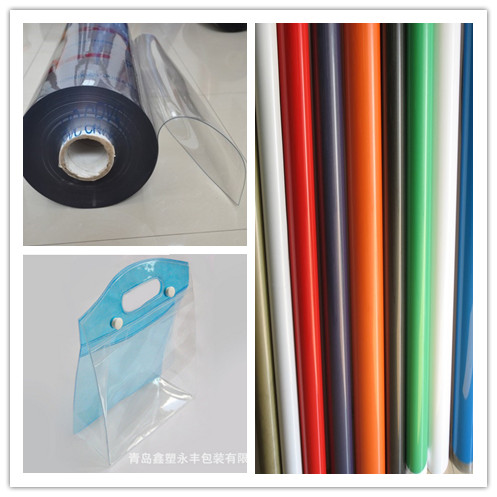
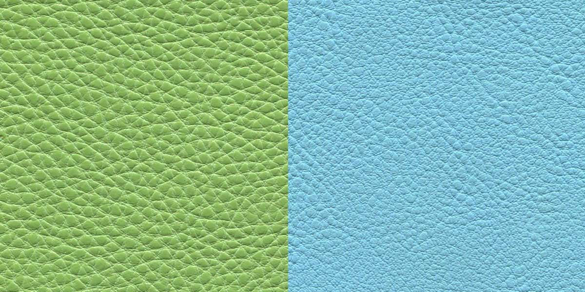
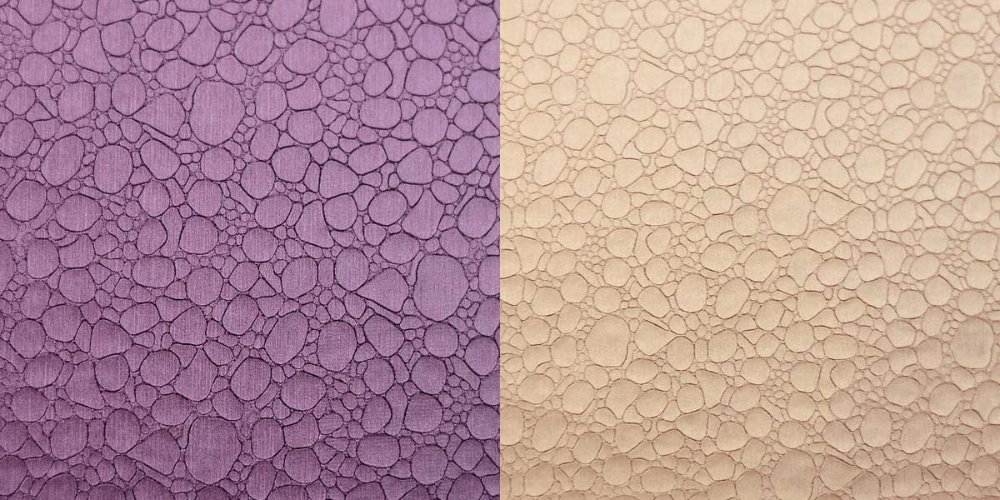
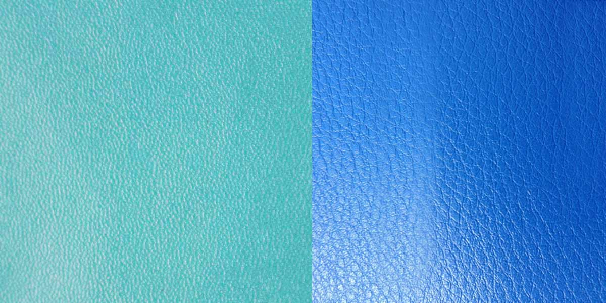
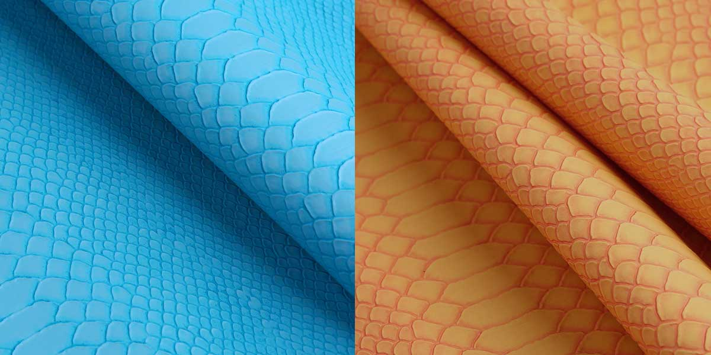
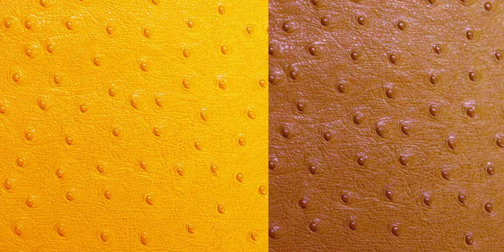
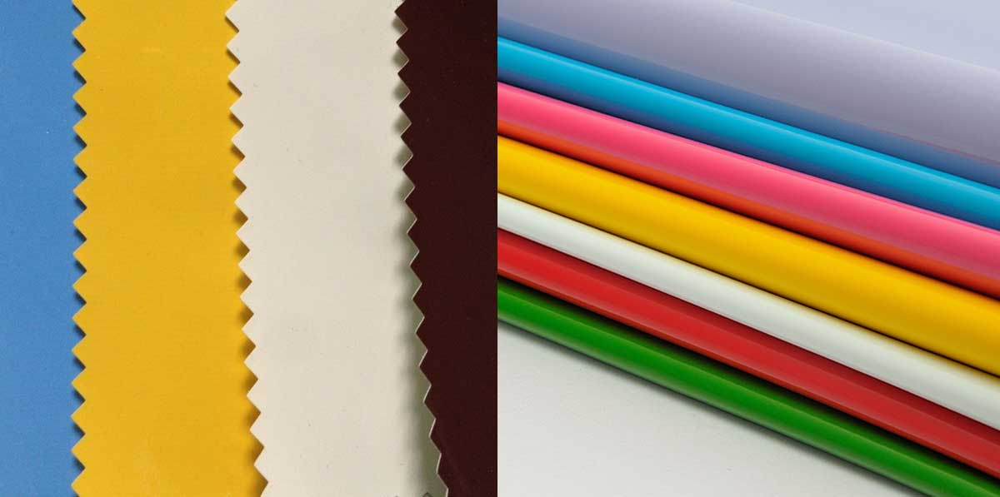

layout: post
title: "箱包 - 皮革"
category： Bags
---

## 皮革

皮革是经脱毛和鞣制等物理、化学加工所得到的已经变性不易腐烂的动物皮。革是由天然蛋白质纤维在三维空间紧密编织构成的，其表面有一种特殊的粒面层，具有自然的粒纹和光泽，手感舒适。

皮革主要分为真皮和合成革，合成革主要有 PU 革 和 PVC 革两种。

PVC 比较硬，比较好压印 LOGO，而 PU 较软，不容易压印。如果压下之后的颜色变成另外一种颜色，这种材料成为变色革。

皮革的厚度使用使用`丝`来衡量，1mm = 100丝。常见的有8丝和10丝的PVC。

皮革类面料需要注意色迁移的问题，要防止颜色渗到里布，导致里布的颜色洗不掉。

PVC 人造革、PU 合成革的区别可以用汽油浸泡的方法区别，方法是用一小块面料，放在汽油中半个小时，然后取出，如果是PVC人造革，则会变硬、变脆，如果是PU合成革，则不会变硬、变脆。

### 分类

__按动物种类：__

主要有猪皮革、牛皮革、羊皮革、马皮革、驴皮革和袋鼠皮革等，另有少量的鱼皮革、爬行类动物皮革、两栖类动物皮革、鸵鸟皮革等。

其中牛皮革又分黄牛皮革、水牛皮革、牦牛皮革和犏牛皮革；羊皮革分为绵羊皮革和山羊皮革。

在主要几类皮革中，黄牛皮革和绵羊皮革，其表面平细，毛眼小，内在结构细密紧实，革身具有较好的丰满和弹性感，物理性能好。因此，优等黄牛革和绵羊革一般用做高档制品的皮料，其价格是大宗的皮革中较高的一类。

__按层次：__

有头层革和二层革，其中头层革有全粒面革和修面革；二层革又有猪二层革和牛二层革等。

__按制造方式：__

- 真皮。“真皮”在皮革制品市场上是常见的字眼，是人们为区别合成革而对天然皮革的一种习惯叫法。其中，牛皮、羊皮和猪皮是制革所用原料的三大皮种。
- 再生皮。将各种动物的废皮及真皮下脚料粉碎后，调配化工原料加工制作而成。其表面加工工艺同真皮的修面皮、压花皮一样，其特点是皮张边缘较整齐、利用率高、价格便宜；但皮身一般较厚，强度较差，只适宜制作平价公文箱、拉杆袋、球杆套等定型工艺产品和平价皮带，其纵切面纤维组织均匀一致，可辨认出流质物混合纤维的凝固效果。
- 人造革。人造革也叫仿皮或胶料，是PVC和PU等人造材料的总称。它是在纺织布基或无纺布基上，由各种不同配方的PVC和PU等发泡或覆膜加工制作而成，可以根据不同强度、耐磨度、耐寒度和色彩、光泽、花纹图案等要求加工制成，具有花色品种繁多、防水性能好、边幅整齐、利用率高和价格相对真皮便宜的特点。

    人造革是极为流行的一类材料，被普遍用来制作各种皮革制品，或替代部分的真皮材料。它日益先进的制作工艺，正被二层皮的加工制作广泛采用。如今，极似真皮特性的人造革已有生产面市，它的表面工艺极其基料的纤维组织，几乎达到真皮的效果，其价格与国产头层皮的价格不相上下。

    人造皮革是通过多种类型的化学纤维混合而成的。人造皮草幅面较大。可以染成各种明亮的色彩；此外，它具有动物皮草的外观，各种野生和养殖的皮草种类都可以仿制。但其最大的特点就是不环保，不易降解，对环境有污染。

- 合成革。合成革是模拟天然革的组成和结构并可作为其代用材料的塑料制品。表面主要是聚氨脂，基料是涤纶、棉、丙纶等合成纤维制成的无纺布。其正、反面都与皮革十分相似，并具有一定的透气性。特点是光泽漂亮，不易发霉和虫蛀，并且比普通人造革更接近天然革。
    
    合成革品种繁多，各种合成革除具有合成纤维无纺布底基和聚氨酯微孔面层等共同特点外，其无纺布纤维品种和加工工艺各不相同。合成革表面光滑、通张厚薄，色泽和强度等均一，在防水、耐酸碱、微生物方面优于天然皮革。

## PVC 革

聚氯乙烯人造革(PVC革)是在织物上涂覆PVC树脂、增塑剂、稳定剂等助剂制成的糊，或者再覆合一层 PVC 膜，然后经一定的工艺过程加工制成的。制品强度高，加工容易，成本低廉。可做各种箱包、座套、衬里、杂物等。但耐油性、耐高温性差，低温柔软性和手感较差。

PVC 革 在制造过程中要先将塑料颗粒热熔搅拌成糊状，按规定的厚度均匀涂覆在T/C针织布底基上，然后进入发泡炉中进行发泡，使其具有能够适应生产各种不同产品、不同要求的柔软度，在出炉的同时进行表面处理（染色、压纹、磨光、消光、磨面起毛等，主要是依照具体的产品要求来进行的）。

PVC 表面也有很多纹路。

- 色泽鲜艳、耐腐蚀、牢固耐用。
- 不存放食品和药品。由于在制造过程中增加了增塑剂、抗老化剂等一些有毒辅助材料来增强其耐热性，韧性，延展性等，故其产品一般不存放食品和药品。

根据特性，PVC 材料可分为：

- 彩边 PVC。彩色 PVC 比无色 PVC 较贵。
- 皮革 PVC
- 透明 PVC。常用于制作化妆包。

常用的为白的，透明的；还有一种是有压痕的，还可以压花，比较贵。

北欧等一些发达国家禁止使用 PVC 材料（常见女包、化妆包），因为 PVC 不容易降解，燃烧或高温会产生有毒物质，不环保。

根据材料的不同，又可分为 PE 和 EVA。EVA 比较薄，像薄膜。

## PU 革

用PU树脂与无纺布为原料生产的人造革称为PU合成革。

PU 是英文 Polyurethane 的缩写，化学中文名称“聚氨酯”。 PU皮革就是聚氨酯成份的表皮。现在广泛适用于做箱包、服装、鞋、车辆和家具的装饰，它已日益得到市场的肯定，其应用范围之广，数量之大，品种之多，是传统的天然皮革无法满足的。

PU 革在制造工艺上比PVC革要复杂一些，由于PU的底布是抗拉强度好的帆布PU料，除了可以涂覆在底布的上面外，还可以将底布包含在中间，使之外观看不到底布的存在。

PU革的物理性能要比PVC革好，耐曲折、柔软度好、抗拉强度大、具有透气性（PVC无）。

PVC革的花纹是通过钢制的花纹辊热压而成的；PU革的花纹是用一种花纹纸先热贴压在半成品革表面，等待冷却下来后再进行将纸革的分离，做表面处理。

PU革的价格比PVC革的要高一倍以上，某些特殊要求的PU革的价格要比PVC革要高2―3倍。一般PU革所需要的花纹纸只能用4―5次即告报废；花纹辊的使用周期长，因此PU革的成本比PVC革的为高。

PU 根据表面成份的不同分为：

- 全 PU
- 半 PU(SEMI PU)

区别在于：

- 相对全 PU 更薄，更柔软，弹性更大。
- 主要用厚度、手感（柔软度）、价格来区分。
- 价格：PVC < 半PU < PU，半PU与PU之间非专业人士很难鉴别。
 
PU 革从结构上分为纹路、表面和底。

- 常见的纹路包括荔枝纹（根据纹路大小可分为小荔枝纹和大荔枝纹）、石头纹、蛇纹、鸵鸟纹、纳帕纹、十字纹（大十字、小十字）、镜面革。有些工程并非使用这些形象的名字来命名纹路，而是使用比较文艺的名字，如水平如镜等。
- PU 一般是绒布底，PVC 一般是针织底和水刺底（或者无纺布底）。

合成革的宽幅一般都是 1.35，纺织布料一般都是 1.45。一般用于复合的材料有杂革和无纺布，无纺布的宽幅是 1.55，如果和 PU 复合，就要使用较小的宽幅，及 PU 的 1.35。

荔枝纹：

石头纹：

纳帕纹：

蛇纹：

鸵鸟纹：

镜面革：

## 半 PU

合成革是一种很好的皮革代用品，用于做冬天的皮夹克，但是由于合成革使用 TPU（聚氨酯弹性体）加工而成的。而TPU价格由非常贵，所以国内很多的生产厂家就用PVC来部分替代，他们是这样做的：布基上先涂上PVC (人造革)然后在涂上TPU的涂层。

这样价格就可以大大的下降，但是 PVC中的增塑剂不到一年就会迁移出来，造成合成革（其实是人造革）变硬、变脆，所以有一些顾客买了新的皮夹克不到一年就边脆、开裂了，其实这种在生产合成革的工厂叫他是半合成革或半PU革。

半 PU 革可以用一种很简单的方法鉴定，就是用铜丝放在火加热，一直到火的颜色是红色的（不能有绿色）时候，铜丝也在火中烧红，将铜丝马上放到合成革上，合成革就熔化到铜丝上，最后，将铜丝再放到火上烧，如果此时的火是绿色的，则证明有 PVC,是半 PU 革，如果此时的火是红色的则证明是 PU 革。

## 杂革

## PVC 与 PU 的区别

属性 |  PVC | PU | 半 PU
-----|------|----|--------
柔软度 | 较硬，韧性较差 | 较软，韧性较好 | 最软
厚度 | 最厚 | 次厚 | 最薄
价格（元/米） | 7-16，环保 + 2.0 | 16-35, 环保 + 1.5 | 13.5-16, 环保 + 1.5
宽幅（有效） | 1.35米 | 1.35米| 1.35米
起订量 | 500m | 1000m | 1000m
耐力 | 用手能撕开 | 用手不能撕开 | 用手不能撕开
底布 | 较稀、较薄 | 较厚 | 较厚
比重 | 比重大 | 比重小| 比重小
纹路 | 纹路较深。中间的发泡层比较明显。 | 纹路较浅| 纹路较浅

从边角看PU的底布要比PVC厚许多，手感方面也有区别，PU的手感柔软一些；PVC的手感较硬一些；也可以用火来烧，PU的味道比PVC的味道要淡很多。

PU、半 PU 和 PVC 一般用于女包、化妆包、公文包、背包、运动包。登山包一帮使用牛津布料，因为牛津布的防水，而且较 PU 和 PVC 轻。

半 PU 因为比较软，需要复合一层（或者加厚、胶水），使其撑起成型。考虑到价格原因，有时候可以使用半 PU 复合一层来代替 PU。

注意，广东的起订量单位为码，1 码 = 0.914米，核算价格时注意单位换算。欧盟和美国会提到环保，谈判的时候需要注意。

## 真皮

“真皮”在皮革制品市场上是常见的字样，是人们为区别合成革而对天然皮革的一种习惯叫法；在消费者的观念中，“真皮”也具有非假的含意。

把皮剖成几层，带粒面的称为头层皮，以下依次为二层皮、三层皮，带肉面层的为肉面剖层皮，以块为单位。

__全粒面：__
    
粒面花纹保持完整，天然毛孔和纹理清晰可见的皮革。
正如木材的木纹、木质和斑痕应该展现出它所属树种的自然本色一样，皮革也应展示出它所属的动物的特点。越好的皮革，需要的修饰越少。较便宜的皮革的原有粒面被磨去并被涂上颜料，被压花以假粒面来代替，它们不象全粒面皮革一样柔软。尽管被一层颜料盖住，但原有的纹理变化依然可见。

全粒面革应居榜首，因为它是由伤残较少的上等原料皮加工而成，革面上保留完好的天然状态，涂层薄，能展现出动物皮自然的花纹美。它不仅耐磨，而且具有良好的透气性。

__半粒面：__

将皮革的粒面层只轻轻磨去一部分，但应在整张皮革面上仍保留未磨掉的那部分粒面，粒面上仍可见到天然毛孔和纹理的皮革。由于英文中使用了 "Top顶"这个词，所以这个术语成了在皮革工业中最容易混淆的。人们猜测 "Top顶"表示最好、顶级的，在这里并不是，这里使用了"Top顶"这个词是因为顶层可以被磨砂、涂颜料和印花纹。基本上说，半粒面皮革不是剖层皮。
剖层

__修面革：__

将粒面表面部分磨去，以减轻粒面瑕疵的影响，然后通过不同整饰方法造出一个假粒面以模仿全粒面皮的皮革。世界皮革产量的18%属于这种皮革。这种皮革经过较多的加工，如：磨砂、打磨、压花、涂颜料来掩饰原有的瑕疵，虫咬、铁丝网的擦伤、角伤等在涂饰前可用磨砂去掉。头层皮是带粒面的外层皮，约 0.9至1.5mm，称为C级的皮革符合这个种类的标准。这种皮革很明显需要打磨，因为除了用人工造出假粒面来代替原有的表面外，就别无用途了。世界皮革产量其余的65%是不适合做家具，只能用作制鞋、衣服、皮带、手袋和汽车座垫。

修面革，是利用磨革机将革表面轻磨后进行涂饰，再压上相应的花纹而制成的。实际上是对带有伤残或粗糙的天然革面进行了“整容”。此种革几乎失掉原有的表面状态，涂饰层较厚，耐磨性和透气性比全粒面革较差。

### 鉴别方法

__鉴别真皮和人造皮的方法：__

1. 手感：用手触摸皮革表面，如有滑爽、柔软、丰满、弹性的感觉就是真皮；而一般人造合成革面发涩、死板、柔软性差。人造革，用手指按压革面，没有明显的毛孔皱纹，如按压后有皱纹，也不会明显自然消失。
2. 眼看。观察真皮革面有较清晰的毛孔，花纹。人造革，尽管也仿制了毛孔，但不清晰。
3. 嗅味：凡是真皮都有皮革的气味；而人造革都具有刺激性较强的塑料气味。
4. 点燃：从真皮革和人造革背面撕下一点纤维，点燃后，凡发出刺鼻的气味，结成疙瘩的是人造革；凡是发出毛发气味，不结硬疙瘩的是真皮。   

__头层皮和二层皮的鉴定方法__

1. 摸手感

    - 头层牛皮是价值较高的皮革，通常不会做很厚的涂层，所以手感基本保留了皮革的柔韧感和悬垂感。
    - 二层牛皮因为要经过比较厚的涂饰或者经过覆膜，所以手感有些发硬发梗，比较死板，缺少悬垂感。
    - 幅面尺寸
        头层皮基本保留了蓝湿皮的全部面积，其皮材的张幅面积较大，而且皮面匀称。对二层皮而言，在剖离头层皮时，会有较大的损耗，皮面面积比头层皮会小很多，而且会有较多的伤残部分。

2. 抗撕扯：按照整车厂的要求，真皮皮材抗撕裂能力在40公斤/平方厘米。具体来说，二层皮剪一个小口后，成年人能很轻松地撕裂。而头层黄牛皮剪一个小口，成年人也要费力才能撕裂。

3. 粒面纹路：头层皮包含乳头层，具有自然的颗粒型粒面和毛孔。用手按下去，自然的皮革皱纹会发生伸缩。而二层皮虽然有人工仿制的纹路，但是没有毛孔，用手按下去，涂层或腹膜的仿皮革皱纹不会发生伸缩变化。
    
__猪革、马革、牛革、羊革的特点和鉴别方法：__

黄牛皮有较匀称的细毛孔，牦牛皮有较粗而稀疏的毛孔，山羊皮有鱼鳞状的毛孔，猪皮有三角粗毛孔。一般来说，皮革表面毛孔的粗细、疏密和分布情况是区分牛革、猪革、马革和羊革的主要依据。

* 牛皮革：面细，强度高，最适宜制作皮鞋。
* 羊革：革粒面的毛孔扁圆，毛孔清楚，几根组成一组，排列呈鱼鳞状。羊皮革轻，薄而软，是皮革服装的理想面料。
* 猪革：表面的毛孔圆而粗大，较倾斜的伸入革内，毛孔的排列为三根一组，革面呈现许多小三角形的图案。猪皮革的透气透水汽性能好，较适于制做内衣和儿童用品；
* 马革：革表面的毛孔呈椭圆形，比黄牛革毛孔稍大，排列较有规律。用于制作皮裤和皮靴效果较好。

__区分水牛革和黄牛革：__

黄牛革和水牛革都称为牛革，但二者也有一定的差别。

* 黄牛革表面的毛孔呈圆形，较直地伸入革内，毛孔紧密而均匀，排列不规则，好象满天星斗。
* 水牛革表面的毛孔比黄牛革粗大，毛孔数较黄牛革稀少，革质较松弛，不如黄牛革细致丰满。

### 价格

头层皮的价格在 800-1000元。有的供应商按 32*32/英寸,有的按 28*28/英寸来算，在采购的时候要问清楚。

真皮价格：真皮计量单位：平方英尺（常规 1平方英尺=28*28cm ）

- 头层皮  15-16元/平方英尺
- 二层皮  8-9元/平方英尺
- 复合皮  6-8元/平方英尺

（注：询问真皮价格时，问清楚1平方英尺是按多少厘米算的，因为有些供应商按“1平方英尺=23*23cm ”计算）

真皮 损耗率≥40%(动物皮不规则，损耗较大)

