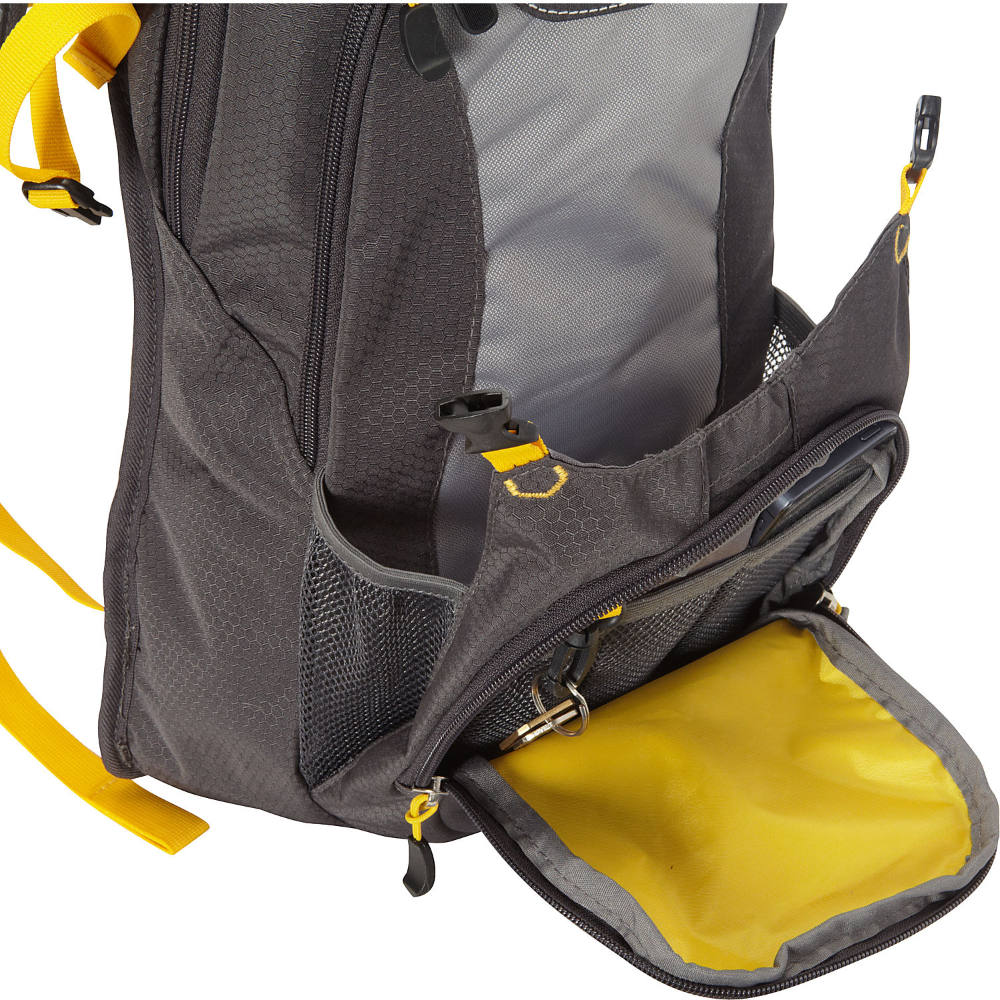

layout: post
title: "箱包 - 水袋包"
category: Bags
---

### Hydration reservoir compartment

Separate, side-access hydration reservoir compartment makes it easy to access your water supply

Zippered shoulder strap hose jacket helps protect it from the elements

### hydration system

2-liter hydration system has a wide opening reservoir for easy filling and cleaning. System is BPA free and antimicrobial

Hands-free reservoir pressure valve

a zippered shoulder strap hose jacket,

Insulated water tube cover helps to prevent water from freezing in tube 

Elastic loops for convenient hydration hose positioning 弹性环，方便水化软管定位

### Front pocket

Hinged front pocket holds a helmet

Front zippered pocket holds bicycle tools, accessories or media player

### Main Pocket

Large, front-load main compartment holds gear

### Strap

HEX-VENT mesh adjustable backpack straps

### Paded Back

HEX-VENT mesh padded back wicks moisture

### Adjustable waist belt

Tuck-away, adjustable waist belt secures the pack

### sternum strap

Adjustable sternum strap helps stabilize the pack

### Reflective loop holds a bike LED blinker