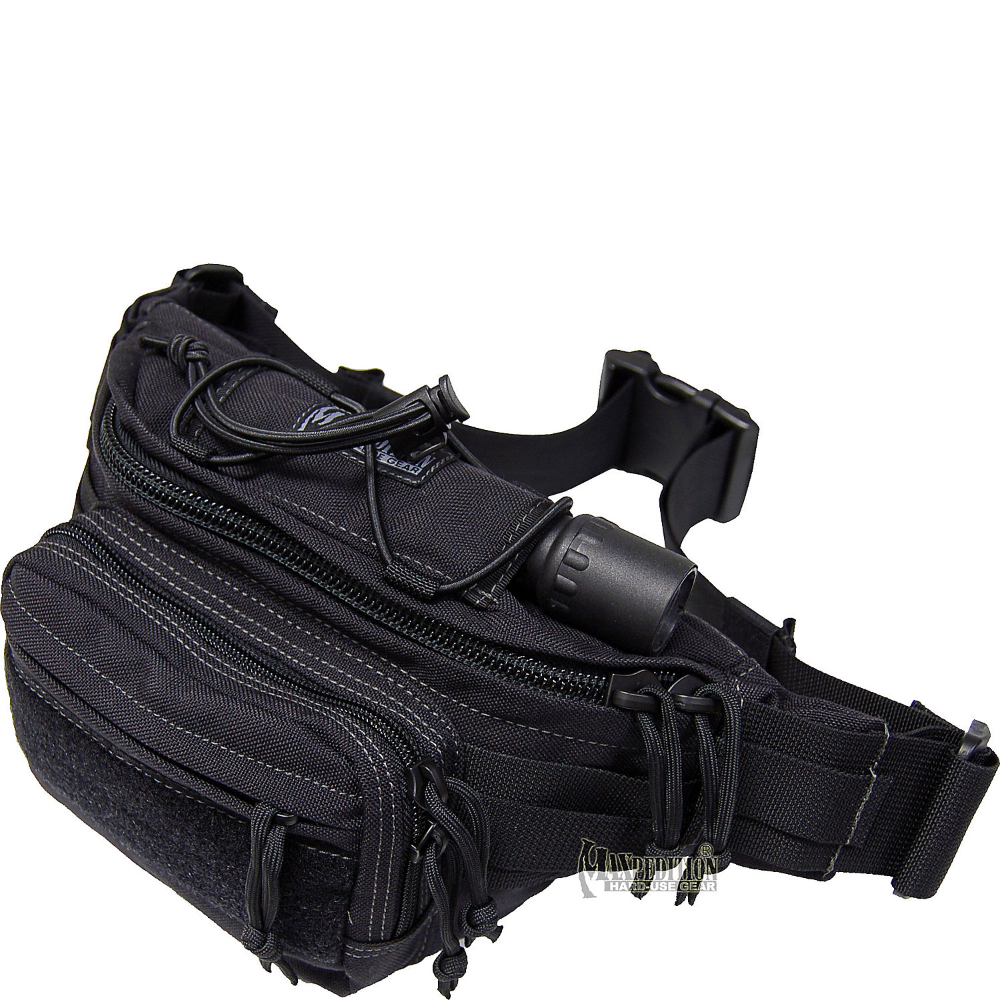

layout: post
title: "箱包 - 腰包"
category: Bag
---

Waist Bag/ Waist Pack

Fanny Pack/ Waist Pack / Hip Bag
Vortex Lumbar Pack
Lightweight Travel Mini Hip Pack
DayLight Lumbar Pack

Fanny Packs, Lumbar Packs, & Waist Packs

Lightweight
avel Hip Pack
VERSIPACK
Versatile
Small Adonis Genuine Leather Waist Purse Fanny Pack

## Structure

## Material

## Feature

- Slash-proof construction
- Lightweight
- Slim profile

### Font Compartment

Front compartment has organizer with RFID blocking card and passport slots, zip wall pocket and pen loop

### main compartment

Roomy main compartment with zip wall pocket

Stylish Canvas Waist Pack

Main compartment contains dividers for organization

Spacious main compartment with single zip-opening and an interior zip-pocket.

### tear- and weather-resistant

tear- and weather-resistant nylon ripstop

### RFID

Front organizer with RFID blocking card and passport slots

RFID-blocking pocket and Smart zipper security

### Waist strap

Adjustable, cut-proof waist strap

Tuck-away waistbelt

Lockable & Slashproof detachable Carrysafe® shoulder strap

Soft herringbone webbing belt lets you carry comfortably around the waist or bandolier style

Accommodates waist to size 44”

Two carry options: removable cross-body shoulder strap and Zip-away adjustable waist belt

Padded waist belt with small sleeve pockets ideal for keeping your power-gel snacks

### Side Compression Strap

Adjustable side compression straps secure and stabilize gear.

### Rear Pocket

Quick access back pocket holds smart phone

One secure zippered pocket on the back

Rear zip-pocket for extra security.

There is also a zippered pocket on the rear exterior for extra security

### LED light

Includes tethered key clip with LED light

### Drainage grommets

Drainage grommets in front, main, and rear compartments

Max waist size 48"

### Torch-Lair

Torch-Lair can hold a medium to large size flashlight

### Back Panel

HEX-VENT mesh padded back panel wicks body moisture and provides superior comfort and provides superior comfort. 

High breathability mesh backing for ventilation

### Organizer

Internal organizer panel with key hook

## Pocket

### Side Water Pocket

Pull out water bottle pocket, zips away when not in use

Dual side water bottle pockets equipped with two BPA free 500 ml soft-touch sports bottles

### Webbing daisy chain

Webbing daisy chain loop to attach a carabiner or bike LED blinker

###  velcro-closed pocket

### Button Closure

Flap over two straps button closure

