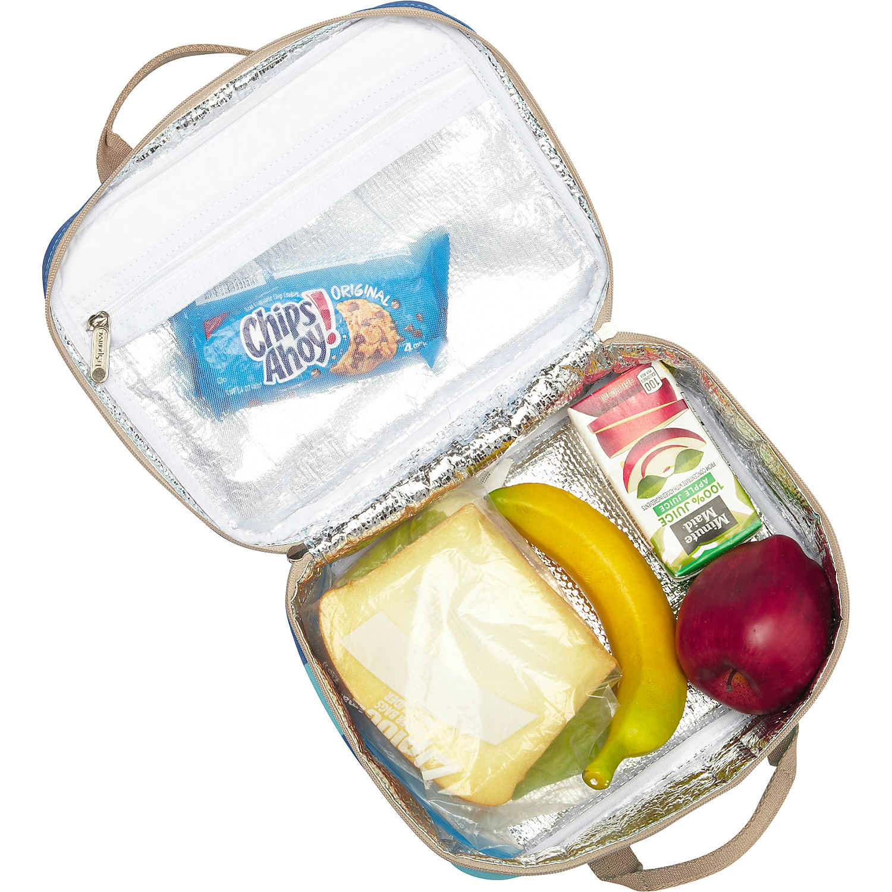
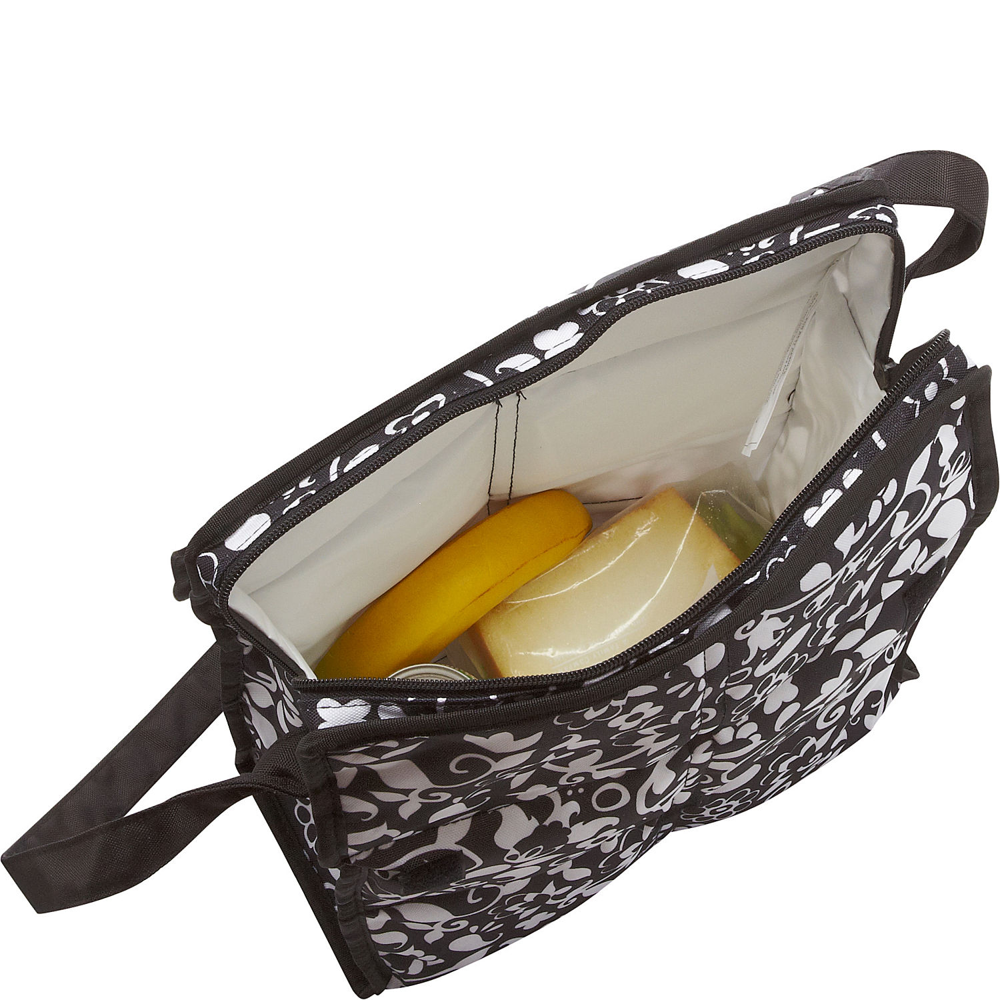
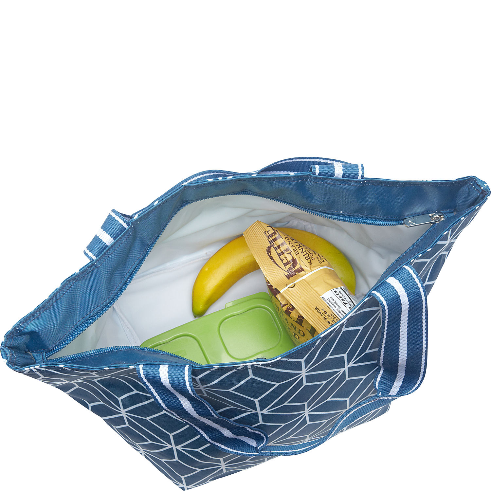

layout: post
title: "箱包 - 冰包"
category: Bag
---

## Category

Coolers & Insulated Bags

- Lunch Bags
- Coolers
- Bottle Holders & Flasks

## Lining

Bottom "cold" compartment is insulated on all six sides and has a welded replaceable PVC-free __PEVA__ liner

Lining is made of __BOPET__ material. This lining complies with the lead standards mandated by the state of California

PVC, BPA & Phthalate-free

Foil lining

PVC-, BPA-, phthalate- and lead-free

vinyl lining

Gray PEVA lining is easy to clean and PVC free

常用的里布：

- Aluminum + PEVA Lining

- Aluminum Foil

    

- EVA
    
    

- PEVA

- BOPET
    
    应该就是铝膜。

- PVC/vinyl

## Cooler

.35mm thick PEVA

25% more foam - stay cooler larger.

## Material

### EVA vs PEVA

See [PEVA vs. EVA shower curtain - Live Toxic Free](http://www.debralynndadd.com/q-a/peva-vs-eva-shower-curtain/)

__Question from HEG__

I went to Target looking for alternatives to vinyl shower curtains and I found both EVA and PEVA ones. What is the difference and is there one that is less toxic than the other?

Thank you

__Debra’s Answer__

PEVA is a nontoxic vinyl (it doesn’t have the chlorine molecule that makes PVC toxic). I used a PEVA shower curtain in a rented apartment for three months. It worked great and doesn’t smell at all.

EVA is Ethylene vinyl acetate, a copolymer of ethylene and vinyl acetate.

Both of these are plastics made from petrochemicals, but they have very low toxicity.

Either a PEVA or an EVA shower curtain would be better than a PVC shower curtain.

### PVC vs PEVA

See [PVC vs PEVA: What’s the difference?](http://www.gorillamarketing.net/news/pvc-vs-peva.html)

Most consumers will know PVC by the commonly used name "vinyl".  PVC is short for polyvinyl chloride, and is most notably used to line shower curtains and other items made of plastic. So what is PEVA, you ask? PEVA is an alternative to PVC. Polyethylene vinyl acetate (PEVA) is a non-chlorinated vinyl and has become the common substitute in several products on the market. 

WAIT! This does not mean you need to throw out products made with PVC! Vinyl exists in many of the products we know and use today. It is one of the most widely produced plastic in the world! While there are other, safer options, the health risks for vinyl are minimal and only exist with acute exposure. So, unless you are living and working in a vinyl-lined room with all vinyl products, your exposure level is low. We only hope to give you more information about the products you most commonly buy and use, not to worry you.

Big words for small items, right? Consumers are becoming more conscientious of the products they purchase and we work with suppliers that offer products made with PEVA. A smart consumer is one who is aware of [safer and healthier products](http://www.gorillamarketing.net/poly-pure-bottle.html) that exist on the market. Just because PEVA is chlorine free, it doesn't make it perfect, but it makes it better. What types of products are being made with PEVA? The most common items are table coverings, car covers, cosmetic bags, baby bibs, lunch coolers, and suit/clothes covers, but as the trend picks up steam, there are sure to be more products made with PEVA.

If you are looking to create a healthier lifestyle for you, your family, or your customers consider asking the question: "Is this product made with PVC or PEVA?" Not only will you be taking a step in 'healthier' direction, you'll sound pretty cool doing it!

Interested in a PEVA product? Check out our summer deal for a [Clique 6 pack cooler ](http://www.gorillamarketing.net/clique-6-pack-cooler.html)with PEVA lining!  If you do want to learn more about the effects of vinyl visit [www.osha.gov](http://www.osha.gov/).   