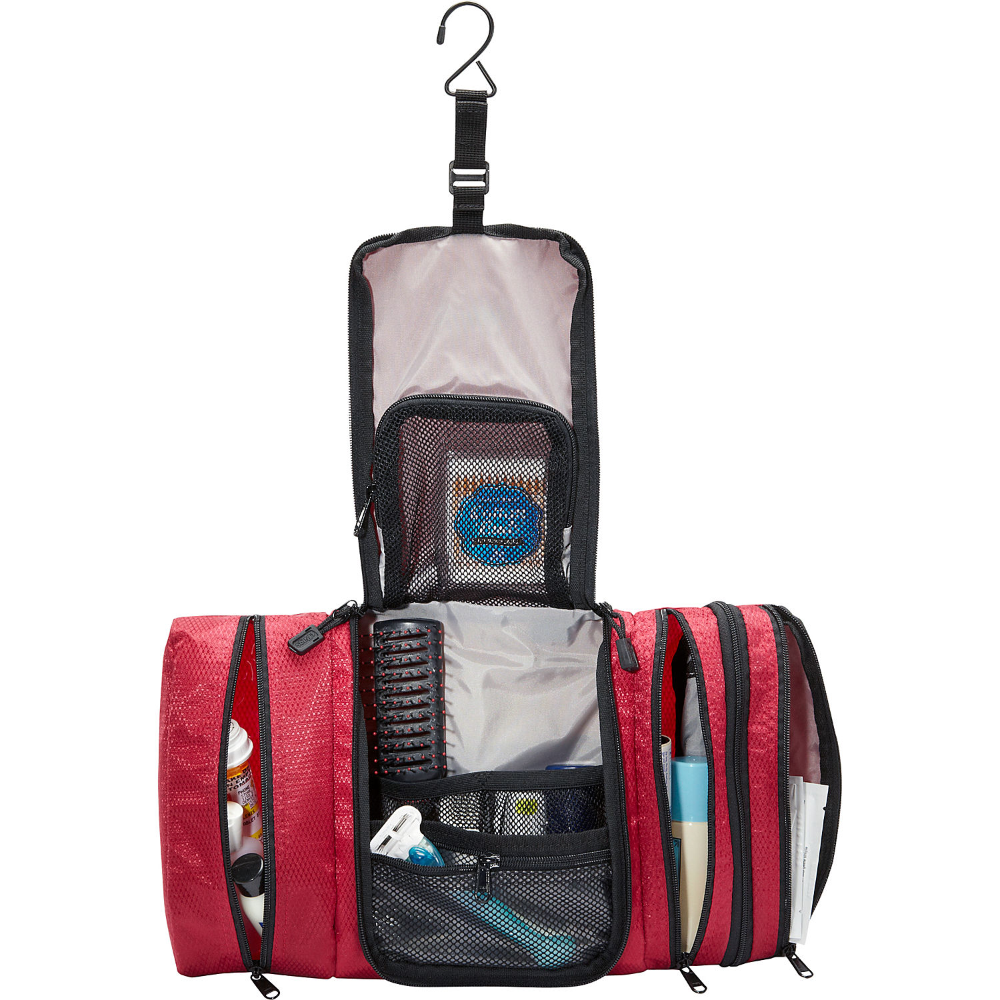
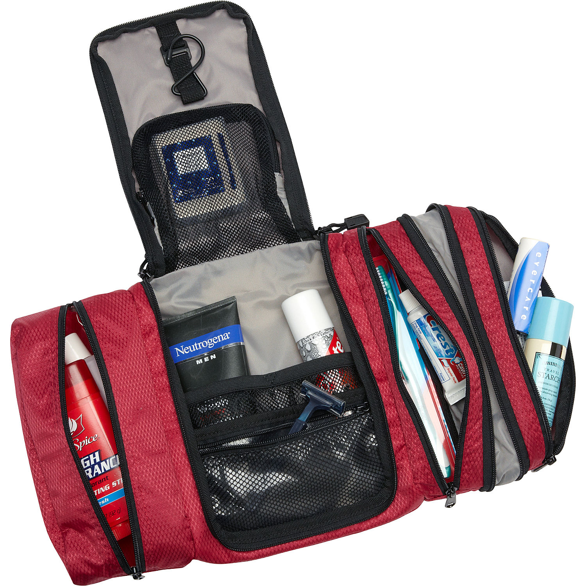
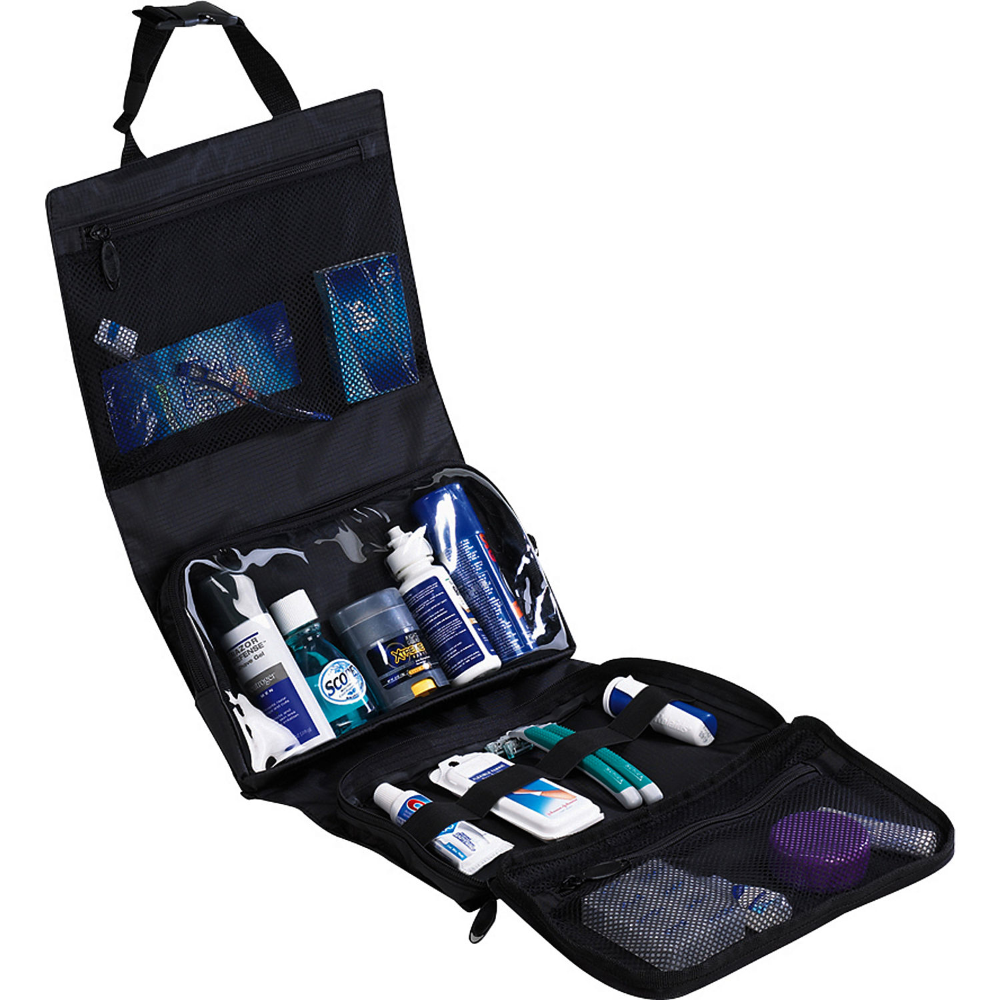
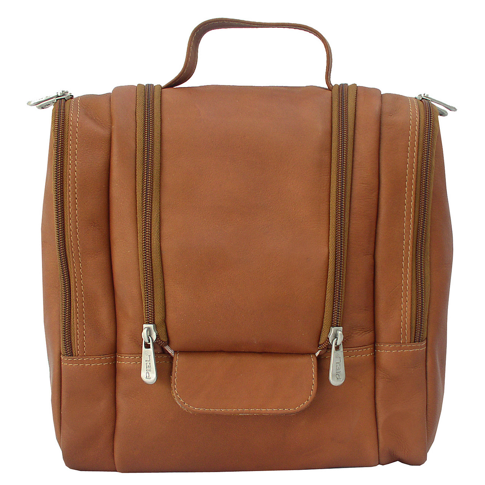
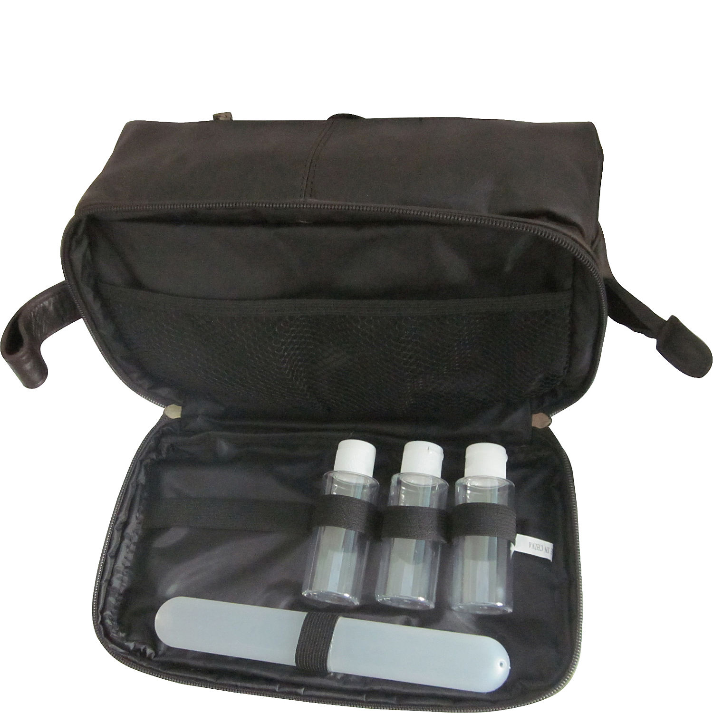

layout: post
title: "箱包 - 化妆包"
category: Bag
---

Toiletry Kit/Cosmetic Bag

Pack-it-Flat Toiletry Kit

Cosmetic Pouch

Durable, lightweight and water repellent

Freezable Lunch Bag with Zip Closure

Extra Large Insulated Cooler Bag 

## Feature

Water-resistant and anti-staining properties

Main compartment is wet/dry to keep leaks from spreading？

Rubber feet lift kit off wet surfaces

### Waterproof

Water-resistant interior for easy cleaning

### Hanging hook

Includes a removable hanging hook for those who prefer a countertop kit

Hangs conveniently for easy access

Stow-away swivel non-slip hook for versatile hanging options

Top hook allows case to hang from a shower bar or towel rack

Hang strap fits over most hooks and towel bars

### Compartments

Four separate compartments, each 2.25"D x 9.25"W - center section is 7.75" wide and right side expands to 3.5"

Center section - 7.75" wide - has a cut-away opening to hold things in place when hanging

Two mesh retainer pockets with elastic binding and an upper mesh pocket that nests into the opening when closed

Left section is 3.75" wide and lined with PVC film to store damp contents

Right section measures 2.5" wide and the expansion zipper increases the width to 3-1/2" wide

Roomy compartment holds full size bottles or clothing

Adjustable fastener keeps it closed for convenient packing, Multiple pockets and compartments for maximum organization

### Organizer

Cosmetic organizer zips to form travel case

### Elastic loops 

Elastic loops holds bottles upright

### Top grab handle and removable shoulder strap

top handle for easy carrying.

### main compartment

Large main compartment features mesh divider, zippered pocket and pocket with easy-to-clean antibacterial lining helping to prevent the growth of odor-, mildew- and mold-causing bacteria

Double zip openings reveals main compartment

Easy-access doctor bag-style opening

### silnylon ripstop

Ultra lightweight silnylon ripstop allows for visibility of contents

## Pockets

Inside zip pocket and elastic compartments.

## Explain 3-1-1 Rule for Air Travel

See <http://traveltips.usatoday.com/explain-3-1-1-rule-air-travel-11207.html>

The Transportation Security Administration, or TSA, sets and enforces the rules for air travel in the United States. Its 3-1-1 rule limits the amount of liquid a passenger can bring on in airplane in his carry-on baggage. These limits were put in place in 2006, following a foiled plot to bomb airplanes using liquids as explosives. Knowing the 3-1-1 rules can help you pack successfully for your trip.

### Rules

The 3-1-1 rule limits the amount of liquid you can bring on an airplane in your carry-on luggage. Passengers are limited to using containers no larger than __3__.4 oz. for their liquids. All containers of liquid which must be placed in a __1 qt__., transparent, plastic, sealable bag. __Each passenger__ may have only one bag for liquids. Passengers can bring on as many 3.4-oz. containers as they can fit in the quart-sized bag when it is sealed.

### Exceptions

The TSA allows a very limited number of exceptions to the 3-1-1 rule. Passengers can pack in their carry-on bags medicine, baby formula and food, breast milk, liquids such as water or orange juice for passengers with a special condition and frozen items--even if the item exceeds the 3-1-1 limits. The TSA says passengers should carry on only what will be needed during the flight but does not place a specific volume limit, saying only that these exceptions are allowed in "reasonable quantities."

## Prop

CA Prop 65 compliant hardware (no lead, nickel or cadmium)

Eco friendly. HADAKI products are AZO free. We use no Phthalates/DEHP, DBP, or BOP.

