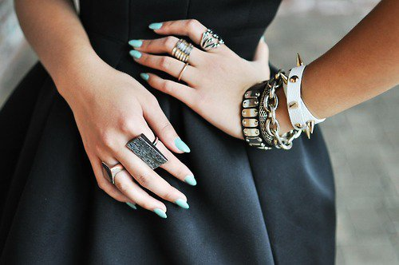
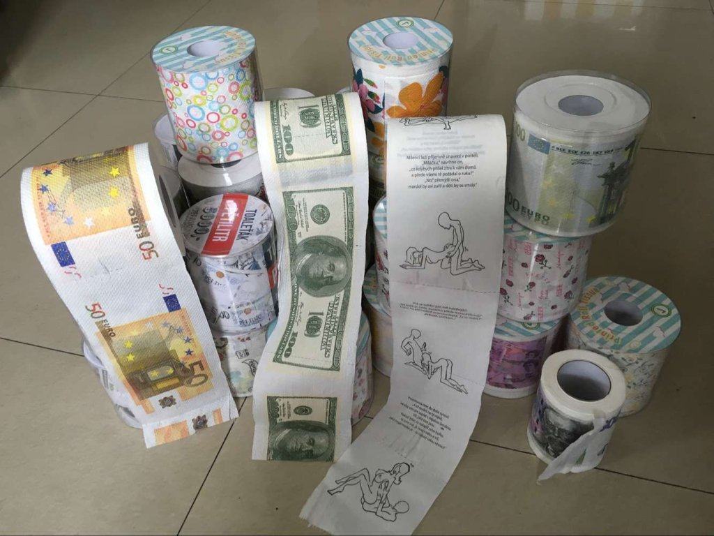
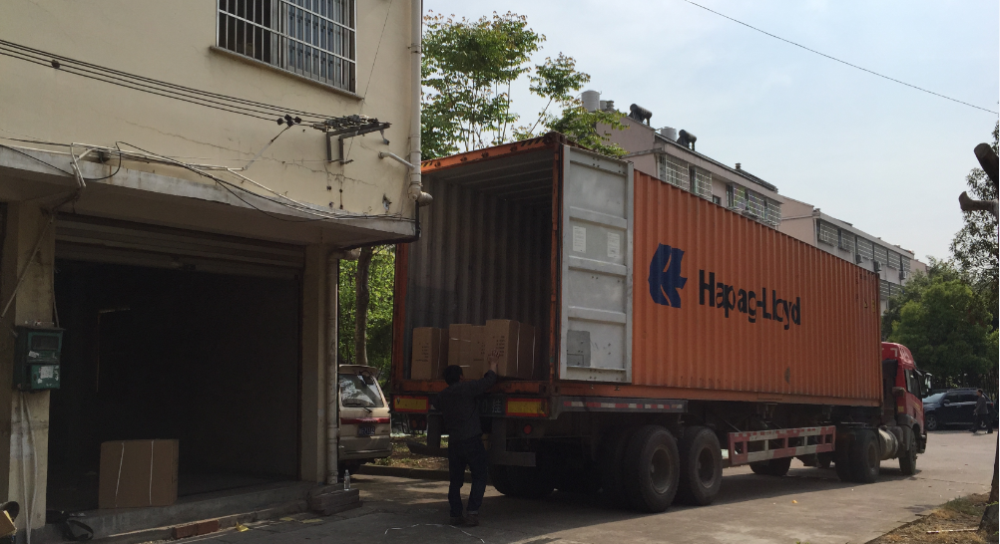
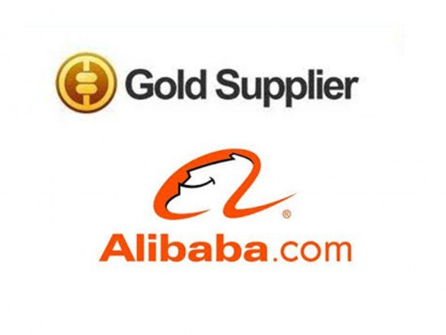

layout: post
title: How to Import Small Quantity from China - Guide for Business Starter
tags: [trade]
category: Trade
---

# How to Import Small Quantity from China: Guide for Business Starter

We got many inquiries from people who **want to start a small business** by importing small quantity products from China, since our website <https://www.inesoi.com> started. Most of them do not have much relevant experience, and just consider it’s very simple: find a Chinese supplier, buy products in low price, ship home and sell high price in local market.

But the truth is importing small quantity directly from China is **never that easy**. You will face many different problems, such as shipping fee higher than product’s value, or your order is much less than supplier’s MOQ. In some circumstance, you may have to give up your wonderful plan of starting the new business.

In this article, we will give a complete introduction of how to import **small quantity products** from China and explain some problems you may have.

## 1.What Is Small Business? And What Is Small Quantity Buyers?

Different companies and people have different definitions about small business. Most sourcing agents or consulting companies define small business as those who import less than USD 500,000 annually. But for many business starters, this amount is way too high, and maybe they still can’t reach after 5 years. That’s why it’s not easy for small starter business to find a suitable sourcing or consulting company who can offer them relevant service.

I’d like to define customers who purchase USD 5,000-50,000 (including different kinds of products) in one order as **Small Business**. With this amount, the shipment volume usually is from 5CBM to a 40HQ container. This amount usually can reach factory’s MOQ, and can buy from them directly.

**4 to 5 CBM** normally will be the most suitable minimum volume for LCL (Less than Container Load) shipping. If less than this, the whole export & import process is complicated and costs lot of money, which means the average cost for each product will be high.

**Small Quantity Buyers** refer to those who buy less than $2,000 per order, and who just start new business (I mentioned in the beginning) are also a part of them. **This article will more focus on helping this group of people.**

## 2.What Kind of Products Are Suitable for Small Quantity Buyer?

For small business importer, those who buy more than USD 5,000 per order, they must know what to import and how to sell. But small business starter probably even have no idea what kind products to start with first.

### a. High-Value or Small Size Products

Shipping is always a big problem for small quantity importers. Because their shipping volume is always too less for LCL, usually less than 2 CBM, and have to choose air freight or express, which cost 8-10 times higher than LCL sea freight.

Products with large size or large package, like mug and teddy bear, is not suitable for small quantity importers, because both express and air freight fee is charged by dimension weight (length*height*width).

Fashion accessories are good choice for small quantity buyer

This means your shipping cost is even higher than products’ value, but your competitors import by LCL sea freight which costs 80% less than you. Then you have no chance to compete with them in local market.

So for small quantity importers, high-value, small-sized products are better choice. Shipping cost won’t be high, sometimes only 10% of product’s value. Such as fashion accessories, small [passport holders](https://www.inesoi.com/product-category/travel-accessories/passport-holders/), watches, etc. Most importers of them won’t choose sea shipping because of the timeliness, so no need to worry about your shipping cost is higher than competitors.

### b. Choose Interesting Products, Instead of Normal Items

Small quantity buyers can try to find some **special and interesting products**, and avoid those common products which can be bought everywhere.

Some people think that daily used products, such as socks, are very easy to be sold as everyone needs them, but it’s not true. Because there must be numerous people importing and selling these items with low profit, and it will be hard to compete with them. But you can think about importing some special socks, such as “non-slip children socks”, or socks with good designs.

Common products in daily life are not suitable for small business, either. For instance, we received many inquiries of from different countries (European and Middle East countries), and they want to import 20GP container of A4 printing papers.

Interesting toilet paper with pictures printed

But they only found that the total cost to import from China has no big difference from the price in their countries. Because this kind of product has no much added value, and the cost is mostly depending on raw material. So the price is very transparent, even with large demanded quantity.

Toilet paper is also a very common product, but our Czech customer select those with **interesting designs printed**: such as US dollar, Euro, Heller, and even Kama Sutra. These special toilet paper can be easily sold in several times higher price than the common one.

## 3.How to Find Chinese Suppliers for Small Quantity Buyers?

Most small quantity buyers find Chinese suppliers **on Internet**. Even customers who buy larger quantity (around USD 30,000-50,000 for each order), they seldom actually come to China for finding suppliers, except attending some fairs.

First is the high cost, including air ticket, hotel fee, and traffic allowance, and it will cost totally around USD 4,000 for a week visiting China. Second is finding a good Chinese supplier is a tough task, except you go directly to some places like fairs or [Yiwu wholesale market](https://blog.inesoi.com/trade/2018-08-28-yiwu-wholesale-market-complete-guide). Or you already contacted suppliers before coming to China.

### a. Alibaba

No matter for large buyers or small quantity buyers, searching Chinese suppliers on Alibaba is the best choice. But If you are buying too small quantity (less than USD 400 for each item), Alibaba suppliers probably can’t sell you because usually they have higher MOQ.

Maybe you can pay for products in higher price, and sometimes suppliers will sell you. If not, you have to turn to DHgate or Aliexpress. Don’t spend much time on persuading them that you **will buy big quantity** in future, and this is for trial. Because Chinese suppliers are hearing this from clients every day, and it doesn’t work at all.

If you want to learn how to find good suppliers on Alibaba, please check another article: [**Tips for Sourcing Good Suppliers on Alibaba. You Never Knew Before.**](https://blog.inesoi.com/trade/2018-08-30-how-to-source-good-suppliers-on-alibaba-completely-guide)

### b. Dhgate and Aliexpress

If the Alibaba supplier’s MOQ is still hard for you to reach, maybe you can only go to DHgate and Aliexpress. Usually DHgate tends to **small quantity wholesalers** whose buying quantity is between Alibaba and Aliexpress. Aliexpress more tends to **retailers**, though it claims itself for online wholesale, and this truth is known by most Chinese suppliers.

## 4.How to Ship Cargo from China When Buying Small Quantity?

I have to say that shipping way is really a big problem for small quantity buyers as mentioned in the beginning. Sometimes small quantity have to give up importing from China because express is the only way to ship, and it’s too expensive.

### a. International Express and Air Freight

International express is suitable for cargoes under 300kg, while air freight is suitable for over 300kg. But air freight needs the same import & export processes as sea freight. You also need to pick up your cargo at the airport.

Hazardous articles such as liquid, power and products with battery cannot be shipped by air in cargo. Balancing scooter is also one among them. (You can check another article-**[Importing Balancing Scooter from China: Problems You Should Know](https://jingsourcing.com/importing-balancing-scooter-china-problems-know/)**)

### b. LCL Companies That Offer All-in Price Shipping Service

This kind of LCL companies are the best choice for small quantity buyers. They usually are specialized in **certain ports or areas**, and offer all-in price shipping service. They will handle all custom and shipping process, and you just need to pick up your cargo in their warehouse, or sometimes they can deliver to door. Their price is very low even you ship 0.5CBM, because the container is shared by 10 to 40 clients.

(You can learn more by check another article: [**How to Ship Products When Import from China: Complete Guide**](https://jingsourcing.com/how-to-ship-products-when-import-from-china/))

But these kind of companies are **hard to find**, not existing in every area or cities. You’d better ask some experienced importers in your country, and maybe they know.

I know some of this kind shipping companies, and I’d like to share them. You can leave your email and country in the comment, and I will send you contact information via Email.  

There are companies offering $80/CBM to Malaysia & Singapore, delivering to door; $280/CBM to Kenya but you have to pick up cargos at their warehouse in Nairobi; $280/CBM to Sydney/Melbourne warehouse, etc. The rate is just for reference.

### c.Consolidate Cargoes from Different Suppliers And Ship Together

If you are buying from **different suppliers**, then you can think about consolidate them in one shipment, and you will save shipping cost. Because even use international express, heavy cargo is charged in lower price/kg than light one.

It makes more sense for sea freight. If you import 5 different products from 5 suppliers, each product 0.5CBM, then you can consider to consolidate them together by LCL sea shipping. By doing this, your shipping cost will be 80% less than express. Or you have to pay for 5 international express separately, because there’s no cheaper solution.

So you need a person to consolidate your cargoes in China. One solution is to find a reliable forwarder who has **its own warehouse**, then you can use it for consolidation (usually free of charge). However, most of forwarders don’t have warehouse, and they just pick up your cargo from the supplier, then send to LCL shipping company to load in container. (This may due to the particularity of Chinese shipping agency industry, which we will introduce in future article)

Another Solution is you can choose **one reliable supplier**, and let other suppliers send all the cargoes to him, then the forwarder can pick up cargoes together in one place.

We strongly recommend you to try to consolidate cargoes, so that you can gain more import experience. Then congratulations, you moved the first step of expanding your business, and you can try to purchase larger quantity next time.

Forwarder are picking up consolidated cargoes in customer’s warehouse

## 5.How to Avoid Scam When Buying Small Quantity as a Business Beginner?

Many starter business are afraid of being scammed when buying products on Internet from China, but the truth is **seldom people** were under this case.

No matter you are buying from Alibaba, Aliexpress, or DHgate, none of suppliers can take your money without sending the products. Because on this kind of online platforms, all suppliers are required to offer their Chinese ID cards, or company registration information in the beginning. Then they have to **pay certain amount fee** every year to become suppliers on these platforms. Such as for being **Gold Supplier** in Alibaba, you have to pay CNY 29,800 (around USD 4,730) annually for member fee; pay for USD 4,700 deposit to become suppliers in Aliexpress.

_One interesting thing is: many people believe that Gold Suppliers are qualified suppliers verified by Alibaba, that’s also what Alibaba tells. But it’s not true. All suppliers on Alibaba are Gold Suppliers, because they already paid for it. So you can just ignore the Gold Supplier thing when searching suppliers on Alibaba._

So the worst situation is the products sent by supplier are in worse quality than you expect, or less products you received.

What you should do when finding suppliers online is being careful, and **do not only** focus on lowest price, because you already can get good profit in retail. Or you will take risk of receiving cheap quality or problem products. Even you want to return the products at that time, you will find shipping cost is high, and most Chinese sellers **don’t accept** return and refund.