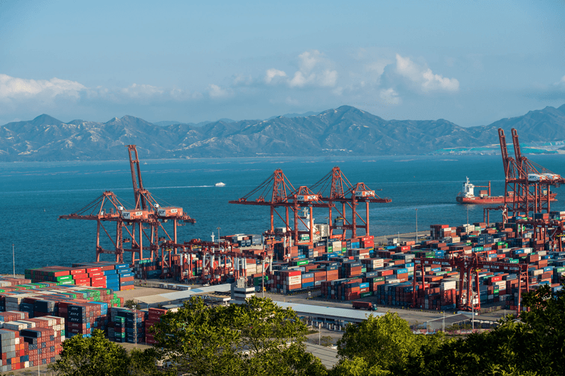
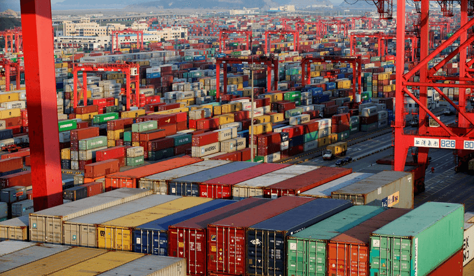

layout: post
title: Importing from China - A Step by Step Guide
tags: [trade]
category: Trade
---

Importing from China has proven a successful tactic of global sourcing for many businesses. Products made in China such as shoes, clothing, electronics, furniture, home furnishings and many more are popular worldwide.

However, it is not an easy task, especially for the newbies. The importing process can be extremely complex, confusing, and costly. Expected gains can often be erased by long transit times, rising or fluctuating delivery costs, regulatory fees, and unexpected delays.

Here’s a step by step Guide from the view of us, [a local freight forwarder](https://cargofromchina.com/local-freight-forwarder/) serving the exporters in China and importers worldwide for years. Let’s check out how to import from China, and what you can do to make the process more smoothly and efficiently.

_NOTE: The information provided below are for general information purposes only. The best practice is always checking with your local customs authority and **buying from small order**._

### 1. Identify your import rights.

When you buy goods from foreign sources, you become the importer. The courier such as DHL/UPS/FedEx will handle everything and deliver to your door if your package is small and used for **personal use only or the value is not so big**. If so, it will save you a lot of time and money.

But before purchasing commercial goods into your country, as a business or an individual, you will need to identify if you have the import rights. ([Learn more](https://help.cbp.gov/app/answers/detail/a_id/197/noIntercept/1) if you are an U.S. resident)

#### Attention:

Many import regulations only apply to goods imported for commercial – business or resale – purposes. And only the customs authority can make judgment calls about what qualifies as personal use. Several suits that are identical or a number of very similar handbags will have a hard time passing the credibility test as items for personal use.

### 2. Identify the goods you want to import.

Trade company make money by selling products. Choosing the wrong products means you are losing time and money. If you’re going to be a successful importer, the first thing you need to do is to choose the correct product for resell.

You’d better gather as much information as possible about the goods you intend to import. Obtain descriptive literature, product composition information and, whenever possible, product samples.

This information will be crucial when it comes time to determine the tariff classification. The tariff clarification number ([HS Code](https://cargofromchina.com/hs-code/)) will be used to determine the rate of duty that will be applied to your goods.

#### _We suggest:_

* _Go with a product you like – you are passionate about your work_
* _Go with a product uniqueness – you can sell at a high price_
* _Go with a product you can ship in large quantities – low shipping cost per unit_

### 3. Ensure the goods you wish to import are permitted into your country.

Certain goods are not allowed to be imported. Different countries have different prohibited products. Also make sure whether the goods you intend to import are subject to any permits, restrictions or regulations by your government.

It is the importer’s (YOUR) responsibility for assuring that the goods comply with a variety of specific rules and regulations.

Importing goods that are unsafe, that fail to meet health code requirements, or that violate restrictions could end up costing you quite a bit of money in fines and penalties. At the very least, such goods would be detained, and possibly destroyed.

### 4. Classify your goods and calculate the landed cost.

Determine the 10-digit tariff classification number for each item you are importing. These numbers along with the [Certificate of Origin](https://cargofromchina.com/certificate-of-origin/) are used to determine the rate of duty you must pay when importing. Then do the land cost calculation.

Pay attention to the [Incoterms](https://cargofromchina.com/incoterms/), and calculate the [total landed cost](https://cargofromchina.com/landed-cost/) before you place your order. For example, FOB means adding the following three together.

* Get the product price from the supplier
* Get the shipping charges from China freight forwarding company (like us)
* Get the charges of Customs clearance, duty&tax, land transport to your warehouse

### 5. Find your supplier in China and place an order.

Place your order with the vendor, shipper or exporter and identify shipping terms that will be used.

Once you have selected your supplier, request a P/I (Proforma Invoice or Quote Sheet) for your prospective purchases to include the harmonized system number, description & value per item. Your P/I must show the weight & the packed dimensions as well as your term of purchase.

_What is a proforma invoice? It is a non binding document helping budgeting your future purchases. It is not a purchase order nor does it creates a legal obligation._

#### Attention:

**1.** Ensure the supplier will agree to shipping under [FOB terms](https://cargofromchina.com/why-fob/) from their nearest port or airport as this will greatly reduce your shipping costs and give you more control over the shipment.

For example, if you were importing from China and the closest port to the supplier is Shanghai, you would request FOB Shanghai terms.

\* If it’s trial order or small shipment, EXW will be also ok.

**2.** Keep in mind shipping by ocean is indeed quite slow, and this means that certainly requires a lot more long-term planning compared to domestic product purchases. Besides, the time required to export goods, including documentation, inland travel, customs clearance, and port or terminal handling for a container of goods can cost upto 7 days.

In general, we recommend place an order at a minimum _3 months before you need your goods at your door_.

#### We suggest NOT:

**1.** Always looking for the lowest price.

If you come across a quote that is significantly cheaper than the others, raise a red flag. You should know that there is no lowest price in China, only the lower and lower prices. Lowest price always accompanies with high risk, maybe quality, quantity or reputation.

_Just find a reliable supplier and grow with them in a healthy way._

**2.** Failure to clarify product details.

If you aren’t extremely clear to your supplier about your required specifications, there is a big chance you would receive exactly what you didn’t want. Not clear means the factory will make the decision for you based on cost saving.

Ensure you double check the materials and the manufacturing process of each quote so you can feel confident in the products you are purchasing.

_Make sure your supplier has totally confirmed every spec of your target product, including the packaging. Sometimes, it’s necessary to send the sample for recheck._

**3.** Showing distrust towards your supplier.

International trade is based on mutual trust. If you don’t trust your supplier, nobody will look after your production in the factory, and nobody will sincerely help you when trouble happens.

### 6. Arrange your cargo transport.

There are many costs associated with shipping goods, including container fees, packaging, terminal handling, and broker fees. In order to get a complete picture of shipping costs, each of these factors should be taken into account.

Once happy with the [freight quote](https://cargofromchina.com/quote/), you will need to send us or forwarder your supplier’s contact details. We’ll take it from there. We’re going to keep close touch with you and your supplier, make sure your shipment transportation quick and safe.

Check the details:

1. [Top 2 things to consider when shipping from China](https://cargofromchina.com/shipping-from-china/)  
2. [Sea freight](https://cargofromchina.com/sea-freight/)  
3. [Air freight](https://cargofromchina.com/air-freight/)  
4. [Courier service](https://cargofromchina.com/courier-services/)

#### We suggest:

**1.** Always consider that [delays](https://cargofromchina.com/shipping-delays/) might happen during the process, such as goods might not be produced on time, the vessel might not sail as scheduled, goods might be held by the customs. Be prepared and plan accordingly.

Do not expect your cargo would leave the port as soon as completed in the factory. Because it needs at least 1~2 days for your cargo transport from the factory to the port. And the process of Customs Declaration needs your cargo to stay at the port for at least 1~2 days.

Besides, there’s only one route frequency each week in some cases. Missing the day of this week, you will have to wait till next week.

**2.** Choose a [good freight forwarder partner](https://cargofromchina.com/).

Logistics is a highly valued aspect of modern business. Shipping costs include both the direct and indirect costs of transporting products from their point of origin to their destination market.

If they get it right, and choose a good logistics provider; they are guaranteed smooth operations, manageable costs, and continuous cash flow.

If they get it wrong, at the very least they could have rising costs and wastage. At worst, they could be facing a failing business model that has to be eventually shut down. Companies will continue to lose money if their logistics is not managed well.

### 7. Track your cargo and get prepared for arrival.

Shipping goods internationally takes time. For example, goods shipped from China, on average, take around 14 days to reach the West Coast of United States or 30 days to reach the East Coast.

During the time, check your commercial invoice, packing list, the bill of lading, and other related [freight documents](https://cargofromchina.com/shipping-documents/). If problems arise that you need to troubleshoot, you should know the steps your goods go through when being cleared by Customs of your country.

### 8. Obtain your shipment.

When the goods arrive, make arrangements for your customs broker to clear them through customs (and quarantine if applicable). If everything goes well, it’s your rights to pick up your shipment.

If you choose our to-door service, you can just wait for your shipment arrived at your designated address.

### Summary

Follow these tips and do your research and you can benefit from importing from China.

Wish you a great success in international trade.

Please feel free to let us know if we can assist you in any way.