layout: post
title: Buy One Get One 亚马逊 Promotion 实战经验及设定
tags: [amazon]
category: Amazon
---

## Promotion

时不时地设置些 Promotion，除了能增加购买率之外，也可以提高 Listing 的能见度。以下 BQool 归纳了创建Promotion 的步奏，提供各位卖家作参考。

[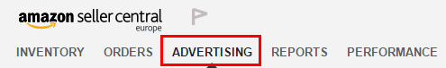](http://blog.bqool.cn/wp-content/uploads/image00-42.png)

登入您的卖家帐号之后，在 **Advertising** 的标签下，点击 **Create**，进到选择Promotion的页面，总共有4种：

* Free shipping (免运费)
* Money off (折扣)
* Buy one get one (买一送一)
* External Benefits (额外赠品)

__Step 1: Conditions 以下有几种情况__

1. Buyers Purchase 买家购买：

    - **At least this quantity of items (至少 X 样商品)**: 表示此促销方案只有在顾客购买X样商品时方可采用，您必须填入数字

    - **At least amount (in $) (至少X金额)**: 表示此促销方案只有在顾客购买至少X金额时方可采用

    - **For every quantity of items purchased (每 X 样商品)**: 顾客每购买X个商品即可得到此促销方案，这个选项仅适用于Money Off 与 Buy One Get One的促销类别

2. Purchased Items 已购买商品：

    Select a product list 挑选商品清单- 您可以创建新的清单 (点击 **Create a new product selection**)，或是挑选不在下拉选单中的清单 (点击 **Select another**)，若您想要在您库存中选择单个产品，点击 **Entire catalog**

3. Buyer gets 买家得到：

    - Money Off: 从下拉选单中选择一项
    - Percent off
    - Amount off (in $)
    - Fixed price for all items (in $): 此选项表示顾客每购买X项商品，将可享有固定金额的折扣，这个选项仅在您上面选择 **For every quantity of items purchased (每 X 样商品)** 时适用
    - Buy One Get One: 使用默认选项的 **Free items**
    - External Benefits: 使用默认选项的 **Post-order benefits**

4. Applies to 适用于：

    - **Money Off**: 选择 **Qualifying Item，**点击 **Select an ASIN**
    - **Buy One Get One**: 选择 **Qualifying Item，**点击 **Select an ASIN** 来选择适用的品项。还要设置您附赠商品的数量
    - **External Benefits**: 使用默认设置的 **Purchased Items**

5. Advanced Options 进阶选项：

    **Tiers** (只适用于 Money Off 的促销): 创建重叠的促销方案套用于不同金额的 order，您可以创建最多9个方案。注意如果您选择 **Applies to Qualifying Item**，Tiers 的选项将无法套用。

**Exclude Items 排除项目**: 选择您想要排除在促销方案之外的产品，要选择不在下拉选单中的清单，**请选择 Select another**。

__Step 2: Scheduling 時程表__

**1. Date Range**: 设定开始与结束的日期时间开始的时间必须要在未来四小时之后
**2. Identifier**: 创建内部描述与 Tracking ID。Tracking ID 并不会显示给买家，仅供内部用途。

__Step 3: Additional Options 附加选项__

1. Claim code: 选择 **Claim code** 来限制买家使用以取得优惠。点击 **Claim code** 来展开设定
2. Customize messaging 客制化讯息: 创建或客制给客户的讯息，并设置展示的先后顺序。点击 Customize messaging 来展开设定
3. 设定完以上资讯，预览没有问题之后，点击 **Submit**

## 一次性优惠码

1. 卖家後台点选 Promotion：[ Advertising ]  > [ Promotions ]

    

2. 点选 [ Percentage off ] → [Create]**

    

3. 点击 [ Create a new product selection ]**

    

4. Create a new product selection

    - Product Selection Type： 点选 ASIN List
    - 按下 [ Create Product Selection ]

    

5. Setup product selection details

    - Product Selection Name / Tracking ID： 输入 Product_Review_Year_Month_Asin# (这是 BQool 建议输入的格式，您也可以自己创造自己的格式！)
    
    - Internal Description： 输入 Product Review Year Month ASIN#

    - ASIN List： 输入 ASIN

    - Submit： 按下 [Submit]

    

6. 回到 [ Promotions ] >  [ Percentage Off ]  >  [ Create ]

    

7. Step 1： Conditions

    - Purchased Items： 选择刚建立的 product selection
    - Buyer gets： 选择 [ Percentage off ]
    - 输入想要折价百分比

    **（举例：如果你想要打 7 折，请输入 30；想要打 2 折，请输入 80，****千万不要写反，以免下场凄惨。）**

    

8. Step 2： Scheduling

    - End Date： 至少输入六个月或一年後的日期 （看您需要的日期）
    - Internal Description： 输入 Product Review year month ASIN

    

9. Step 3： Additional Options

    - Internal Description：  自行输入
    - Claim Code： 请选 Single -Use
    - One redemption per customer： 请务必勾选
    - Detail page display text： 更新之后，默认不会显示

    

10. Review Promotion → [Submit]

    

11. 按下 [Manage Your Promotions]

    

12. 点击 [ Manage Promotion ] > 选择 [ All ] > 看到刚刚设定的促销

    

13. 按下 [Manage claim codes]

    

14. Manage Claim Codes

    - Group Name： 输入名称
    - Quantity： 输入数量 Quantity (看您想要给几个人，这边举例 8 位)
    - Create： 按下 [Create]
    - 右下角下载 **[ Download ]** 即可！

    

    

## Free Shipping

首先我们先到 亚马逊卖家后台的 promotion 页面。

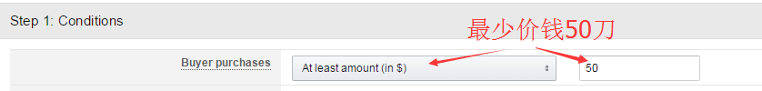 [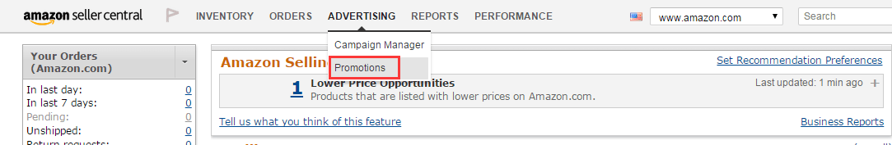](http://blog.bqool.cn/wp-content/uploads/image10-5.png)

进入到 promotion 的页面后，我们要看的是红色框框内的四个 promotion 的设置。各别为 Free Shipping, Money Off, Buy One Get One 和 External Benefits，promotion 设置讲解的顺序为从左到右。

[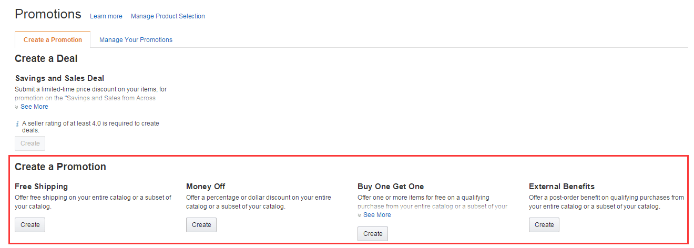](http://blog.bqool.cn/wp-content/uploads/image11-5.png)

现在先来介绍 Free Shipping ( 免运费 ) 的设置，点击 Create

[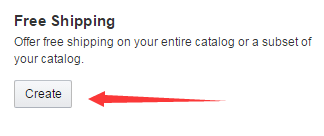](http://blog.bqool.cn/wp-content/uploads/image05-16.png)

进入到 Create a promotion: Free Shipping 页面，最重要的规则设置莫非于设置 Conditions

BQool 贴心叮咛：卖家在设置 promotion 时，必须要记得第一步骤的第一选项 Buyer purchases ，是主宰着整个 Step 1 promotion 的设定，那么填写的优先顺序是要从上到下，因为上层的设置都会影响到下方的选项。Free Shipping 的 promotion 虽然没这么明显的显示出设定上的优先顺序，但是其他 promotion 的设置像是 money off 等，读者们就会发觉这情况了。

[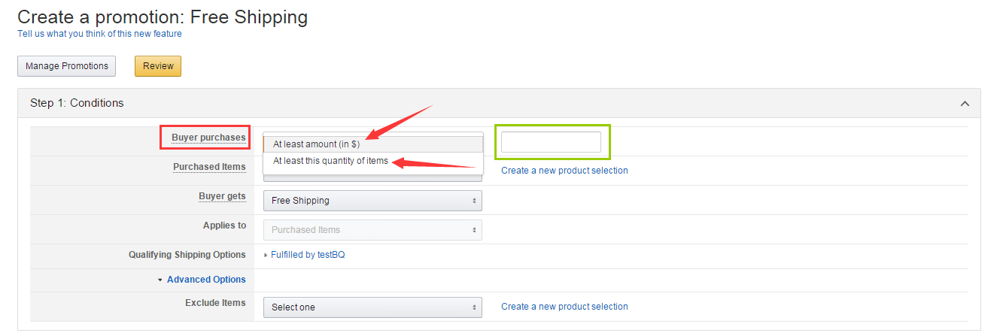](http://blog.bqool.cn/wp-content/uploads/image01-35.png)

当选择 Buyer purchases ( 红框内 ) 的选项时， Free Shipping 给你个二选一的选择

* At least amount ( in $ ) – 意思是说买家最少要买多少钱的商品才会有这优惠
* At least this quantity of items – 意思是说买家最少要买多少个商品才会有这优惠

Buyer purchases 的用意是买家要先符合你设定的具备条件，才可以享有这优惠。  
选择好规则后，在绿色的框框内依照选择的规则输入最少价钱或是最少商品的数值(数字就好)，比如说：最少价钱 50刀，或者是最少商品 3个。

[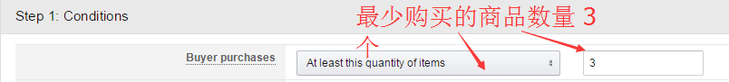](http://blog.bqool.cn/wp-content/uploads/image00-47.png)

选择完 Buyer purchase 后，卖家需要填写以下栏位

A. Purchased items：卖家在这选择哪些产品才享有 promotion

B. Buyer gets：对买家的优惠，这里是默认 Free Shipping

C. Applies to：哪些产品可以有这 promotion，这里是默认 purchased items (购买的商品)

[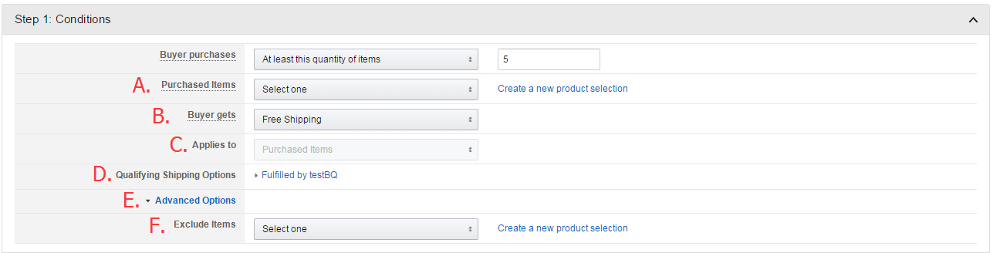](http://blog.bqool.cn/wp-content/uploads/image08-11.png)

D. Qualifying Shipping options：卖家可以在这打勾勾选择免费寄送的寄送方式有哪些

[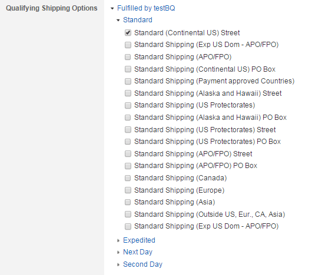](http://blog.bqool.cn/wp-content/uploads/image03-25.png)

E. Advance Options: 每个promotion 的方案都有 Advance Options，点击后就会出现下方 F 的选项，那每个 promotion 的 Advance Options 显示的选项都不大一样。

F. Advance Options- Exclude Items: 在 Free Shipping，卖家可以在这排除掉不要参加promotion 的商品。

步骤一结束之后，卖家们就可以到步骤二选择您要 promotion 开始和结束的日期与时间，这部份较简单易懂，所以就不多说了。

[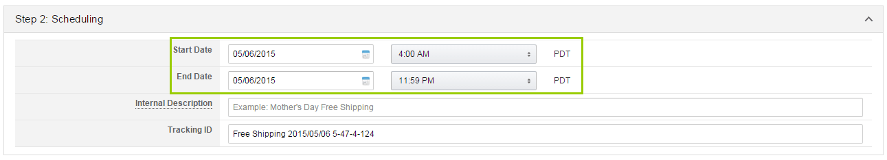](http://blog.bqool.cn/wp-content/uploads/image04-23.png)

步骤三：Additional Options，这部份是用来设置商品页面上的促销讯息，卖家可以自行更改这里面的内容，如果不想要自己改写促销讯息的话，使用亚马逊的默认设置就行了，如果卖家需要使用 claim code 的功能，也可以在步骤 3 这启用 claim code。

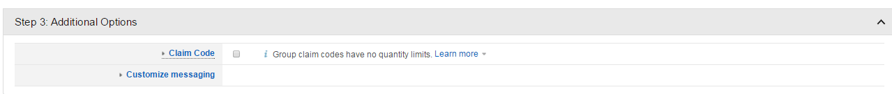

三个步骤完成后，卖家可以 review 自己的 pormotion 设定，再 submit 结束 promotion 设置。

[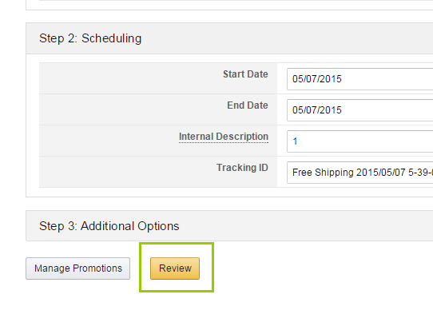](http://blog.bqool.cn/wp-content/uploads/image02-31.png)

[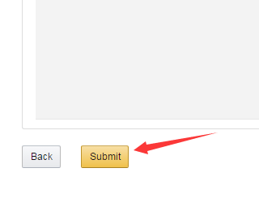](http://blog.bqool.cn/wp-content/uploads/image07-8.png)

以上是 Free Shipping promotion 的例子，所有的 promotion 步骤二和步骤三设置大致都是一样的 ( 除了External Benefits 会有点不同 )，所以后续三篇的 promotion介绍就不会详细描述这些步骤的设定，而是提供各式各样的 promotion 架设范例让各位参考。敬启期待。

## Buy One Get One

请先点击 Create 并进入规则架设页面。买家结账 $20 美金以上即可享有指定免费商品一份。

[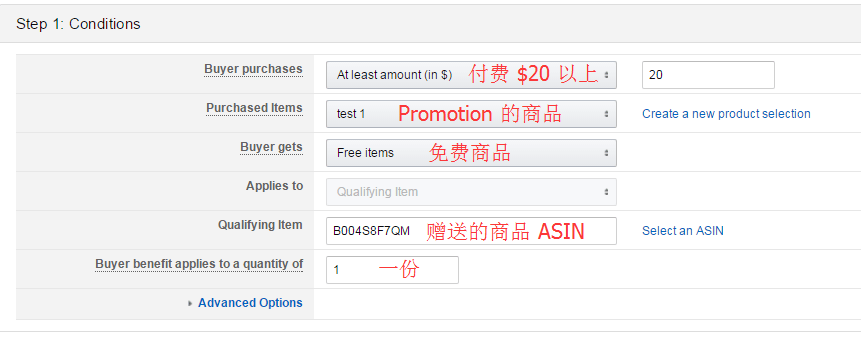](http://blog.bqool.cn/wp-content/uploads/image04-24.png)

买一送一 ，或是买多送一 (结账两个商品以上，其中一个变成免费)。

[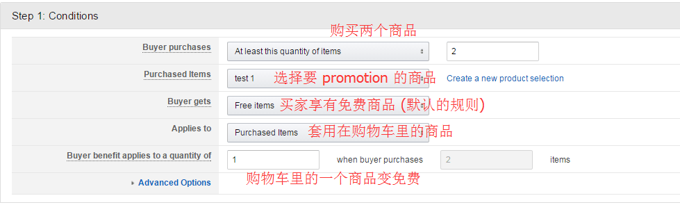](http://blog.bqool.cn/wp-content/uploads/image03-26.png)

够买两个以上有 promotion 的商品，赠送指定商品一份。

[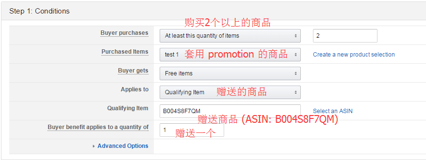](http://blog.bqool.cn/wp-content/uploads/image01-36.png)

买家购买三个 promotion 的商品，其中两个 promotion 的商品是免费的。

[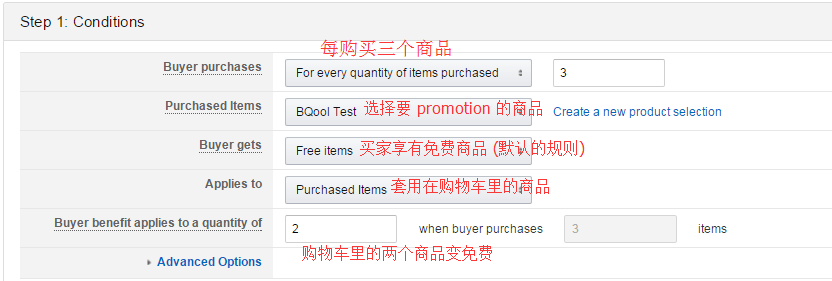](http://blog.bqool.cn/wp-content/uploads/image02-32.png)

买家购买3个 promotion 的商品，可以享有指定免费商品一份。

[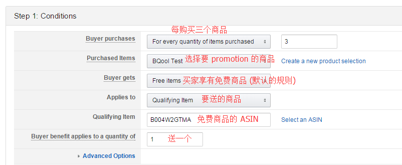](http://blog.bqool.cn/wp-content/uploads/image00-48.png)

除了建立 Promotion 之外，技巧性的关闭 Promotion 也是十分重要的！

