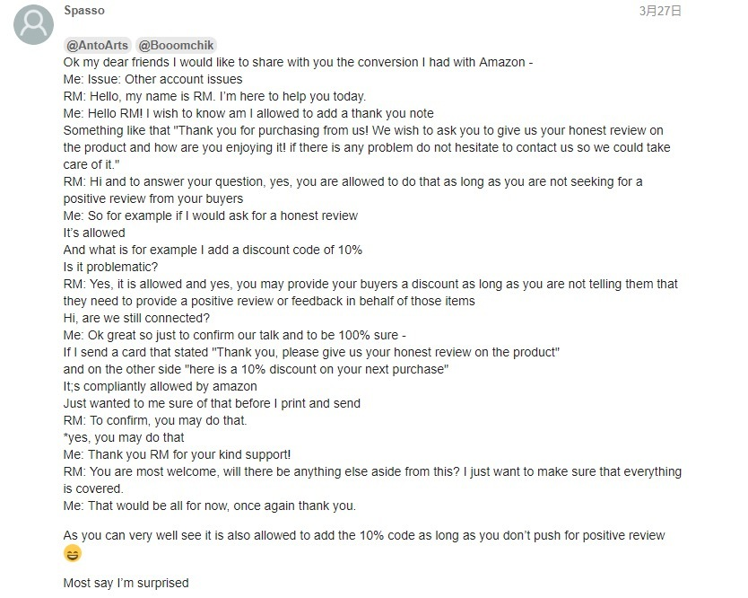
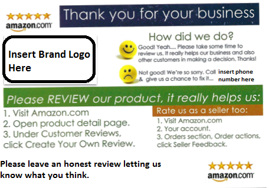
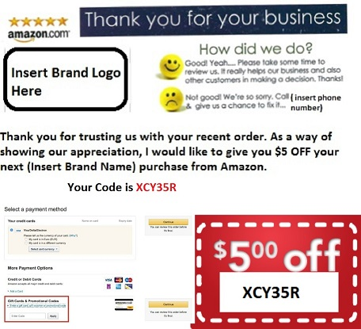
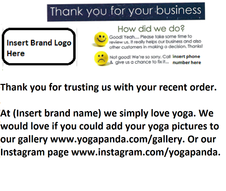

layout: post
title: Using Amazon Product Inserts for Reviews
tags: [amazon, review]
category: Amazon
---

## How to Use Amazon Product Inserts for Reviews

Including physical inserts inside the packages for your products can be a very effective way for Amazon sellers to get product reviews. 

These don’t have to be super complicated. 

Basically, you want to make sure you:

1. Follow the rules.
2. Remind customers why they bought your product (highlight the benefits).
3. Actually ask them to leave a review and include instructions for doing so.
4. Keep the design simple, easy-to-read and brand-congruent.

## Don’t Break the Rules

Make sure your inserts are compliant with Amazon’s Terms of Services. A couple of reviews aren’t worth getting your seller account suspended. So be a good seller and [don’t break the rules](https://sellercentral.amazon.com/gp/help/external/200386250). 

You cannot offer a discount or any kind of incentive for a review. This is strictly against Amazon’s rules as we have mentioned in previous chapters.

And you have to encourage honest reviews – not strictly positive reviews.

## What to Include in Product Inserts for Amazon Reviews

Amazon Product insert cards are a great way to send a message to your customers because every one of your customers is guaranteed to see it. Whether they bother to read it or not will depend on a couple of things, listed below.

What is your product? If it is something low cost and basic, your customers will be less likely to read your insert card. However, if it has a higher cost, or is more complex, your customers will be more likely to read what you have to tell them.

Think Apple Iphone insert vs emoji pillow which one will you be more likely to read the insert card off?

Common mistakes when designing Amazon insert cards:

1. Have 1 goal per insert card. If you have a list of things to tell your customer, then send it in a follow-up email using **[feedback genius](https://secure.sellerlabs.com/aff//idevaffiliate.php?id=705_2)** or similar automated email services.

2. Do NOT try to get the customer to try and buy from you on Amazon. This is a sure-fire way to get your Amazon seller account suspended.

3. Do NOT expect many people to act on what you ask them to do. If you can get a response rate of 5% to a message in your insert card, this is good.

Below, I give you 4 different examples of Amazon Product insert cards and when and how you should use them to grow your Amazon FBA business. Feel free to copy the templates that I have provided for you.

## Amazon Product Insert Cards

### 1. Amazon Product Insert Cards: Increase Reviews

With your first batch of inventory, your focus should be to rank your products and get as many reviews as possible. With this in mind, the aim of your insert cards should be to get customers to leave a product review. Below is an example of the type of insert card that you would use when you are launching a new product and seeking customer reviews. Feel free to copy it and use it as a template for your own Amazon product insert card.

### 2. Amazon Product Insert Cards: Increase Sales & Ranking

Once you get over 100 reviews on your product listing, your focus should switch from reviews to sales. Your aim should be to increase the sales of all your products off Amazon so that your ranking improves, which will, in turn, increase your organic sales further. Below is an example of an insert card that you can use to encourage customers to become repeat customers of your brand. Feel free to copy it and use it as a template for your own Amazon product insert card.

“Thank you for trusting us with your recent order. As a way of showing our appreciation, I would like to give you $5 OFF your next (Insert Brand Name) purchase from Amazon.”

### 3. Amazon Product Insert Cards: Branding

Once you have a wide selection of products ranking well on Amazon and they all have over 100 reviews, you may decide to start building your brand off Amazon. Sharing pictures of your customers using your products is a great way to start building a community around your brand. The third type of insert card that I use is for the sole purpose of branding. Below is an example of an insert card that you can use to encourage customers to become a major part of your brand. Feel free to copy it and use it as a template for your own Amazon product insert card.

“Thank you for trusting us with your recent order. At (Insert brand name) we simply love yoga. We would love if you could add your yoga pictures to our gallery www.yogapanda.com/gallery. Or our Instagram page www.instagram.com/yogapanda.”

### 4. Amazon Product Insert Cards: Growing an email list

If you simply want to build an email list of your customers so that you can email them during your new product launches, then the best way to do this is by inviting them to a landing page, so that you capture their email addresses. Your product should retail for more than $20 for this to work adequately, as it is extremely unlikely that anyone will take out the warranty on products with a low-value. Below is an example of an insert card that you can use to encourage customers to sign up to your email list. Feel free to copy it and use it as a template for your own Amazon product insert card.

“At Yoga Panda we offer a **FREE** 1-year warranty on all of our products. This means that if your product breaks through no fault of your own we will replace it with a new one for **FREE**. To the avail of the Yoga Panda 1-year warranty, you must sign up for free within 1 week of making your purchase. Please visit www.yogapanda.com/warranty within 1 week of making your purchase and enter your name and email address to get covered.”
