layout: post
title: Source Product in Yiwu Wholesale Market: Complete Guide
tags: [trade]
category: Trade
---

Whenever people talk about sourcing products from China, the Chinese Fairs always come first to many people’s minds, like the Canton fair in Guangzhou. But you can only attend these exhibitions at specific times. 

In this case, I highly recommend that you come to Yiwu Wholesale Market, Which is the biggest wholesale market in the world. And you’re very likely to find a supplier that you need at any time. 

By reading this article, you will get to learn the features of Yiwu wholesale market, find out how to purchase in Yiwu, discover the products with potential commercial value, and realize your business dream. 

This is a long article, and I organize it into 7 chapters. You can click either icons or the text below, to navigate to each chapters. If you like this article, please share it with your friends.

## Chapter 1: Where is Yiwu? & What is Yiwu Wholesale Market?

Where is Yiwu? Yiwu is located in Zhejiang Province, close to Ningbo Port and Shanghai Port. For more information about the location of Yiwu and how to get to Yiwu, you can [click here](https://jingsourcing.com/how-to-get-to-yiwu/). 

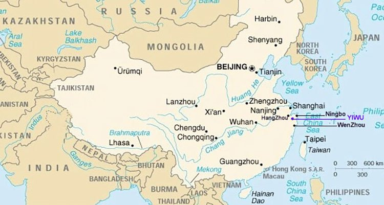

Yiwu is really a [multicultural city](https://www.theguardian.com/cities/2017/mar/23/welcome-yiwu-china-testing-ground-multicultural-city). It attracts more than 500, 000 foreign procurers who come here every year to develop their businesses. Yiwu also has over 14, 000 foreign businessmen from more than 100 different countries who reside there.All the people come to Yiwu for the biggest wholesale market in the world, which is “Yiwu Wholesale market”. 

Here, you will find a wide array of products.There are more than 70, 000 booths in this market exhibiting different products. It makes Yiwu be more of a huge fair instead of a market. And what distinguishes it from all the other open fairs is that Yiwu market is open all year round, except during the Spring Festival.  

In the Yiwu wholesale market, you can find suppliers of various products. These suppliers are from all parts of China. And their factories may not be in Yiwu, but from the surrounding cities of Yiwu such as Zhuji, or farther, like Guangzhou, Shenzhen, etc. 

But they are all concentrated in the Yiwu wholesale market for sales. This makes it easier for customers at home and from abroad to make centralized purchases.

### Travel through Yiwu Wholesale Market

In fact, Yiwu has many wholesale markets. But the most famous wholesale market is called Yiwu International Trade Market, also known as Futian Market because it is located in Futian. But foreigners prefer to call it “Yiwu Wholesale Market”. 

And what I have mentioned in this article is  referring to this market. As for some other Yiwu Markets, I will discuss them in Chapter 8. 

## Chapter 2: A Map Guide of Yiwu Wholesale Market

The Yiwu wholesale market has five main districts, each with 3-4 floors. All the areas are connected. Actually, you can visit the market from one district to the other four districts without leaving the building. 

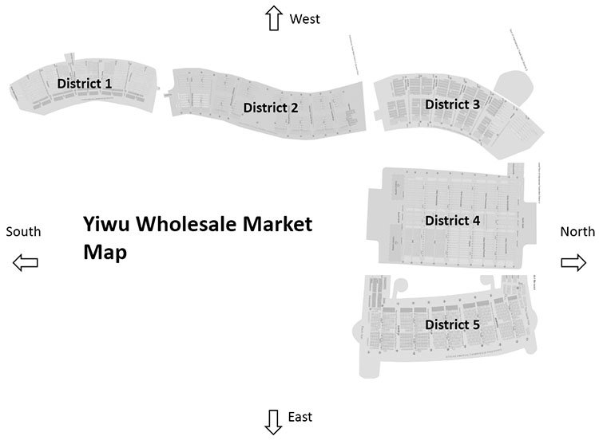

I have to say that Yiwu Wholesale Market is the best in China and even in the whole world. Because no any other wholesale market is as well planned as the Yiwu Wholesale Market. All areas are subdivided according to the category of their products. 

You can easily find the products that you want to import from here. I have sorted out various product categories in every district for your reference. And of course, you can [click here](https://jingsourcing.com/download/94fc2d57d91b6efd228597e33d55fef5.pdf) to download the map or enter your email to get a detailed map. 

### District 1

- F1: Common toys, Electric toys, Inflatable toys, Plush toys, Flower accessories
- F2: Jewelry, Head Ornament
- F3: Ornament Accessories, Porcelain & Crystal, Picture Frame, Tourism Craft, Decoration Craft, Festival Craft
- F4: Factory Outlets

### District 2

- F1: Suitcases & Bags, Schoolbags, Rainwear, Rain Capes & Poly Bags, Umbrellas
- F2: Vehicles, Hardware Tools & Fittings, Locks, Electric Products
- F3: Electric Instrument, Batteries/Lamp $ Flashlight, Clocks & Watches, Telecommunication Appliances, Small Home Appliances, Shaver, Kitchen & Bath
- F4: Factory Outlets, Electronics, Suitcase & Bags, Clocks & Watches, Hardware & Electric Appliances, Pavilion

### District 3

- F1: Glasses, Pen & Inks, Paper Articles
- F2: Sporting Articles, Office suppliers & Stationery
- F3: Factory Outlets-Zippers, Accessories, Sporting Articles

### District 4

- F1: Socks
- F2: General Merchandise for Daily Use, Knitting Products, Gloves, HAT
- F3: Sewing Thread & Tape, Shoes, Lace, Necktie, Wool Yarn, Towel
- F4: Belt, Scarf, Bar & Underwear, Scarf, Bar 

### District 5

- F1: Imported Commodities, African Products Exhibition Center, Jewelry & Handcrafts, Clothing & Hats, Article of Daily Use, Food, Health Care Products
- F2: Beddings
- F3: Needle Weaver Fabrics, Knitting Raw Material, Curtains
- F4: Auto Accessories, Car & Motorcycle Parts, Pet (fish) Products

## Chapter 3: How to Deal With Suppliers in Yiwu Market?

### 1.How to communicate with Suppliers in Yiwu Market

When you ask for the products at the booths, you will find that you can simply communicate with the suppliers in Yiwu Wholesale Market, for instance, talking about the price. Because the suppliers can understand some basic English, such as how much, price, cheap, good, and other simple English words. 

When you see a product at a booth, you can use your finger to point it out. And then the suppliers will show you the price of RMB with a calculator. You need to pay attention to the fact that suppliers in the market only accept RMB and reject the US dollars. 

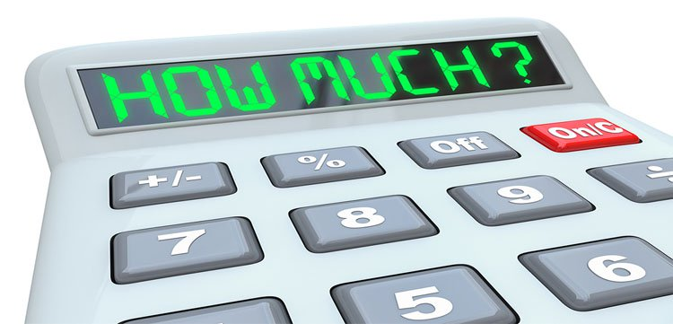

Since the sellers can only communicate in this simple way, if you go to buy a small amount of stock, then you can manage on your own. But if you want to communicate more deeply about the product, such as customizing the content. Then you will find that communication will become very difficult. In this case, it would be a good decision to find a translator or Yiwu market agent.

### 2.Hire a Translator or a Yiwu Market Agent to Help You

Translator and agents can help you determine price, quantity per carton, CBM per carton, minimum order quantity, production time, minimum quantity for customizing packaging and more with suppliers. 

    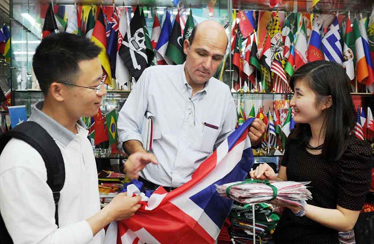
    <figcaption class="vc_figure-caption">A foreign customer is visiting a flag booth with an agent</figcaption>

Here, you need to note that the work of the translator is mainly to help you communicate with the supplier in the market. But as for orders, inspections, and delivery after leaving the market, that’s not their job. The reward for a translator is about ¥350 a day, which is equivalent to $40-$50 a day. 

However, an agent will help you with everything in China, even like packaging matters. Sometimes, when your quantity is small, the supplier may not help you to package your products. But agents can package your goods according to your requirements. And fees are mainly charged based on the percentage of the purchase amount.

### 3.Tips for Finding Yiwu Wholesale Market Suppliers

◆. Whether you go directly to buy in the market, or go with a translator or agent, I suggest that you find more suppliers and find a better price among them. The districts of Yiwu market are very clear. 

Generally, the suppliers of the same product are all situated in the same area. You only need to go around them to find similar suppliers. Also you can check on the website of “Yiwugou” to find a supplier’s information.

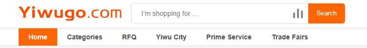

◆. After selecting a supplier, you must confirm with the supplier that the actual products and the samples in the stores are the same. If not, they should let you know in advance. Because it is very common that the actual products and the samples are not the same in Yiwu market. 

For this problem, the supplier will not take the initiative to explain to you, and it is only when you actually receive the actual products that you will find it’s too late. Therefore, I strongly recommend that you confirm this issue with the supplier in advance. 

◆. Some suppliers in the Yiwu market are specialized in doing one category, and some others do the various categories of products at the same time. If you are unfamiliar with Yiwu market, then professional agents can help you find more professional suppliers, even manufacturers. 

Their prices will tend to be better, the quality of the products will be more secure, and the suppliers are more familiar with the products. The suppliers that deal with a lot of categories often have multiple cooperative factories. Relatively speaking, the suppliers who do various categories are not more professional than those who have specialized in just one category. 

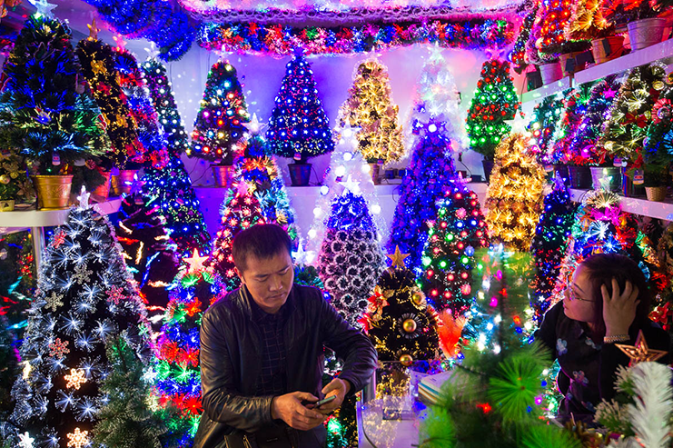

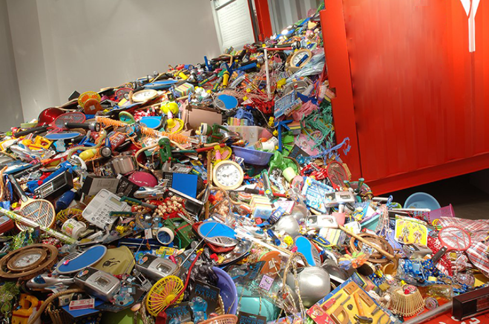

◆. For price negotiations, the price of the supplier will not be very different. Generally, the quantity of about 1000 pieces can be offered at a great price. And sometimes, the supplier will give you a little discount of about 3-5%. 

Some customers think that if they directly ask the supplier whether the price of 10, 000 pieces will be lower, they will get a low price of around 10-20%. But this is not true, as even after doing this; the price will still be the same as that of 1000 pieces. 

You don’t have to be surprised, because this is normal. Since suppliers don’t believe you will buy 10, 000 pieces. They just think that this is a trick of you asking them about the lowest price possible. So, when you hear that the price of 1000 pieces is almost the same as that of 10, 000 pieces, you shouldn’t be surprised at all.

## Chapter 4: Find A Yiwu Market Agent and Know Their Tricks

When you come to Yiwu, you will find that there are too many agents. But there are only a few large companies with at least 500 people, and thousands of agents with 10 people or less, or even just 2-3 people. 

Among the various agencies, it is important to find a good company and build trust with them, since long-term cooperation is important.  The damage done by a bad agency to your business cannot be under-estimated. 

So, there are some hidden rules and tricks that you need to know in the Yiwu Wholesale Market. By understanding these things, you can easily find a good agency to protect your own interests. 

### 4.1 Where To Find Your Yiwu Market Agent?

If you are abroad but want to find a good agent in advance for visiting the Yiwu market, then you can search for “Yiwu Market Agent” on Google, where you will find some Yiwu agents. If you have already arrived in Yiwu, you will see a lot of advertisements about Yiwu agents at the airport, train station, and even at your hotel entrance. You can choose one of them. 

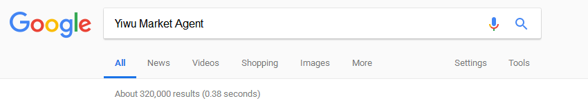

Here, I also want to share something special with you. If you are a customer from the Middle East and Africa, then you can find people who are doing import and export business in Yiwu directly to your country. They can communicate with you in your own language and they fully understand the situation of China and your country. 

You can go and search for them as agents. They will prepare everything for you in China, including visas, air tickets, hotel reservations, etc. After coming to China, you only need to focus on purchasing your products, and they will do the following: inspection, delivery, customs clearance, and other issues for you. 

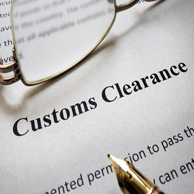

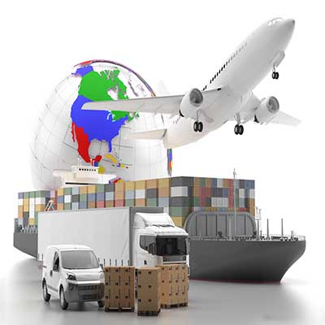

### 4.2 What does Yiwu Market Agent Serve?

The services provided by the Yiwu Market Agent are as follows: 

1. Yiwu market agent will take you to the market, and help you source wholesale products according to your procurement plan. Or when you don’t have any plan, they can take you to some of the most popular shops in the market.

2. When you enter the store, the agent can act as a translator to help you communicate with the supplier. If you’re lucky, he or she can get some discounts for you. 

3. Generally speaking, many guests will purchase some goods in various shops to form a whole cabinet in Yiwu market. And your agent will help you to create a variety of forms to help track your various products. 

4. When you finally decide on the goods you want to purchase, the agent will help you to place an order with the supplier and pay the required amount. This is because the supplier only accepts the RMB. 

    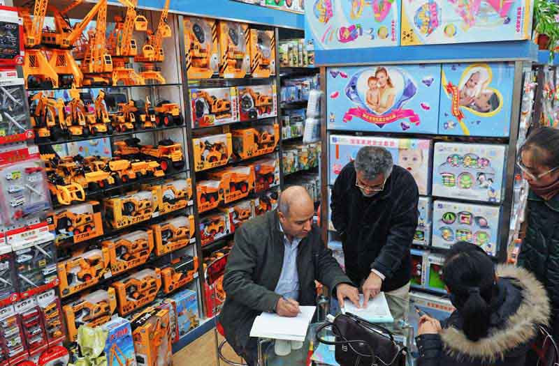

5. Agents can provide their warehouses in China, by temporarily storing the products you have purchased. This gives you time to concentrate on your purchases without worrying about having a place to store your goods in China.  

6. They receive goods for you, check the goods, and then ship them to your country. When you complete the procurement process, you can just go back to your country. Your agent will help you to complete the follow-up. This way, you don’t have to waste time; after all, time is money. 

7. As you enjoy these services provided by the agent, they will charge you a certain service fee, which is usually settled according to the total amount of purchases.

### 4.3 What is Yiwu Agent’s Service Charge? How Much Should You Pay for The Agent Service? 

This is a very interesting topic and one that foreigners who come to Yiwu to purchase goods are normally concerned about, especially for those importers who have no any purchasing experience in Yiwu. You may not be aware that there are more than 1, 000 agencies in Yiwu! The largest agency normally has at least 500 people and the smallest agency usually has around 5 people. 

There are so many agents available in Yiwu. In fact, you will not know how to choose the best agent. At this point, you may be attracted to ads that claim to offer 3% commission or even lower, and some even give 0% commission. 

My advice is that you should not be misled by these ads. This is just a low-cost competitive marketing method used by agencies to attract new customers. When you contact these companies, they will also tell you that there are various other service fees to collect. Although there is no set industry standard in Yiwu, as far as I know, it is more reasonable and reliable for the agents to charge around 5-10% service fee. 

You can go ahead and choose an agent with a low service fee, but you will find some of the problems that I am going to talk about in the next paragraph. They are some of the most used tricks by Yiwu agents, which many of our readers have shared with us. 

### 4.4 Some of Yiwu Agent’s Tricks You Need to Know

In order to maintain the interests of their own company, some agencies that charge 3% or lower service fees often use some tricks to make up for the loss of service fees.

1. Change suppliers

    When you think that the quality of supplier A’s product is good, the price is acceptable, and as a result, you go ahead and place your order. But then, your agent is more likely to replace your supplier A with a cheaper supplier B, in order to benefit from it. As for you, the lower price of supplier B means that you may get a poor quality product.  

2. Ask suppliers for a kick back

    When you go directly to the market, your agent will help you to negotiate with the supplier. During this time, the agent will use the Chinese language to ask the supplier to increase the original price by 2-3% as a quote for you. In this case, the price of the product you pay will be more expensive. 

3. Force suppliers to cut prices

    When you and the supplier decide on the product and price, the agent will force the supplier to cut the price when placing the order. This way, the agent receives the profit from the price difference. This situation will also cause the supplier to give you poor product quality and protect their profit.

## Chapter 5: How to Ship Products from Yiwu to Your Country?

Yiwu is a city with very developed logistics and transportation networks. Here, you can choose to ship to your country in many ways. In general, there is express delivery, air transportation, and shipping. 

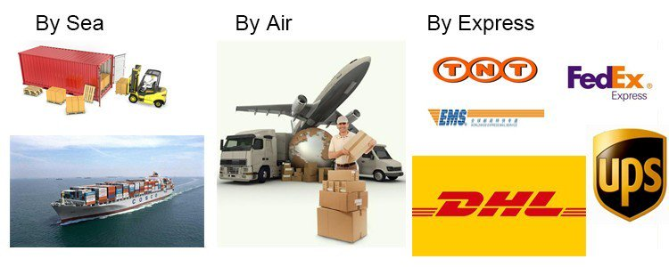

Among them, express delivery is the fastest way. Frankly speaking, the goods can be sent directly to the address door that you provide within 3-5 days. Note that; express delivery is the most costly way. So it is only suitable for small, high-value goods, such as electronic products, accessories, watches and so on. 

If you are ready to send by express, then I suggest that you do not contact Fedex, DHL, UPS, or any other official express. Because their discounts for individuals are usually limited. A good solution would be to contact Yiwu’s express agent. 

You can find a lot of such express delivery companies around the market. They have a very low discount rate because they have a lot of clients. If you compare the two, you will find that using an express agent can really help you reduce the cost of freight. 

If you are shipping, or want to transport by air, you can go to the Chanchun District and Futian District of Yiwu Market to find some freight forwarding companies. 

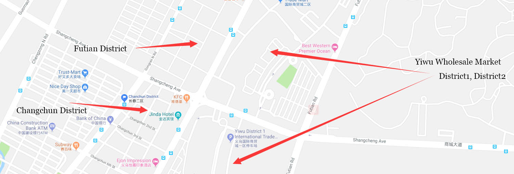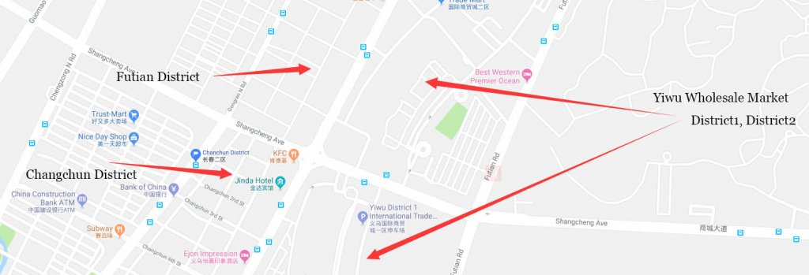

Many freight forwarding companies will claim to be able to send to any country. However, these freight forwarding companies are not the best choice. I suggest that you find some freight forwarders that are specialized in your country line. Such companies normally give you a full quote to your country right away, including some details on customs clearance. 

Some freight forwarders will tell you that they can ship goods to any country. In fact, they ship to several major countries. So, if your country is not one of those countries that they normally ship to, they will contact other freight forwarders to help you ship. Then, the quote will end up being much higher. 

Especially, for some customers in the Middle East, Africa, Russia, and South America, customs clearance is not as easy as in North America, and it is more likely to have problems.

The freight forwarding companies in the special line can help you solve various problems more professionally because of their rich experience. And a large number of these special line freight forwarding companies have been opened in Yiwu by people from your country, so it will be more convenient in communicating. 

If you are from a country along the “[Yixinou Railway](https://www.businessinsider.com/the-longest-railway-in-the-world-2015-1)“, you can also choose to ship the goods to your country by rail. The “Yixinou railway” starts from Yiwu and passes through **Kazakhstan**, **Russia**, **Belarus**, **Poland**, **Germany**, **France**, and finally, **Madrid**. The choice of rail transport saves about half of the cost of time, and its cost is only half or less that of air transport.

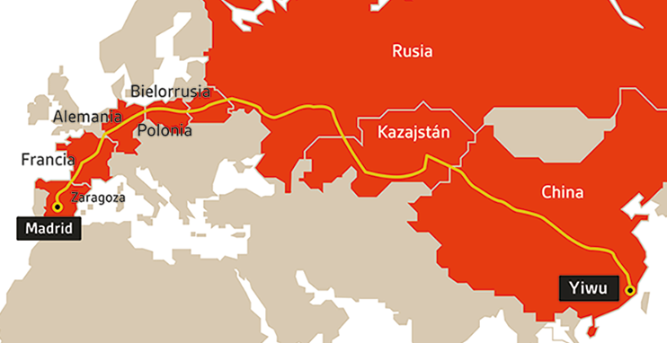

## Chapter 6: Four Things You Need to Know About Yiwu Wholesale Market

### 6.1 Are All the Booths Opened by Manufacturers?

Most booths are owned by individual businesses, while others are owned by trading companies and they’ve got lots of factories that supply them on a long-term basis. If you do not want to buy in large quantities, in some cases, you may get better prices from them than when buying from the factory. 

There are some booths owned by factories. These are mainly based in Yiwu and nearby cities. Others are based in Fujian, Guangdong, and other provinces. The scales of these factories range between 10 and 1, 000 staffs. 

If it’s your first time visiting Yiwu, or you do not have much information and experience on import, you will find it challenging trying to distinguish whether these are individual businesses, small workshops, or large-scale factories. Even though most booths claim to be manufacturers, you shouldn’t trust them at all. 

### 6.2 Are Yiwu Products of Poor Quality as Alleged?

Some commentators on the internet allege that all Yiwu products are of poor quality, thus they cannot be exported to the United States. This is not true because of the following reasons:

Yiwu product does not mean “Made in Yiwu”. As mentioned earlier, Chinese products have industrial areas where they are manufactured from. Many products sold in Yiwu are made in other leading production areas and they are just availed in Yiwu for sale.

One of the top 3 exporting countries from Yiwu is the U.S. Many high-quality products are exported from China to the U.S every year. Yiwu also has some budget products which target developing countries, but it’s not true to say that all Yiwu products are not of good quality. 

For example, most Christmas products are produced in Yiwu, but you will also find suppliers in places like Shenzhen and other areas. However, the Shenzen supplier may play a dirty trick by not telling you that the products were manufactured in Yiwu, or even he/she may claim that what they sell is better than that made in Yiwu.  

### 6.3 Is Yiwu Wholesale Market only suitable for Small Businesses?

Many articles on the internet are saying that Yiwu market is only suitable for small businesses, and Shenzhen or other big cities are better for big orders. But the truth is that you won’t find a market with an MOQ that’s higher than that of the markets in Yiwu. 

For those individuals who want to buy one item from $1000 or more to 2-3 containers, this is the best place to source them. It’s quite difficult to persuade the booth to sell one or two cartons for one item, as this quantity is very less than their MOQ. 

Usually, every product in any market needs lead time. However, some of them tend to have spot goods so that you can purchase in small quantities. But there are two conditions which you should consider before buying spot goods.

Spot goods cannot be changed. All the colors, logos, and styles, as well as packaging, remain the same as the samples that you see in the booth. If you want customized products, you will have to buy in large quantities. Because spot goods are already manufactured, their standard or design is not current, thus they are not suitable for fashion products.

### 6.4 How Does Yiwu Differ from Ningbo, Shenzhen, and Guangzhou?

Ningbo, Shenzhen, and Guangzhou are all big coastal cities in China and have ports, which is a factor that gives them many advantages of export. This is also the reason why most large international companies have set up their procurement or branch offices in these cities. Also, there are various professional trading companies which offer better services. 

Yiwu does not have a port and relies on the Ningbo port, which is 200km away. Meanwhile, Yiwu supplies many goods to Ningbo, Shenzhen, and Guangzhou. 

You can’t find any other place like Yiwu wholesale market that collects so many products from Ningbo, Shenzhen, and Guangzhou. 

Ningbo doesn’t have any market and its advantage is the port only. On the other hand, Shenzhen only has a market for electronic products, while Guangzhou is a popular market for jewelry, clothing, and related items. And these markets are in different places and sourcing from them is not easy. It is only during Canton Fair when suppliers congregate at one place in China.

## Chapter 7: Other Wholesale Markets and Yiwu Fairs

In fact, Yiwu has many different types of wholesale markets. The Yiwu wholesale market that you know is referred to as the “Futian market”. But there are other wholesale markets in Yiwu. These markets are not as famous as the Futian market, but you can also find some products that you want here.

### Yiwu Huangyuan Clothing Market

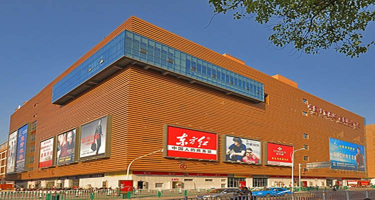

Tag: clothes, suit, uniform, coat, scarf, dress, T-shirt, jeans, skirt, shirt, trousers, jacket

### Yiwu Furniture Market

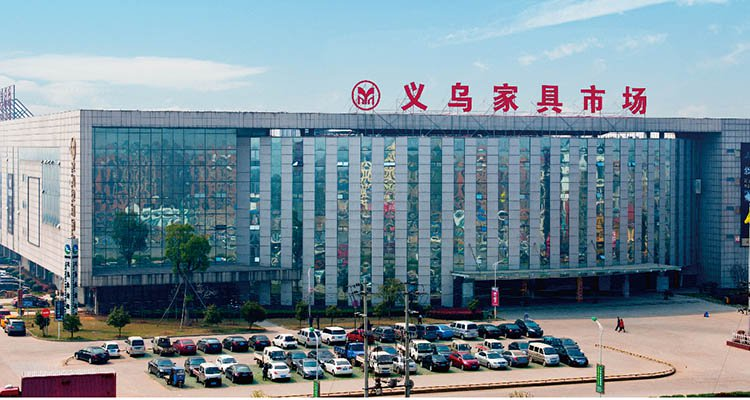

Tag: light, sofa, chair, bed, drawer, door, table, bookshelf, fireplace, couch, mirror, crib, clothes tree

### Yiwu International Capital Goods Market

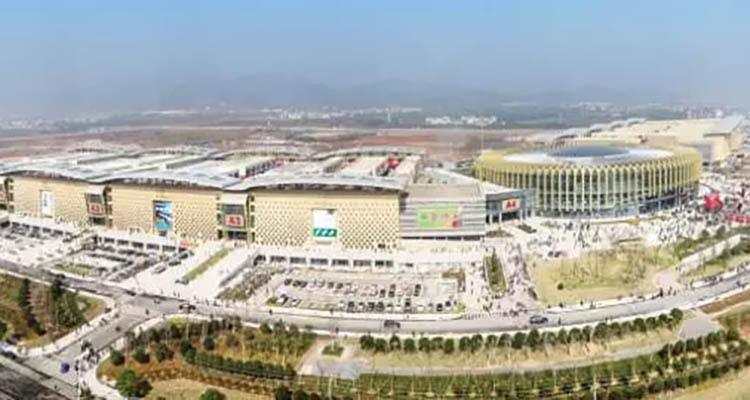

Tag: kitchenware, lamp bulb, LED, leather, crafts, tools, equipment

Although Yiwu has many open markets all year round, Yiwu’s exhibitions will also be held from time-to-time. Most of the customers who come to China to participate in the Canton Fair normally fly to Yiwu to participate in Yiwu Exhibition after the completion of the Canton Fair. 

You can think of Yiwu’s exhibition as a mini Canton, where to find some real factories. But if you want me to give you some advice about whether to go to the Canton Fair or to the Yiwu Exhibition, my suggestion will be the Canton Fair, as you will find more suppliers and products there. The following is an exhibition to be held in Yiwu in September 2018 and 2019. You can refer to it. 

Name of Fairs in Yiwu | Data             
--------------------------------------- | -----------------
[The Belt and Road Yiwu Sports Industry Exhibition ](http://ty.yw-ybh.com/)| Sep.7-9/2018     
[2018 China Art and Frame Expo ](http://www.cafexpo.net/)                  | Sep.18-20/2018   
[China Yiwu Auto and Motorcycle Parts Exhibition ](http://www.yiwufair.com/)| Oct.21-24/2018   
[China Yiwu International Commodities Fair ](http://www.yiwufair.com/)     | Oct.21-25/2018   
[2018 China Yiwu International Manufacturing Equipment Expo ](http://www.yw-ybh.com/)             | Nov.29-Dec.1/2018
[2018 Belt and Road Initiative (Yiwu) glasses and eye care products fair](http://www.yw-ybh.com/) | Apr.1-3/2019     
[The 14th China (Yiwu) Cultural Products Trade Fair ](http://www.ssofair.com/)| Apr.27-30/2019   

**Now It’s Your Turn**

Are you ready to come to Yiwu and see the biggest wholesale market for yourself?

Do you want to be one of the importers from Yiwu and accelerate your business?

Have you understood how to avoid the tricks and get the good products at wonderful prices?

What have you learned from this article? Let me hear your voice by leaving a comment below right now. 

