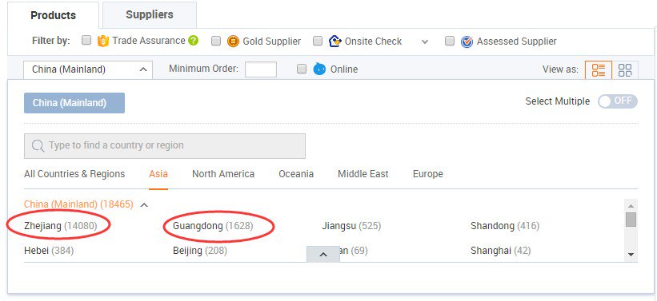
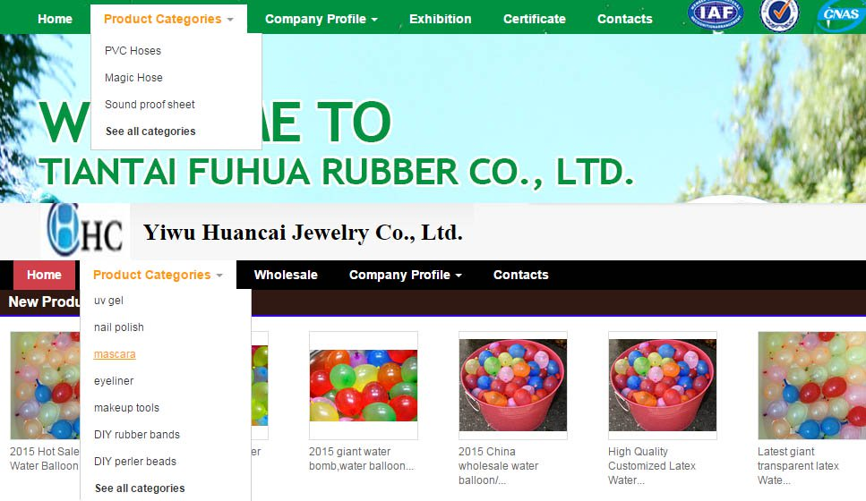

layout: post
title: Tips for Sourcing Good Suppliers on Alibaba
tags: [trade, alibaba]
category: Trade
---

When it comes to discussing about how to source products (or how to find suppliers) in China, most people will come up with **[Alibaba.com](http://www.alibaba.com/)**. Because it is the largest B2B trading platform in the world, with millions Chinese suppliers in every industry. In each product category, there are still thousands suppliers, and most people don’t know how to select their most suitable supplier. As dealing with all kinds Chinese suppliers for years, I’d like to share some tips to find a good supplier on Alibaba.

The following article will provide you certain **tips** for choosing your desired product from Alibaba. Here we will use ‘x hose’ as an example product. _(All companies mentioned in this article have no relationship with author)_

## 1. Gather relevant information about the product

### a. Know the key word of the product and make related searches

For instance you search for ‘X hose’ on Alibaba. The resultant webpage will show you all products related to ‘X hose’ that are available on Alibaba. Do a thorough check on the search results and identify that particular word for ‘X Hose’ as used by suppliers for sales purposes. Most suppliers sell your desired product by the name of ‘X hose. Other suppliers might use words like ‘magic hose’ or ‘garden hose’ for selling the same product i.e. ‘X hose’. Thus you can also search for ‘magic hose’ or ‘garden hose’ and get relevant results for your desired product. The search results will lead you to more suppliers of ‘X hose’ in China.

### b.Identify the places where product is manufactured, reduce suppliers’ scope.

When you search for **‘[X hose](https://www.youtube.com/results?search_query=x+hose)’** on Alibaba, you will that most manufacturing plants for ‘X hose’ are concentrated in two areas of China. The **[Zhejiang Province](https://en.wikipedia.org/wiki/Zhejiang)** leads with about 14,827 suppliers of ‘X hose’. **Guangdong** falls second in place with about 3145 suppliers of ‘X hose’ registered on Alibaba. There are very few number of ‘x hose’ suppliers from other provinces of China.

Buyers with certain familiarity about China are well aware of the fact that this commonly used product is usually produced in Guangdong and Zhejiang Provinces. Suppliers in other places are not manufacturers, but generally **middle men**. Do not consider them for purchasing ‘X hose’ as their price per piece is very high.  
_(Also bear in mind that most **daily use products** are majorly manufactured in Zhejiang and Guangdong, and only a few of them in Fujian. Other regions of China produce Machine, Farm Products, and chemical products.)_

If you compare the suppliers from Guangdong to those in Zhejiang, you will find that the number of suppliers in Zhejiang is 4.6 times to the number of suppliers in Guangdong. Most suppliers in Guangdong are trading companies and not manufacturers or factories. These trading companies purchase all their products from manufacturers based in Zhejiang. This clearly means that the quality of product supplied by both is similar, but products supplied by trading companies are about 10-20 % more expensive in comparison to those supplied by manufacturers.

Suppliers from Guangdong claim to supply better quality products than manufacturers located in. However, this can **never be true** because Zhejiang has advantages in terms of availability of low cost material and cheap labor. The cost of material and labor are high in areas, like Guangdong and so suppliers cannot supply good quality product at similar prices. Out of the total 3145 suppliers in Guangdong, just two or three are manufacturers. The rest of them are all traders, selling their products at high prices. With all the competitive advantages suppliers in Zhejiang offer excellent quality product at low prices.

## 2. Identify your actual requirement and choose an appropriate supplier on Alibaba

The most crucial part here is to identify the actual demand for a particular product. The process of manufacturing ‘X hose’ is quite easy and simple. It is for this reason that there are numerous manufacturers of this product. You now need to decide whether you should make your purchases from manufacturers or from trading companies. If you wish large quantity .i.e. around more than 2,000 pieces, you can buy from manufacturers. But, you only need 200-2,000 pcs, we suggest that you should buy **from trading companies**, even if their price per piece is a bit high as compared to manufacturers.

The following suggestions will help you in **[choosing a good trading company](https://jingsourcing.com/4-reasons-why-trading-companies-are-better-than-manufacturers/)** for making your purchases:

### a. Look for the company’s name and address

Usually professional companies always choose their names **according to the product** they manufacture. For e.g. there are two companies named ‘Tiantai Fuhua Rubber Co., Ltd’ and ‘Yiwu Huancai Jewelry Co., ltd’. Out of the two the former one appears to be associated with the production of magic hose. This is, because production of magic hose requires the use of rubber and ‘Tiantai Fuhua Rubber’ can produce it at low material cost. On the other hand ‘Yiwu Huancai jewelry’ might have just uploaded the sale of magic hose on Alibaba to supply this product to two or three customers in a year.

### b. Search for other products of the company

Usually professional trading companies sell **similar type of products**. This means that if a trading company deals in the supply of ‘magic hose’, the other products in its portfolio will also be similar. Unprofessional companies are involved in the sale of mixed and disorderly range of products. For instance they might be selling ‘X hose’ along with related products like **[toys](https://jingsourcing.com/how-to-import-toys-from-china-complete-guide-2/)** and totally unrelated products like cosmetics.  
So if you look at the catalog of two companies discussed above, you will surely find ‘magic hose’ as prominent product in the catalog of “Tiantai Fuhua Rubber”. Whereas the catalog of “Yiwu Huancai Jewelry”, will not have “magic hose’’ as product, because it is primarily involved in the production of cosmetics.

### c. Read the description of their products carefully

Professional trading companies describe their products **in detail**, but the description of unprofessional trading companies is extremely simple. Professional trading companies have usually supply good quality products. This is primarily due to their experience in manufacturing that particular product since years.

## 3. Correspondence and communication are important

After carefully following the above mentioned steps, you will have a long list of suppliers, ready to choose the most suitable supplier. At this point of time, it becomes extremely important for you to **communicate with** the chosen list of potential suppliers. On the basis of this communication you will surely be able to judge the right supplier for your product. Use the following suggestions before placing the final orders for your desired product.

### a. Learn more product details from professional suppliers

It might so happen that you do not know much about the product you desire to purchase. You can prepare **a list of questions** and ask those from the supplier. This will help in understating the product and its features.  
Usually professional suppliers are enthusiastic to answer all your questions related to quality, process and price of the product. But, professional suppliers usually sell products at higher price as compared to other suppliers on Alibaba.

### b. Ask suppliers’ enough questions to judge if they are qualified

Ask **sufficient questions** about the product and manufacturing process. This will help you identifying whether your supplier is a factory or middlemen (too many middlemen in Alibaba claim that they are themselves involved in manufacturing.). Another advantage is that suppliers won’t quote high price of product, because they think you are experts for that product.

Taking Xhose as example, you can ask supplier what’s the price for 50FT, 75FT, 100FT and 10FT hose, the width and weight of the textile, rubber’s materials, specifications related to rubber, kind connecting accessories available, maximum water pressure and so on. Inexperienced suppliers and traders are not able to answer all questions well, because of **lack of product knowledge** and little or no experience in selling the product

### c. Compare the price, choose your best supplier

By the time you receive the price quote from professional suppliers (usually they are good trading companies), you already know the appropriate product price in accordance to the quality. In most cases this price is higher than others. If this high price is acceptable and you don’t want to take any risk, then buying from these traders is the best available option. At the same time, you can ignore suppliers that are quoting a price higher than these professional traders.

If you want to buy same quality but at a lower price, then you should make your purchases from suppliers who quote around 10% lower than the professional traders. These suppliers usually are very small trading companies with low profit, or small factories (2 staff operating Alibaba, and 15 workers producing). But, trading with them is **not an easy task** as such suppliers are not very experienced. To avoid unnecessary issues, you as a customer need to tell them every minute detail about your requirement. Suppliers quoting 15% lower price than the professional, tend to supply products that might be different from your expectations. It is vital to order a few sample products to check quality, before making bulk purchases.

Hope the above mentioned tips will help you choose a reliable professional supplier on Alibaba.