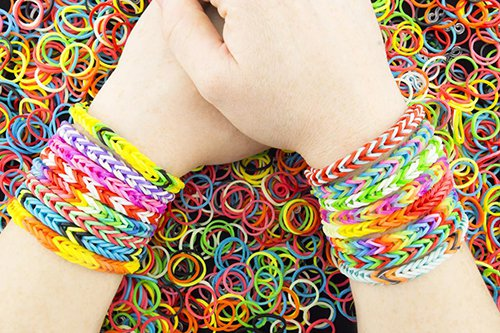
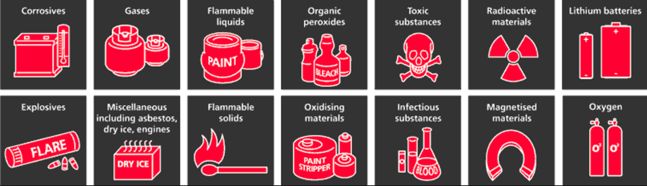
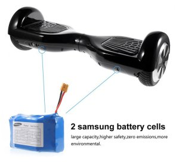

layout: post
title: Importing Balancing Scooter from China - Problems You Should Know
tags: [trade]
category: Trade
---

Balancing scooter becomes **one of the most popular products** in the world since 2015, and lots of customers want to import this product by asking us to source suppliers from China.

Our last blog introduces some basic information of[ **how to import balancing scooter from China**](https://jingsourcing.com/import-balancing-scooter-china-complete-guide/). In this article, we will emphasize the problems you have to deal with when importing balancing scooter from China. By knowing this, your business may be smoother.

## 1.Patent Issue When Import or Sell Balancing Scooter

Last September, a US company “Segway” applied to the USITC (United States International Trade Commission) for starting “337 Investigation”. USITC accepted and started “337 Investigation” at last November.

Segway is the manufacturer of **world’s first balancing scooter**, also the only manufacturer located in US. It holds over 600 patents of balancing scooter. So the application to USITC is aim to several Chinese balancing factories for patent infringement. The final result of this investigation will directly determine whether made-in-China balancing scooters can keep selling in US.

Loom bands from Rainbow loom

Actually, the fundamental cause is that **Chinese balancing scooters** are too popular among young American with its fashionable design and affordable price. As a native company, Segway feels much pressure and want to evict these Chinese companies out of US.

Importing large quantity balancing scooters to US is very difficult now, but this situation **only exists in US** so far. Other countries (such as UK, Canada, and Germany) do not have this kind of patent issue. So if you are planning to import to these countries, do not worry about this problem.

_This remains me of loom bands, the most popular toy in 2014. The patent is hold by US Company Rainbow Loom, and it_ _sued against other competitors_ _for copyright infringement regarding its clasp system. Almost all Chinese loom bands suppliers cannot export their products to US, so they choose other countries instead._

## 2.Shipping Problem When Import Balancing Scooter from China

Being a hazardous article, battery is always difficult to ship by air. Because of the fire disaster cause by lithium battery on airplane, recently all airlines won’t ship any battery that is over 100Wh.

Battery of balancing scooter is around 150Wh which makes it **not possible** to ship in bulk by air. In the future, the airline may not ship any kind of lithium battery in large quantity. So for balancing scooter importers, sea shipping is and will be only solution when you buy in quantity.

Although sea shipping must take more time, it’s safer and more legal, which is necessary for all business.

A list of hazardous articles in air freight

## 3.Too Many Chinese Retailers on Internet, Will You Have Profit?

There are already existing thousands Chinese suppliers selling this on site like EBay, Amazon, and Aliexpress. They sell as low as $320 with free shipping to Germany, however we don’t know the battery quality. People start to worry about will they still have profit in market of their countries._(You may find $250 on Aliexpress, but the price is not including shipping. $310 is the lowest free shipping price I can found on Aliexpress now)_

As the air shipping problem mentioned above, Aliexpress seller will pay at least $120 express fee each. Even there are no much express company accept the product now.

However, if you import more than 10 units from China, supplier usually offer $130-$160 each for 6.5” type (price will be different by battery type), and Sea Freight shipping by LCL or FCL to Germany will cost $6-$12 each. It means you still have good profit, even sell in your country same price as Aliexpress sellers.

With a reasonable price, a reliable shop, and commendable service, customers will certainly choose you rather than online shops.

## 4.How to Choose High Quality Balancing Scooter?

Being one kind of electronic bike, battery is **key point of** balancing scooter. It will decide how long distance it goes and the power it performs.

Balancing scooter with Samsung battery

Suppliers usually offer two kinds of batteries: 2.2Ah and 4.4Ah, these represent different battery capacities. Besides, Battery can be divided into LG, Samsung brand, and no brand (most are poor quality). The price difference is around $20.

So it is very important to know **what kind of battery** the supplier offers when you get his quotation. Some suppliers may scam you by quoting high price but using poor quality no brand battery. Be careful when you are looking for suppliers, and do not only focus on price.

Searching on Alibaba or Google is better way to find wholesale suppliers, and do not go to Aliexpress. Balancing scooter’s factories are mainly gathering in Shenzhen and Yongkang City, so suppliers from these two cities are most possible to be factories. The former is China’s capital of electronic products, while the latter is the capital of scooters and hardware. ( you can get more information in our last blog:[How to Import Balancing Scooter from China: Complete Guide](https://jingsourcing.com/import-balancing-scooter-china-complete-guide/))