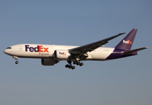
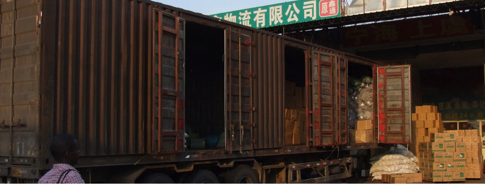
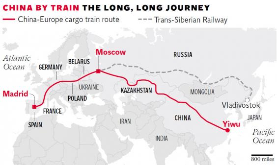

layout: post
title: How to Ship Products When Import from China - Complete Guide
tags: [trade]
category: Trade
---

Being a sourcing agent who helps source products from China, we usually ship our large customers’ cargoes **by full containers**. For many other small customers who are satisfied with the price we quote, as they do not have much experience in importing from China, they always get confused about different shipping methods.

Some of them consider to ship by express in the beginning, but the cost is much higher than they expect even with small quantity. Some just want to ship 2CBM cargo by sea freight because it is the cheapest way, but only find the whole import & export process is complicated and expensive in the end.

If you are **doing small business** and usually import much less than 20GP container load products one time, or you just start your business in importing from China, this article can give you some useful suggestions about shipping, by analyzing different kinds of situation you may run into.

## 1. International Express -Fast and Most Convenient Way

For shipping **less than 200Kg** common products, there’s almost **no better choice** than sending by international express. If you can’t afford the express fee, maybe you can buy more products and ship together by sea freight, or you have to give up and buy from local suppliers.  

International express (FedEx, DHL, UPS, etc.) is suitable for **high-value products** or products which need to be delivered to certain place very soon, such as fashion products including jewelry, clothing, or electronics.

There is one important thing you should keep in mind when using international express: they calculate the bulky cargo by **dimension weight** (length*width*height/5000). If you ship 200 mugs to Canada by DHL, the weight is 200g/mug, but the dimension weight is 300g/mug, then DHL will charge by 300g/mug. So that means products with big space will cost a lot express fee.

However, large purchasers sometimes prefer international express than air freight because it usually have **cargo promotion price** which is much cheaper if you have large cargo that is over 1,000 Kg. The price is not much difference from air freight, but is more convenient than the latter.

_For instance, Chinese Amazon suppliers often use FedEx when they have FBA (Fulfillment by Amazon) goods, 1,000 Kg goods only takes around $2.8/Kg to US. And can arrive in 5-6 days._

## 2.China Post Mail Package -Most Economical Way for 20-200Kg Cargo

When your cargo is **20-200Kg**, **[China Post Mail](http://english.chinapost.com.cn/)** by sea will be another choice, which is around 1/3 price of international express, especially for remote regions like Africa countries where other express companies charge high freight.

Another good thing is that it calculates all goods **only by weight**, never by dimension weight, which means good for light weight products.

But it has 20Kg limitation for each package, so you have to separate your cargo into several cartons. And it normally take around 2 month on shipping, so only when you really care about shipping rate, you will choose it.

_Example, an Australian customers buy kids toys from us every 2 month. Every shipment will be 5-6 cartons, around 100 Kg, 0.5 CBM. This volume is too less for sea freight shipping (the LCL), and if shipped by express, the freight cost will be calculated by dimension weight which is 2-3 times higher than by China Post._ 

## 3.Air Freight -Fast and Suitable for More than 500Kg Cargo

Air freight is cheaper but faster than express. But your cargo should better be **more than 500Kg**, or international express will be better. And their dimensional weight is calculated as length*width*height/6000, less than international express.

This shipping way is **airport to airport**, which means supplier have to send the cargo to the airport and manage the custom export process. When cargo arrives the airport of your place, you have to pick up them at airport and do the custom import process. If the closet international airport is quite far away from your place, then the domestic forwarding cost will be also a lot of money.

## Note: Hazardous Articles of Air Transportation

All airlines have strict rules about shipping hazardous articles cargo, including products which are easy to burn or explode, or chemical products which are toxic. Balancing scooter is one among them because of lithium battery. ([**Importing Balancing Scooter from China: Problems You Should Know**](https://jingsourcing.com/importing-balancing-scooter-china-problems-know/)) So it’s **not possible** to ship this cargo via international express, air freight, or China Post Air Package. The only choice is sea shipping.

## 4.Less than Container Load Sea Shipping(LCL）

LCL sea shipping is the most economical way among all shipping methods, when your cargo is **more than 2-3CBM**. If even less than that, we would recommend you to choose China Post or others. Because every sea shipping has fixed fees for export process in China, around $100-$150, and also fixed import fees when cargo arrive port. So shipping only 2CBM will cost a lot money.

Sea freight is port to port, so don’t forget to count in the forwarding cost from the port to your warehouse. If your place is far away from sea port or there’s even no sea port in your country, you’d better to find a local shipping company to inquire them how to ship from China. Because they know the shipping to your place better than Chinese suppliers or forwarders.

There is one **special situation**: if your cargo is around 15-20CBM, it’s **cheaper and faster** to use a 20GP container rather than LCL.

**Tips**: If there are still some empty space left in your container, you can buy some low-value goods or bulky cargo and ship them together. Because these products can be considered as free shipping. Toys importers usually will buy **[Pit Balls](https://jingsourcing.com/product/pit-balls/)** to fill the free space of containers.

There existing few forwarders who specialized in LCL **in certain countries**, and you can get very cheap price from them. And they will help you handle custom process first, then you pick up cargo in their warehouse. However, finding them is a little difficult.

_One forwarder we worked with are specialized in African line. They can even accept as less as 0.1 CBM cargo. For example, they charge $280/CBM to Nairobi, so 0.1 CBM only cost $28. You just need to pick up your cargo in their warehouse located in Nairobi, so it’s supper economic and convenient._ 

_If you know some of this kind company, please tell us by email:_ [_info@jingsourcing.com_](mailto:info@jingsourcing.com)_, thank you._

A forwarder who offers LCL service

## 5.Full Container Load Sea Shipping

It’s well-known that full container load sea shipping is the cheapest shipping way, which is frequently used by our large customers as well. The following are the basis capacities of three common containers:

* 20GP 5 ton           26CBM
* 40GP 22 ton        54CBM
* 40HQ 22 ton       68CBM

This shipping way will be introduced in detail in future articles.

## 6.Full Container Railway Shipping -Yixin’ou Railway Shipping Line

**[Yixin’ou Railway Line](https://www.rt.com/news/207447-china-spain-longest-train/)** was opened on Nov. 2014, which connect China and many countries in Europe. This line start at **[Yiwu City](https://jingsourcing.com/yiwu-wholesale-market-guide-1/)**, China, via Kazakhstan, Russia, Belarus, Poland, Germany, France, and finally arrived in Madrid, Spain. But it only accept full **container load shipping** currently.

Yixin’ou line’s route

Before it was opened, the goods traded between China and Europe need at least 1 month in shipping, but right now it only needs 15-20 days by railway. However, its freight fee is around 3-4 times higher than which of sea shipping, but still are much cheaper than air freight (around 8-10 times higher than what of sea shipping).

Yixin’ou line is really a better choice for European businessmen exporting wine and olive oil to China. Because it’s more stable during the journey, so that the products can be sold after placing very short time when arriving China.
     